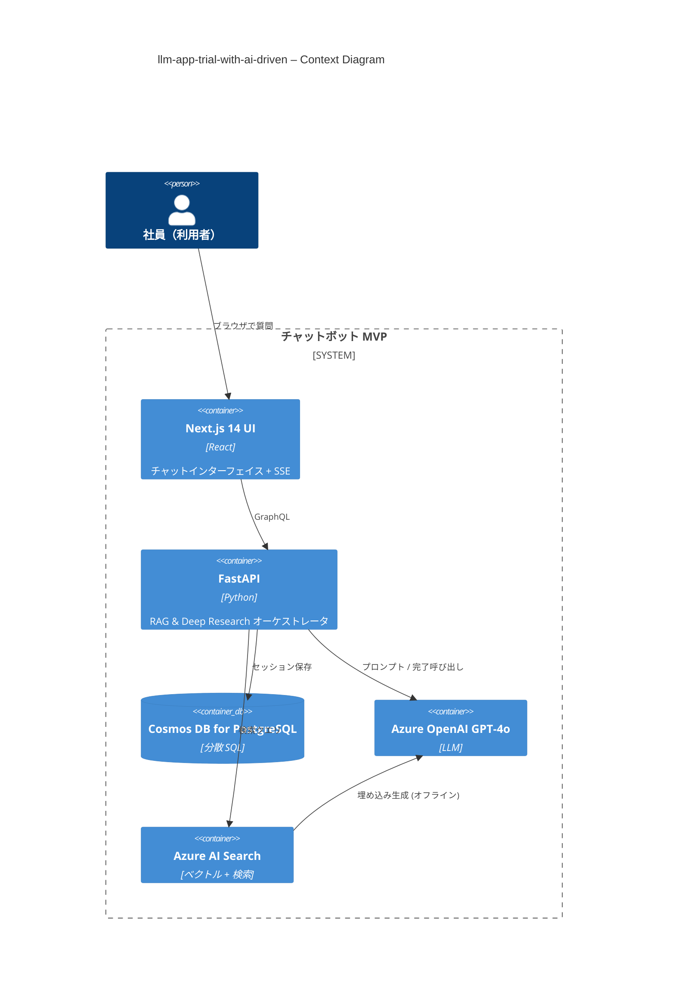

# llm-app-trial-with-ai-driven

> **目的** — 社内ドキュメントを対象にした **LLM ベースのナレッジ Q\&A チャットボット** を、RAG + Deep Research アーキテクチャで MVP として実装・検証する。

---

## 🌟 ハイレベル概要

| 区分           | 採用技術 / 役割                                                                    |
| ------------ | ---------------------------------------------------------------------------- |
| **フロントエンド**  | **Next.js 14** (React / TypeScript) — チャット UI、SSE または WebSocket でストリーミング表示   |
| **バックエンド**   | FastAPI (Python 3.12) + Strawberry GraphQL — 認証、RAG・Deep Research オーケストレーション |
| **LLM / 検索** | Azure OpenAI (GPT‑4o) で生成、Azure AI Search でベクトル & フルテキスト検索                   |
| **データベース**   | Azure Cosmos DB for PostgreSQL — セッション・メッセージ・リサーチノートを保存                      |
| **IaC**      | Terraform & Azure Bicep — すべて無料枠 SKU でプロビジョニング                               |

> **MVP ゴール** — 社内 FAQ への回答（引用付き）と `/deepresearch` コマンドによる多段階レポート生成が動くこと。

---

## 📑 機能 (MVP 範囲)

* **チャット回答 + 引用** — ベクトル検索 → GPT‑4o で回答を生成し、回答内に引用元リンクを付与
* **Deep Research モード** — Planner → Search → Summarizer → Writer のループで詳細レポートを生成
* **ストリーミング UI** — LLM 応答をフロントに逐次送信
* **セッション履歴** — Cosmos DB にチャット・リサーチ結果を永続化
* **無料枠運用** — すべての Azure リソースを Free SKU に固定、`terraform destroy` で即削除可

---

## 🏗️ リポジトリ構成 (ドラフト)

```text
/README.md          – 本ファイル
/docs/              – 要件定義・アーキテクチャ図・ADR など
/frontend/          – Next.js 14 (App Router)
/backend/           – FastAPI + GraphQL + Agent ロジック
/infra/             – Terraform と Bicep モジュール
/scripts/           – 補助 CLI・ドキュメント投入スクリプト
```

---

## 🚀 クイックスタート

新規開発者は **[docs/developer_onboarding.md](docs/developer_onboarding.md)** を参照してください。**15分以内**でローカル環境セットアップから初回コントリビュートまで完了できるよう設計されています。

### 最速セットアップ（5分）

```bash
# 1. リポジトリクローン
git clone https://github.com/yourname/llm-app-trial-with-ai-driven.git
cd llm-app-trial-with-ai-driven

# 2. 環境設定
cp .env.sample .env  # Azure キーを記入

# 3. Docker環境起動
docker compose up --build

# 4. ブラウザで確認
# http://localhost:3000 でチャット画面にアクセス
```

### 技術分野別ガイド

| 分野                    | 推奨ドキュメント                                                                                                            | 所要時間    |
| --------------------- | ----------------------------------------------------------------------------------------------------------------- | ------- |
| **フロントエンド開発者**      | [developer_onboarding.md#フロントエンド開発パス](docs/developer_onboarding.md#フロントエンド開発パス)                                   | 10-15分  |
| **バックエンド開発者**       | [developer_onboarding.md#バックエンド開発パス](docs/developer_onboarding.md#バックエンド開発パス)                                     | 15-20分  |
| **インフラ/DevOps エンジニア** | [developer_onboarding.md#インフラ開発パス](docs/developer_onboarding.md#インフラ開発パス)                                         | 20-25分  |
| **プロダクトマネージャー/QA**  | [developer_onboarding.md#プロダクト・qa-パス](docs/developer_onboarding.md#プロダクト・qa-パス)                                   | 10-15分  |

---

## 🔧 環境設定

詳細な環境変数管理、Azure リソース設定、CI/CD設定については **[docs/environment_setup.md](docs/environment_setup.md)** を参照してください。

### 最小構成環境変数

```dotenv
# Azure サービス
AZURE_OPENAI_API_KEY=<your-key>
AZURE_OPENAI_ENDPOINT=https://<your-endpoint>.openai.azure.com/
AZURE_SEARCH_ENDPOINT=https://<your-endpoint>.search.windows.net
AZURE_SEARCH_KEY=<your-key>

# ローカル開発DB
COSMOS_POSTGRES_HOST=localhost
COSMOS_POSTGRES_USER=postgres
COSMOS_POSTGRES_PASSWORD=postgres
```

---

## 🖼️ アーキテクチャ図 (Mermaid C4 Context)



---

## 📖 ドキュメント

| 種類                | ドキュメント                                                                                                                                        | 説明                           |
| ----------------- | --------------------------------------------------------------------------------------------------------------------------------------------- | ---------------------------- |
| **開発者オンボーディング**   | **[docs/developer_onboarding.md](docs/developer_onboarding.md)**                                                                               | 新規開発者向け15分セットアップガイド        |
| **環境設定**          | [docs/environment_setup.md](docs/environment_setup.md)                                                                                       | 環境変数・Azure設定・CI/CD詳細         |
| **アーキテクチャ**       | [docs/architecture/README.md](docs/architecture/README.md)                                                                                   | 設計図・コンポーネント詳細               |
| **API仕様**         | [docs/api_spec.md](docs/api_spec.md)                                                                                                         | GraphQL スキーマ・エンドポイント        |
| **コントリビューション**    | [docs/contributing.md](docs/contributing.md)                                                                                                 | コーディング規約・PRプロセス            |
| **要件定義**          | [docs/requirements.md](docs/requirements.md)                                                                                                 | 機能要件・非機能要件                   |
| **運用ガイド**         | [docs/operational_runbook.md](docs/operational_runbook.md)                                                                                   | 障害対応・メンテナンス手順              |
| **ロードマップ**        | [docs/roadmap.md](docs/roadmap.md)                                                                                                           | 実装フェーズとタスクバックログ            |

---

## 📝 ライセンス & 謝辞

MIT License © 2025 – AI‑driven dev community

* Microsoft *RAG for Enterprise* サンプル
* OpenAI Deep Research リファレンス
* LangChain / LangGraph 例
