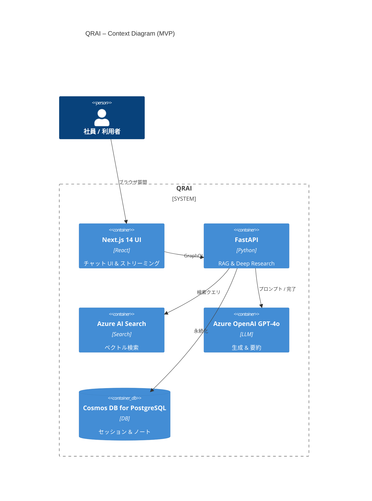

# QRAI アーキテクチャ概要

> **目的** — この `architecture` フォルダーの案内役として、開発・レビュー参加者が最初に読めば全体像と詳細ドキュメントへの入り口を把握できるようにする。

---

## 1. "いきなり俯瞰" C4 Context 図

> *Mermaid 表示に対応した環境 (GitHub / VS Code + Mermaid 拡張) では下図がレンダリングされます。手元で図が見えない場合は 2 章の手順を参照してください。*



---

## 2. 図をレンダリングする方法

| 方法                   | 手順                                                                                               |
| -------------------- | ------------------------------------------------------------------------------------------------ |
| **GitHub**           | ファイルを push してリポジトリをブラウザで開くだけで Mermaid 図が自動描画されます。                                                |
| **Cursor / VS Code** | 拡張「Markdown Preview Mermaid Support」(bierner.markdown-mermaid) をインストールし `Ctrl+Shift+V` でプレビュー。   |
| **CLI 出力**           | `npm i -g @mermaid-js/mermaid-cli` → `mmdc -i diagram_src/context.mmd -o context.svg` で SVG を生成。 |

> 生成された SVG / PNG を Markdown 内にリンクする運用も可能です。CI で自動生成する場合は `diagram_src/*.mmd` を入力とし、SVG はコミット対象から除外すると差分が軽く済みます。

---

## 3. 詳細ドキュメント一覧

| ファイル                                                           | 内容                                 |
| -------------------------------------------------------------- | ---------------------------------- |
| **[context.md](context.md)**                                   | C4 Context 図（利用者・外部システムの俯瞰）        |
| **[container.md](container.md)**                               | C4 Container 図（主要コンテナ＋依存関係）        |
| **[component\_rag.md](component_rag.md)**                      | RAG サービスクラス／シーケンス詳細                |
| **[component\_deep\_research.md](component_deep_research.md)** | Deep Research エージェント DAG & ループ詳細   |
| **[component\_api.md](component_api.md)**                      | FastAPI + GraphQL API レイヤ設計         |
| **[error\_handling.md](error_handling.md)**                    | 包括的エラーハンドリング戦略・フォールバック・監視       |
| **[performance\_monitoring.md](performance_monitoring.md)**    | パフォーマンス監視・ログ・トレース・アラート体系        |
| **[test\_strategy.md](test_strategy.md)**                      | テストピラミッド・ユニット/統合/E2E/負荷テスト戦略    |
| **[cost\_management.md](cost_management.md)**                  | コスト最適化・予算管理・無料枠活用・段階的拡張戦略      |
| **[runtime.md](runtime.md)**                                   | 時系列シーケンス／状態遷移図                     |
| **[deployment.md](deployment.md)**                             | C4 Deployment 図＋Terraform/Bicep 概要 |
| **[data\_model.md](data_model.md)**                            | ER 図・パーティション設計                     |
| **[crosscutting.md](crosscutting.md)**                         | 運用・セキュリティ・NFR まとめ                  |
| **[開発者オンボーディング](../developer_onboarding.md)**                | 新規開発者向け15分セットアップガイド               |
| **[環境設定の詳細](../environment_setup.md)**                        | 開発/ステージング/本番環境の設定差分・命名規則         |
| **[adr\_index.md](../adr_index.md)**                           | ADR 一覧へのリンク（docs/adr/）             |

---

## 4. Mermaid ソース (`diagram_src/`)

```
architecture/
  diagram_src/
    context.mmd
    container.mmd
    runtime.mmd
    ...
```

* `*.mmd` ファイルは人間が編集しやすいシングル図のソース。
* CI / 手元 CLI で SVG に変換し、必要ならドキュメント内に画像として埋め込み。

---

## 5. 更新ポリシー (ベストプラクティス)

1. **構造が変わったら図を更新** — コード変更 PR に図の差分を含める。
2. **命名は PascalCase / 英語** — C4 の推奨に従う。
3. **Mermaid 11 系で互換維持** — GitHub / VS Code の既定バージョン。

> ***Tip:*** 大きな図は細分化し `component_*.md` へ切り出すとレビューやバイブコーディングが容易になります。

---

*Last updated: 2025‑06‑03*
