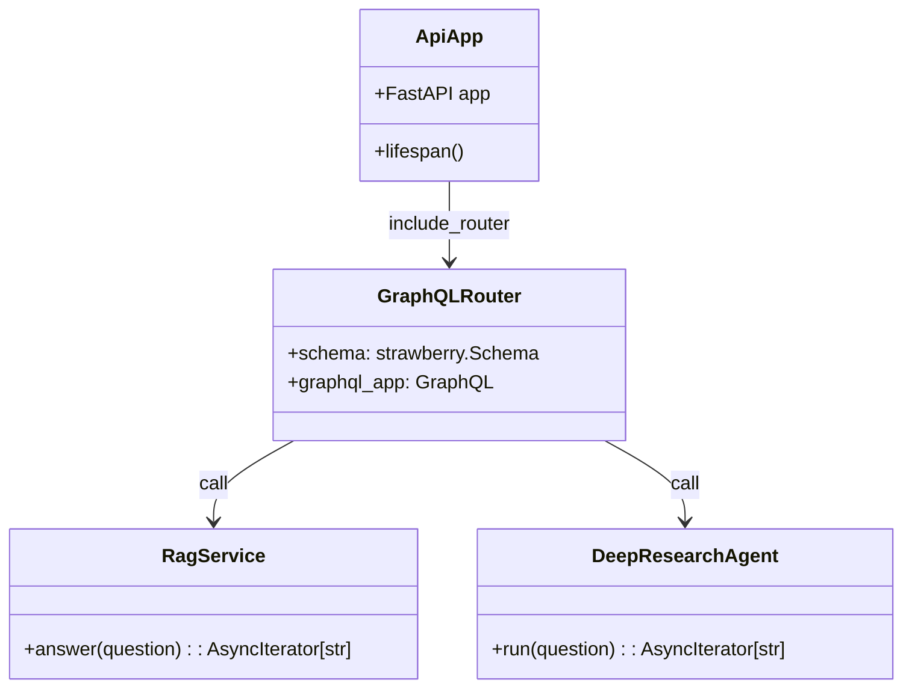

# API コンポーネント設計 – FastAPI + Strawberry GraphQL

> **目的** — バックエンド API サービス（FastAPI **v0.110+**、GraphQL ルーターは **Strawberry**）の内部構造・ライフサイクル・ミドルウェア構成を明確化し、保守・追加機能の開発をスムーズにする。

---

## 1. 概要

* **エントリポイント**: `main.py`
* **ASGI サーバ**: `uvicorn` (dev), `gunicorn -k uvicorn.workers.UvicornWorker` (Container App)
* **GraphQL** エンドポイント: `/graphql` (HTTP POST) / `/graphql/stream` (SSE over HTTP)
* REST は `/health`, `/metrics` のみ expose。

---

## 2. フォルダ構成（`backend/`）

```text
backend/
  main.py                # FastAPI app factory
  api/
    graphql_schema.py    # Strawberry type defs & resolvers
    middleware.py        # CORS, Auth, RateLimit
    deps.py              # Depends() 定義
  services/
    rag.py               # RagService
    deep_agent.py        # DeepResearchAgent
  infra/
    search_client.py     # Azure AI Search helper
    openai_client.py     # Azure OpenAI helper
    db.py                # SQLAlchemy async engine
  config.py              # Pydantic BaseSettings
```

---

## 3. クラス図（High‑level）



---

## 4. ミドルウェアスタック

| 順序 | ミドルウェア                        | 役割                        | 実装パッケージ               |
| -- | ----------------------------- | ------------------------- | --------------------- |
| 1  | `structlog` Logging           | JSON 構造ログ出力・trace\_id 付与  | `structlog`, `loguru` |
| 2  | `TrustedHost`                 | Host ヘッダチェック              | FastAPI built‑in      |
| 3  | `CORSMiddleware`              | `*.staticapps.net` のみ許可   | FastAPI built‑in      |
| 4  | **AuthMiddleware (optional)** | Azure AD OIDC トークン検証      | `python‑jose`, `msal` |
| 5  | **RateLimitMiddleware**       | 20 req/min/IP (free tier) | `slowapi`             |
| 6  | `GZipMiddleware`              | 1 KiB 以上レスポンス圧縮           | FastAPI built‑in      |

> Dev 環境では Auth をスキップ可。RateLimit の設定については **[../environment_setup.md](../environment_setup.md)** を参照してください。

---

## 5. Lifespan & Dependency Injection

```python
@app.on_event("startup")
async def startup():
    await db.init_async_engine()
    search_client = init_ai_search()
    openai_client = init_openai()
    app.state.clients = {"search": search_client, "openai": openai_client}
```

* **依存注入**: `Depends(get_clients)` で Service 層にクライアント共有。
* **shutdown**: エンジン dispose／HTTP セッション close。

---

## 6. GraphQL Resolver ポリシー

| 種別           | 名前             | ハンドラー                       | 返却型                   |
| ------------ | -------------- | --------------------------- | --------------------- |
| Query        | `sessions`     | `get_sessions()`            | `[Session]`           |
| Mutation     | `ask`          | `ask_rag()` or `ask_deep()` | `AskPayload`          |
| Subscription | `streamAnswer` | `stream_answer()`           | `AsyncGenerator[str]` |

`ask_mutation` は `deepResearch` 引数でルート切替。ストリーミングは Strawberry の `@strawberry.subscription` + `graphql‑sse` プロトコル。

---

## 7. エラーハンドリング

包括的なエラーハンドリング戦略については **[error_handling.md](error_handling.md)** を参照してください。

API レイヤでの基本的な例外キャッチと GraphQL エラーレスポンス変換のみを担当し、具体的なリトライ・フォールバック戦略は各サービス層で実装します。

---

## 8. パフォーマンス指針

* **Async** すべての外部 I/O (`httpx.AsyncClient`, `asyncpg`)。
* **Worker 数**: `uvicorn --workers $(nproc)` (Container App scales)。
* **Caching**: In‑process LRU 256 entries for embedding vector cache (TODO redis option)。

---

## 9. セキュリティ TODO（prod）

* **mTLS** between Container App and AI Search via Private Endpoint。
* **GraphQL Depth Limit** 10, Complexity Limit 1000 (plugin)。

## 10. テスト戦略

詳細なテスト戦略（ユニット・統合・E2E・負荷テスト）については **[test_strategy.md](test_strategy.md)** を参照してください。

API コンポーネントに関連する主要テストアプローチ：

| レイヤ            | ツール                               | 目的                                                                                 |
| -------------- | --------------------------------- | ---------------------------------------------------------------------------------- |
| **ユニット / ルータ** | `pytest` + **FastAPI TestClient** | 依存をモックし、RAG・DeepResearchResolver が期待 JSON を返すか 50 ms 以内で検証                         |
| **負荷・回線コスト**   | **Locust** (Python)               | 無料枠 Container App の QPS 上限 ≈ 20 RPS を越えないかシナリオ試験。シナリオ例: 5 ユーザ同時 / 1 msg s⁻¹ で 5 分間 |

```