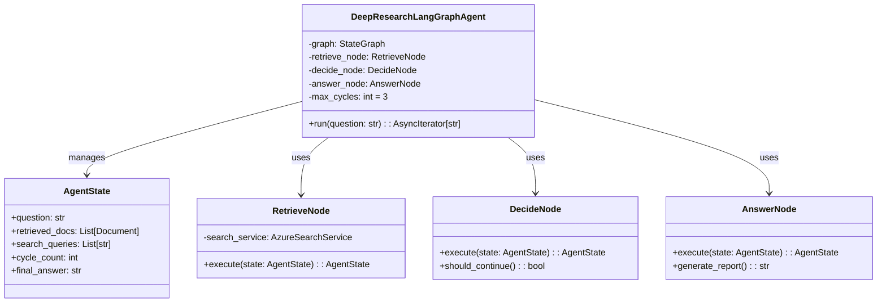
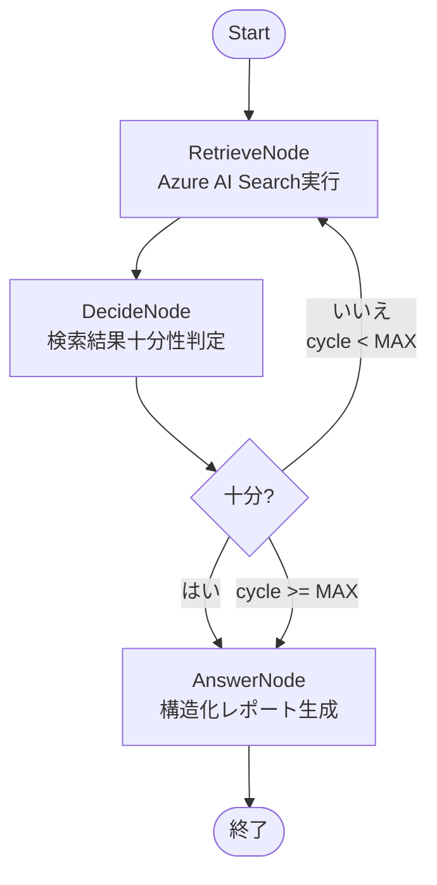
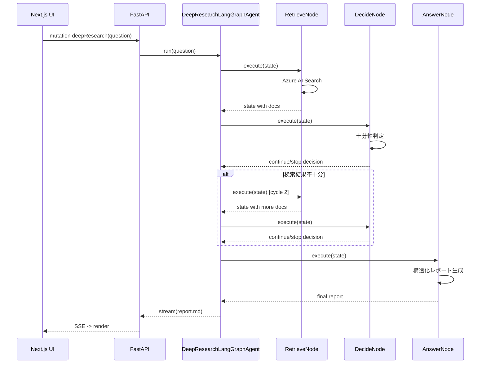

# DeepResearchLangGraphAgent コンポーネント設計

> **目的** — LangGraph Agentic RAGを使用した多段階リサーチ（Deep Research）機能を担う `DeepResearchLangGraphAgent` の内部ロジック・状態遷移・エラー処理を定義し、実装とテストの指針を提供する。

---

## 1. エージェントの役割と特徴

* **Retrieve → Decide → Answer** の3ノードをLangGraph StateGraphで管理。
* Agentic RAG方式で「検索 → 十分性判定 → 回答/追加検索」循環を最大 `MAX_CYCLES` 回繰り返し、**コスト最適化**を実現。
* 検索ツールは **Azure AI Search** を使用し、関連性スコアによる品質管理。
* 中間ノートを `research_notes` テーブルへ保存し、監査・再利用を容易にする。

---

## 2. クラス図

---

## 3. 状態遷移 (LangGraph StateGraph)

---

## 4. シーケンス図（UI とのやり取り）

---

## 5. パラメータ

| 名称               | 既定値      | 説明                            |
| ---------------- | -------- | ----------------------------- |
| `MAX_CYCLES`     | 3        | Retrieve-Decide循環の最大回数上限 |
| `RELEVANCE_THRESHOLD` | 0.7      | 検索結果の関連性スコア閾値                |
| `MIN_DOCS_COUNT` | 5        | DecideNodeが「十分」と判定する最小ドキュメント数              |
| `REPORT_STYLE`   | Markdown | UI に表示する最終レポート書式              |

---

## 6. エラーハンドリング

詳細なエラーハンドリング戦略については **[error_handling.md](error_handling.md)** を参照してください。

LangGraph Deep Research特有の考慮事項:
- **RetrieveNodeが0件**: DecideNodeで即座にAnswerNodeへ遷移
- **DecideNodeタイムアウト**: 現在の検索結果でAnswerNodeへ強制遷移
- **AnswerNodeエラー**: 部分的な結果で簡易レポートを生成
- **MAX_CYCLES到達**: 強制的にAnswerNodeへ遷移し、収集済み情報でレポート生成

---

## 7. 監査・トレーサビリティ

* `research_notes` テーブルに `node_name`, `cycle_no`, `retrieved_docs`, `decision_reason`, `final_report` を保存。
* 各ノード実行結果を記録し、デバッグ・改善に活用。
* PII を含まず、セッション毎にパーティションしクエリ削除を容易に。

---

## 8. パフォーマンス・コスト最適化

* **DecideNode最適化**: 検索結果十分性を適切に判定し、不要な検索を回避。
* **並列検索**: RetrieveNodeで複数クエリを `asyncio.gather` で同時実行。
* **トークン効率**: AnswerNodeで必要最小限の情報のみを使用してレポート生成。
* **キャッシュ活用**: 同一質問の検索結果をセッション内でキャッシュ。

---

*Last updated: 2025‑06‑12*
