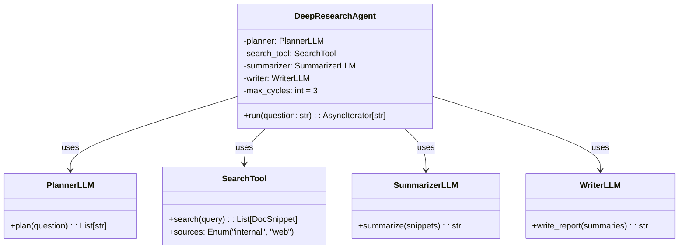
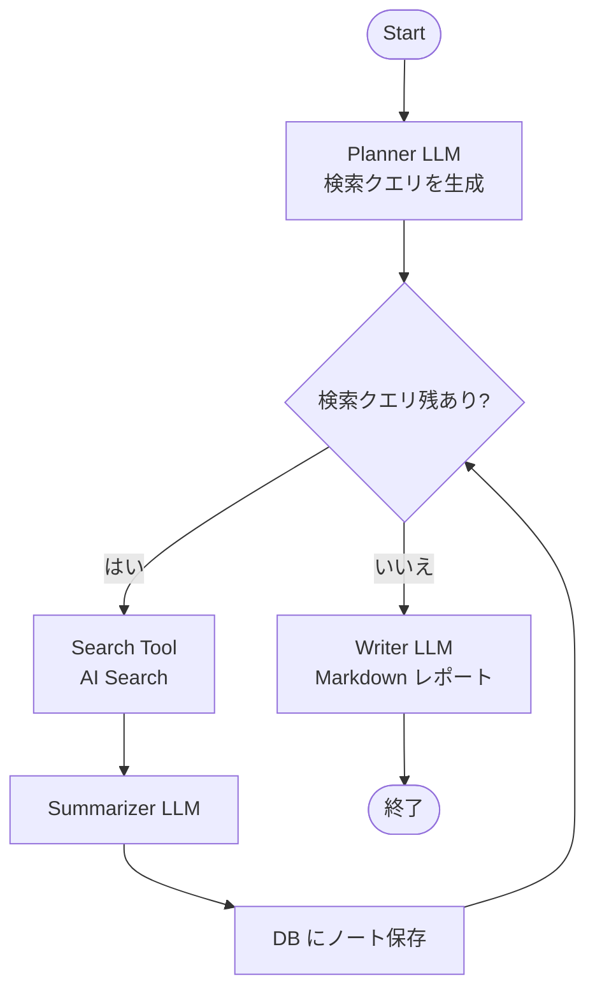
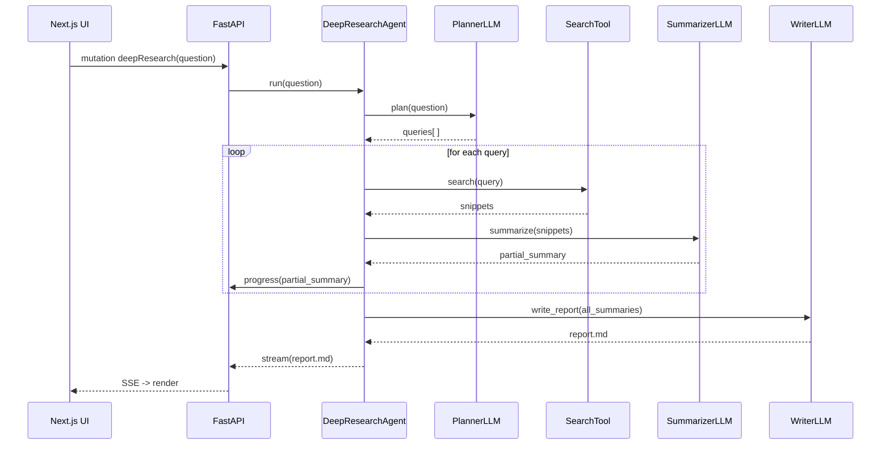

# DeepResearchAgent コンポーネント設計

> **目的** — 多段階リサーチ（Deep Research）機能を担う `DeepResearchAgent` の内部ロジック・状態遷移・エラー処理を定義し、実装とテストの指針を提供する。

---

## 1. エージェントの役割と特徴

* **Planner → Search → Summarizer → Writer** の 4 ステージを LangGraph DAG で管理。
* ReAct 方式で「Thought → Action → Observation」ループを最大 `MAX_CYCLES` 回繰り返し、**知識ギャップを自己評価**して追加検索を実行。
* 検索ツールは **Azure AI Search** を既定に、将来拡張で外部 Web 検索もプラグイン可能。
* 中間ノートを `research_notes` テーブルへ保存し、監査・再利用を容易にする。

---

## 2. クラス図

---

## 3. 状態遷移 (LangGraph DAG)

---

## 4. シーケンス図（UI とのやり取り）

---

## 5. パラメータ

| 名称               | 既定値      | 説明                            |
| ---------------- | -------- | ----------------------------- |
| `MAX_CYCLES`     | 3        | Planner が生成したクエリ数を超えないループ回数上限 |
| `SUMMARY_TOKENS` | 512      | 各チャンク要約のトークン上限                |
| `REPORT_STYLE`   | Markdown | UI に表示する最終レポート書式              |

---

## 6. エラーハンドリング

詳細なエラーハンドリング戦略については **[error_handling.md](error_handling.md)** を参照してください。

Deep Research特有の考慮事項:
- **Plannerが空クエリ**: 即終了し "詳細調査不要" メッセージを返却
- **SearchToolが0件**: 当該ステップをスキップし、次のクエリへ進行  
- **ステップタイムアウト**: 部分的な結果で最終レポートを生成

---

## 7. 監査・トレーサビリティ

* `research_notes` テーブルに `step_no`, `query`, `summary_md`, `sources` を保存。
* PII を含まず、セッション毎にパーティションしクエリ削除を容易に。

---

## 8. パフォーマンス

* 各クエリ要約は `asyncio.gather` で並列実行しレイテンシ削減。
* Planner プロンプトに「検索クエリは最大 3 件」と明示して無限ループ防止。

---

*Last updated: 2025‑06‑03*
