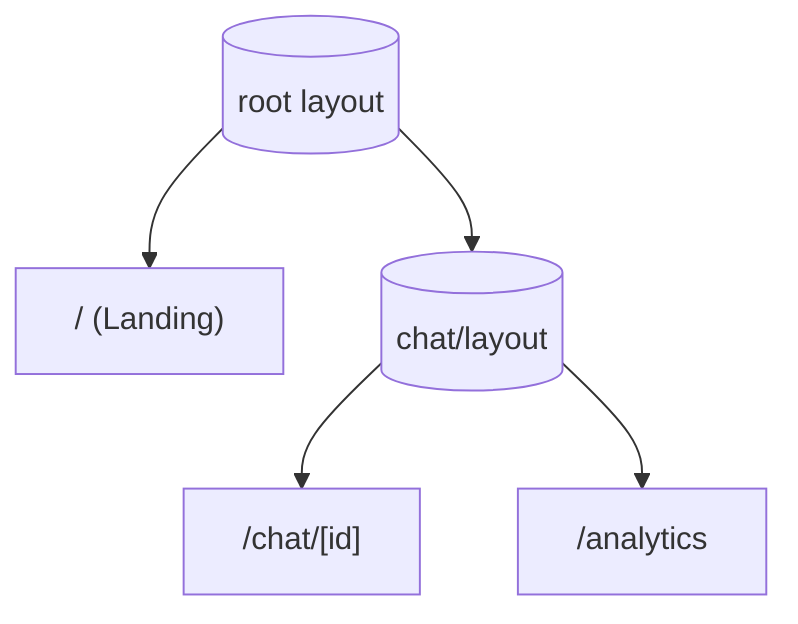
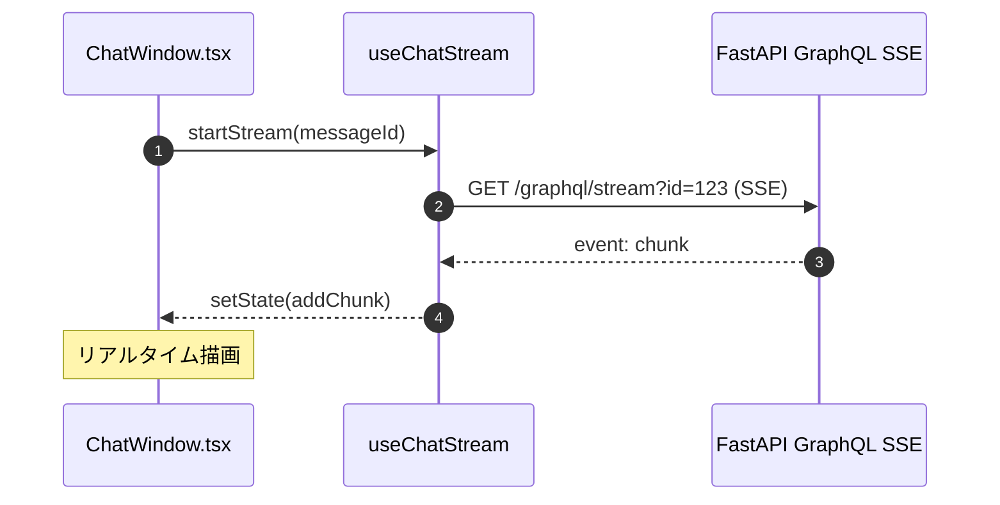
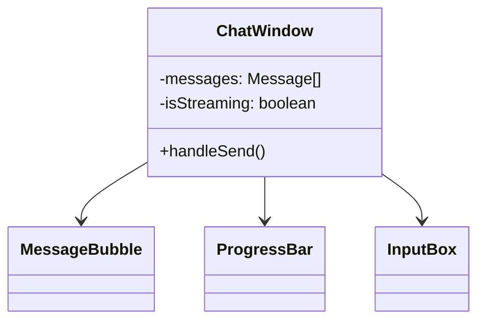

# Frontend コンポーネント設計 – Next.js 14 UI

> **目的** — フロントエンド（Next.js 14 App Router）のフォルダー構成・ページ遷移・状態管理・ストリーミング受信フローをまとめ、実装者がページ追加やリファクタ時に迷わないようにする。

---

## 1. ディレクトリ構成（`src/`）

```text
src/
  app/                 # Next.js 14 App Router ディレクトリ
    layout.tsx         # ルートレイアウト
    page.tsx           # トップページ
    chat/
      layout.tsx       # チャット共通レイアウト (Sidebar)
      [id]/page.tsx    # /chat/[sessionId] 動的ルート
    analytics/page.tsx # KPI ダッシュボード (将来追加)

  components/
    ChatWindow.tsx
    MessageBubble.tsx
    Sidebar.tsx
    ProgressBar.tsx

  components/ui/       # shadcn/ui 自動生成フォルダ
    Button.tsx
    Card.tsx
    Dialog.tsx

  hooks/
    useChatStream.ts
    useSessionList.ts

  lib/
    graphqlClient.ts
    constants.ts
```

> 上記は **Mermaid Gantt** ではなく、プレーンテキストのツリー表記に変更。Mermaid パーサエラーを回避し、GitHub/VS Code でそのまま閲覧可能にしました。

## 2. ページ & レイアウトツリー. ページ & レイアウトツリー



* `chat/layout.tsx` が **Sidebar + <Outlet />** を提供し、`ChatPage` がメインウィンドウ。
* `Analytics` は後付けの KPI 画面、同じレイアウトを再利用。

---

## 3. データ取得 & キャッシュ

| データ              | 取得 Hook                 | キャッシュ戦略                               |
| ---------------- | ----------------------- | ------------------------------------- |
| セッション一覧          | `useSessionList()`      | SWR key: `"/sessions?user=…"`, 1 分再検証 |
| メッセージストリーム       | `useChatStream()`       | SSE＋`useEventSource`、履歴は SWR fallback |
| Deep Research 進捗 | `useChatStream()` サブタイプ | SSE Event: `progress` を Context で配信   |

> **SWR + GraphQL** — `graphql-request` クライアントを `swr` の fetcher に設定し型安全 (`codegen`)。

---

## 4. ストリーミング受信フロー & パフォーマンス

### 4‑1 シーケンス図



### 4‑2 メモリリーク防止 (Abort)

* `useChatStream` 内で **AbortController** を保持し、`return () => controller.abort()` でアンマウント時に接続を閉じる。これにより Next.js の Hot Reload やタブクローズ時に **Idle SSE が残存しない**。([reddit.com](https://www.reddit.com/r/nextjs/comments/1f4ay40/server_sent_events/?utm_source=chatgpt.com))

### 4‑3 メッセージ **Virtualization**

* 長いチャット履歴 (>1k msg) の DOM 負荷を抑えるため、`react-virtuoso` or `react-window` を利用して **可視範囲のみレンダリング**。([medium.com](https://medium.com/%40ignatovich.dm/virtualization-in-react-improving-performance-for-large-lists-3df0800022ef?utm_source=chatgpt.com), [getstream.io](https://getstream.io/chat/docs/sdk/react/components/core-components/virtualized_list/?utm_source=chatgpt.com))
* shadcn/ui の `ScrollArea` をラップして実装するとデザイン整合が取れる。

### 4‑4 GraphQL over SSE ライブラリ

* `graphql-sse` クライアントを `useChatStream` に組み込み、WebSocket ではなく **SSE + Fetch** で Subscription を実現。([the-guild.dev](https://the-guild.dev/graphql/hive/blog/graphql-over-sse?utm_source=chatgpt.com), [wundergraph.com](https://wundergraph.com/blog/deprecate_graphql_subscriptions_over_websockets?utm_source=chatgpt.com))

---

## 5. コンポーネント階層 (抜粋). コンポーネント階層 (抜粋)



* **MessageBubble** は `role` に応じてスタイル分岐。
* **ProgressBar** は Deep Research 中のみ表示。

---

## 6. スタイリング & UX ポリシー

* **Tailwind CSS × shadcn/ui** を採用。Tailwind のユーティリティに加え、shadcn/ui の `Button`, `Card`, `Dialog` などリッチコンポーネントを利用して開発速度を向上。
* プロジェクトルートの `components/ui` フォルダーに shadcn 生成コマンド `npx shadcn-ui@latest add button card dialog` で配置。
* **ブランドカラー**: `from-blue-500 to-purple-600` グラデを基調に、shadcn テーマトークンを上書き (`tailwind.config.ts` の `extend.colors`)。
* **レスポンシブ**: shadcn/ui は Radix UI ベースなのでアクセシビリティ対応済み。モバイルでは `Sheet` コンポーネントで Sidebar をドロワー表示。
* **アクセシビリティ**: `aria-live="polite"` を `ChatWindow` に設定しストリーム更新を読み上げ。

## 7. テスト戦略

詳細なテスト戦略については **[test_strategy.md](test_strategy.md)** を参照してください。

フロントエンド固有のテストアプローチ：

* **unit**: `vitest` + React Testing Library (`MessageBubble` DOM)
* **e2e**: `Playwright` でチャット送信 → ストリーム表示検証
* **lint**: ESLint + Stylelint + markdownlint (docs)

---

## 8. 未来の TODO

* **Service Worker** でオフラインキャッシュ
* **React Server Components** への段階移行 (Next.js 14)
* **PWA** 対応とモバイルホーム画面アイコン

---

*Last updated: 2025-06-03*
