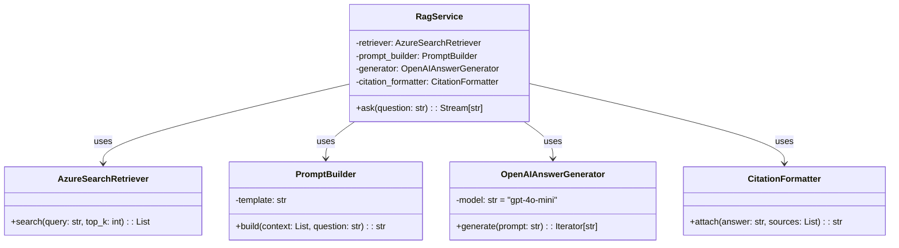
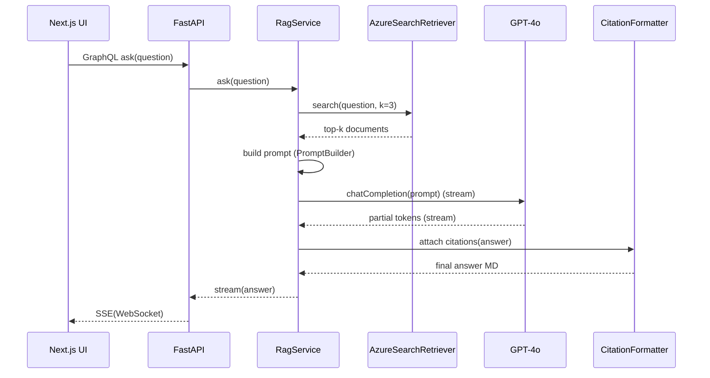

# RagService コンポーネント設計

> **目的** — Retrieval‑Augmented Generation (RAG) パイプラインを FastAPI 内の `RagService` として実装する際の内部構造・データフロー・パラメータを明確化し、実装・テスト・パフォーマンスチューニングの指針を共有する。

---

## 1. コンポーネント概要

| レイヤ                  | クラス / モジュール             | 主要責務                                                                                                                                                                                                   |
| -------------------- | ----------------------- | ------------------------------------------------------------------------------------------------------------------------------------------------------------------------------------------------------ |
| **Controller**       | `RagService` (Facade)   | API から呼び出され、検索→生成→整形の全工程を連携                                                                                                                                                                            |
| **Retrieval**        | `AzureSearchRetriever`  | Azure AI Search に top‑k ベクトル / キーワード検索を実行し、関連チャンクを返却 ([learn.microsoft.com](https://learn.microsoft.com/en-us/azure/search/retrieval-augmented-generation-overview?utm_source=chatgpt.com))            |
| **Prompting**        | `PromptBuilder`         | System / Instruction / Context / Question のテンプレートを組み立て、LLM へ渡す ([python.langchain.com](https://python.langchain.com/docs/tutorials/rag/?utm_source=chatgpt.com))                                       |
| **Generation**       | `OpenAIAnswerGenerator` | GPT‑4o へ prompt を送信し、ストリーミングで回答を受信 ([github.com](https://github.com/Azure-Samples/azure-search-openai-demo?utm_source=chatgpt.com))                                                                    |
| **Citation**         | `CitationFormatter`     | 各チャンクの URL / タイトルを脚注番号で付与し Markdown に整形 ([learn.microsoft.com](https://learn.microsoft.com/en-us/answers/questions/1375673/how-to-return-citations-with-azure-openai-api-resp?utm_source=chatgpt.com)) |
| **Cache (optional)** | `VectorCache`           | embedding を Redis 等に保存し検索コストを削減（NFR 拡張） ([medium.com](https://medium.com/%40sujith.adr/simple-retrieval-augmented-generation-rag-application-with-langchain-27781379c6cc?utm_source=chatgpt.com))      |

> Microsoft Learn と LangChain のチュートリアルは、Retriever → PromptBuilder → LLM の 3 層を推奨構成としています ([learn.microsoft.com](https://learn.microsoft.com/en-us/azure/search/retrieval-augmented-generation-overview?utm_source=chatgpt.com), [js.langchain.com](https://js.langchain.com/docs/tutorials/rag/?utm_source=chatgpt.com))。

---

## 2. クラス図

---

## 3. シーケンス図（RAG 応答フロー）

---

## 4. 主要パラメータと環境変数

| 名称            | 既定値                      | 説明                                                                                                                                                                                            |
| ------------- | ------------------------ | --------------------------------------------------------------------------------------------------------------------------------------------------------------------------------------------- |
| `TOP_K`       | 3                        | Retriever のヒット件数 ([ibm.com](https://www.ibm.com/architectures/patterns/genai-rag?utm_source=chatgpt.com))                                                                                     |
| `EMBED_MODEL` | `text-embedding-ada-002` | AI Search インデックス作成時の埋め込みモデル                                                                                                                                                                   |
| `GPT_MODEL`   | `gpt-4o-mini`            | 回答生成モデル ([learn.microsoft.com](https://learn.microsoft.com/en-us/azure/ai-services/document-intelligence/concept/retrieval-augmented-generation?view=doc-intel-4.0.0&utm_source=chatgpt.com)) |
| `TEMPERATURE` | 0.2                      | LLM 温度設定（ factual 回答を優先）                                                                                                                                                                      |
| `MAX_TOKENS`  | 1024                     | 生成トークン上限                                                                                                                                                                                      |

詳細な環境変数管理と設定については **[../environment_setup.md](../environment_setup.md)** を参照してください。

---

## 5. エラーハンドリング & リトライ

詳細なエラーハンドリング戦略については **[error_handling.md](error_handling.md)** を参照してください。

RAG特有の考慮事項:
- **検索結果0件**: "該当文書が見つかりませんでした" を返却（HTTP 204）
- **プロンプト構築エラー**: 最小限のコンテキストで回答生成を試行
- **引用整形失敗**: 引用なしの回答として出力

---

## 6. パフォーマンス・コスト考慮

* **top‑k = 3** 以上の場合、回答精度は上がるが Prompt サイズが増えトークン課金が上がる ([ibm.com](https://www.ibm.com/architectures/patterns/genai-rag?utm_source=chatgpt.com))。
* **ストリーミング** により先頭トークン 1 秒以内表示を実現し UX 向上 (NFR‑01)。
* **VectorCache** 導入時は Cache Hit 70% 以上を目標にし、未ヒット時のみ AI Search を呼び出す。

---

## 7. 参考実装 / 資料

| 資料                                                                                                                                                                                              | ポイント                          |
| ----------------------------------------------------------------------------------------------------------------------------------------------------------------------------------------------- | ----------------------------- |
| Azure Search + OpenAI Demo (GitHub) ([github.com](https://github.com/Azure-Samples/azure-search-openai-demo?utm_source=chatgpt.com))                                                            | RagService に近い構造のサンプルコード      |
| Microsoft Learn RAG Overview ([learn.microsoft.com](https://learn.microsoft.com/en-us/azure/search/retrieval-augmented-generation-overview?utm_source=chatgpt.com))                             | 検索+生成の推奨アーキとガイドライン            |
| LangChain RAG Tutorial ([python.langchain.com](https://python.langchain.com/docs/tutorials/rag/?utm_source=chatgpt.com))                                                                        | Retriever→Prompt→LLM の 3 層構成例 |
| IBM RAG Pattern ([ibm.com](https://www.ibm.com/architectures/patterns/genai-rag?utm_source=chatgpt.com))                                                                                        | RAG パターンのマイクロサービス分割指針         |
| RAG Solution Design Guide (Azure) ([learn.microsoft.com](https://learn.microsoft.com/en-us/azure/architecture/ai-ml/guide/rag/rag-solution-design-and-evaluation-guide?utm_source=chatgpt.com)) | エラーハンドル・評価指標の詳細               |

---

*Last updated: 2025‑06‑03*
