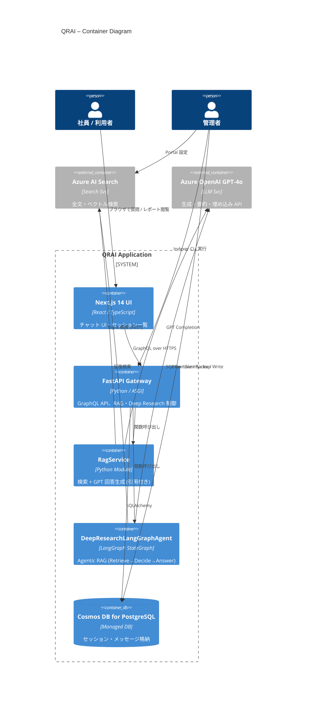

# C4 Container 図 – QRAI

> **目的** — QRAI 内部をデプロイ単位で分割し、外部依存（PaaS）は灰色で区別する。内部詳細は Component 図以降へ委譲。

---

## 1. Mermaid 図

---

## 2. コンテナ説明

| 種別           | コンテナ              | スタック            | 主な責務                  |
| ------------ | ----------------- | --------------- | --------------------- |
| **Internal** | Next.js UI        | React 18, SWR   | チャット入力・ストリーミング・履歴閲覧   |
|              | FastAPI Gateway   | FastAPI+GraphQL | 認証、RAG・DR モジュール呼び出し   |
|              | RagService        | Python          | AI Search & GPT で回答生成 |
|              | DeepResearchLangGraphAgent | LangGraph StateGraph | Retrieve / Decide / Answer ノード  |
|              | Cosmos DB (PG)    | PaaS            | 永続化                   |
| **External** | Azure AI Search   | PaaS            | 文書検索 API              |
|              | Azure OpenAI      | PaaS            | 生成・要約・埋め込み            |

---

## 3. 開発と運用視点

* **内外分離** — PaaS を `Container_Ext` として灰色表示し、責務と管理範囲を明確化。
* **スケールパス** — RagService / AgentService は将来独立コンテナへ分離し易い構成。
* **コスト管理** — 外部 PaaS への呼び出し回数を RagService で一元制御。

---

*Last updated: 2025‑06‑03*
