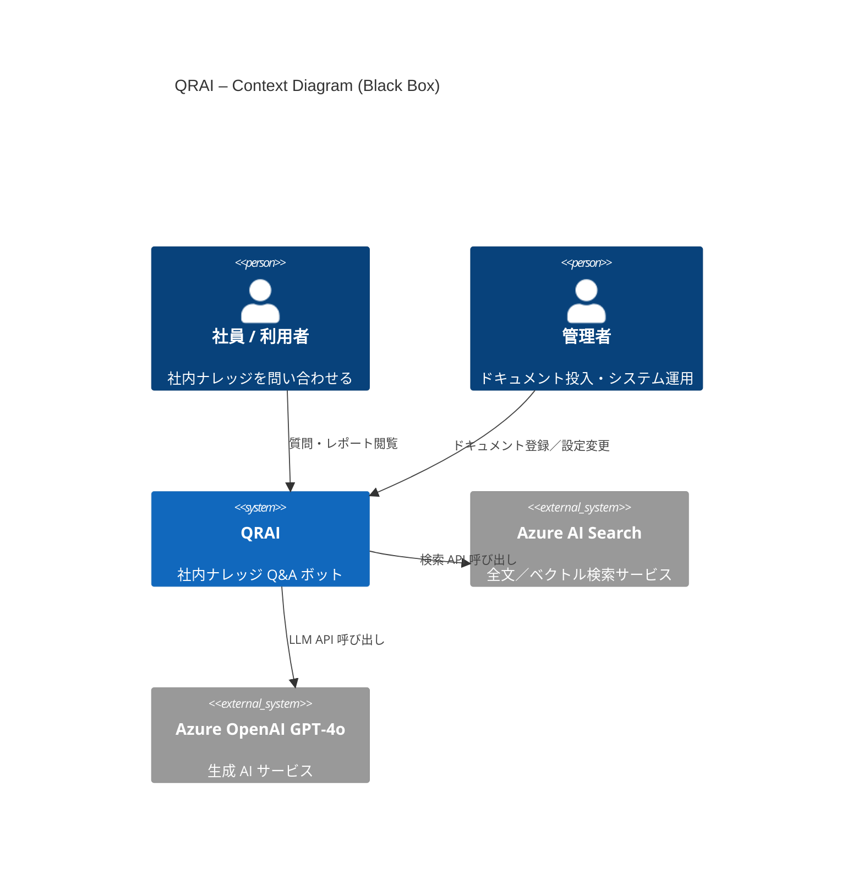

# C4 Context 図 – QRAI

> **目的** — QRAI を 1 つの黒箱システムとして捉え、誰が利用し、どの外部サービスに依存しているかを示す。内部構成は Container 図以降へ委任。

---

## 1. Mermaid 図

---

## 2. ステークホルダー

| ステークホルダー     | 関心事                  |
| ------------ | -------------------- |
| **社員 / 利用者** | 正確さ・引用・応答速度          |
| **管理者**      | インデックス更新、無料枠コスト、監査ログ |

---

## 3. 外部依存サービス

| サービス                    | 役割                   | Free Tier 設定       |
| ----------------------- | -------------------- | ------------------ |
| **Azure AI Search**     | ドキュメント検索 (全文 + ベクトル) | `Basic (Free)` SKU |
| **Azure OpenAI GPT‑4o** | 文章生成・要約・埋め込み         | `gpt-4o-mini` デプロイ |

---

*内部コンテナの責務と通信は [container.md](container.md) を参照してください。*

*Last updated: 2025‑06‑03*
