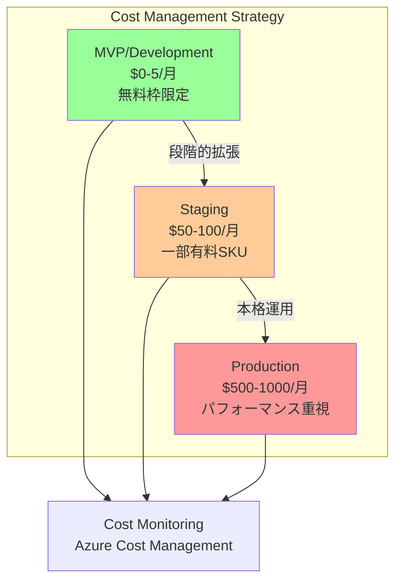

# コスト管理・最適化戦略 – QRAI

> **目的** — Azure 無料枠を最大活用したコスト最適化戦略を定義し、開発・ステージング・本番環境での予算管理・使用量監視・コスト最適化を体系化する。MVP フェーズでの $5/月目標から本番環境での拡張性まで段階的にコスト戦略を構築。

---

## 1. コスト戦略概要

### 1-1 環境別コスト目標



### 1-2 コスト管理原則

| 原則                | MVP              | Staging          | Production       |
| ----------------- | ---------------- | ---------------- | ---------------- |
| **無料枠最大活用**       | 100% 無料枠のみ      | 80% 無料枠 + 20% 有料 | 20% 無料枠 + 80% 有料 |
| **予算アラート**        | $5 閾値 80%        | $100 閾値 80%     | $1000 閾値 90%    |
| **リソース自動削除**      | 24時間後自動停止      | 週末自動停止          | 本番継続運用          |
| **スケール戦略**        | 手動スケール          | 制限付きオートスケール     | フルオートスケール       |
| **監視粒度**          | 日次コストレポート       | 時間単位監視          | リアルタイム監視        |

---

## 2. Azure 無料枠活用戦略

### 2-1 利用可能な無料枠リソース

| サービス                   | 無料枠制限                                      | QRAI での使用                           | 月額推定コスト    |
| ---------------------- | ------------------------------------------ | ----------------------------------- | ---------- |
| **Container Apps**     | 180,000 vCPU秒、360,000 GiB秒/月               | FastAPI + Next.js ホスティング            | $0         |
| **Azure AI Search**    | F1: 50MB ストレージ、3 QPS                       | ドキュメント検索インデックス                    | $0         |
| **Azure OpenAI**       | 無料枠なし（従量課金）                                | GPT-4o-mini: $0.15/1M tokens       | $1-3       |
| **Cosmos DB for PG**  | 32GB ストレージ、400 RU/s                        | セッション・メッセージ・ノートストレージ               | $0         |
| **Static Web Apps**    | 100GB 転送/月                                  | 将来的なフロントエンド配信（現在は Container Apps） | $0         |
| **Azure Monitor**      | 5GB ログ取り込み/月                               | パフォーマンス・エラー監視                     | $0         |
| **Storage Account**    | 5GB LRS、20,000 トランザクション/月                 | バックアップ・静的ファイル                     | $0         |

**合計推定コスト**: **$1-5/月** (主に Azure OpenAI Token 使用量に依存)

### 2-2 無料枠制限と対策

| 制限項目                  | 制限値              | 対策                                        | 監視アラート        |
| --------------------- | ---------------- | ----------------------------------------- | ------------- |
| **AI Search ストレージ**   | 50MB             | ドキュメント圧縮、古いインデックス削除、分割インデックス戦略         | > 45MB        |
| **AI Search QPS**     | 3 QPS            | リクエスト制御、キャッシュ戦略、Rate Limiting実装      | > 2.5 QPS     |
| **Cosmos DB ストレージ**  | 32GB             | 古いセッション TTL 削除、データ圧縮                  | > 28GB        |
| **OpenAI Token**      | 無制限（従量課金）        | トークン使用量監視、プロンプト最適化、キャッシュ戦略           | > 50K/日      |
| **Container Apps**    | 180K vCPU秒/月     | オートスケール設定最適化、アイドル時間の短縮               | > 150K vCPU秒  |
| **Log Analytics**     | 5GB/月            | ログレベル最適化、重要ログのみ取り込み、ローテーション設定       | > 4GB/月       |

---

## 3. IaC コスト制御

### 3-1 Terraform コスト変数

```hcl
# variables.tf
variable "is_free_tier" {
  description = "Force free tier SKUs only"
  type        = bool
  default     = true
}

variable "environment" {
  description = "Environment (dev/staging/prod)"
  type        = string
  default     = "dev"

  validation {
    condition = contains(["dev", "staging", "prod"], var.environment)
    error_message = "Environment must be dev, staging, or prod."
  }
}

variable "cost_budget_limit" {
  description = "Monthly cost budget limit in USD"
  type        = number
  default     = 5
}

# locals.tf
locals {
  # 無料枠制限の強制
  ai_search_sku = var.is_free_tier ? "free" : (
    var.environment == "prod" ? "standard" : "basic"
  )

  openai_model = var.is_free_tier ? "gpt-4o-mini" : "gpt-4"

  container_cpu = var.is_free_tier ? 0.25 : (
    var.environment == "prod" ? 2.0 : 1.0
  )

  container_memory = var.is_free_tier ? "0.5Gi" : (
    var.environment == "prod" ? "4Gi" : "2Gi"
  )
}
```

### 3-2 リソース定義例

```hcl
# ai_search.tf
resource "azurerm_search_service" "main" {
  name                = "search-qrai-${var.environment}"
  resource_group_name = azurerm_resource_group.main.name
  location           = azurerm_resource_group.main.location
  sku                = local.ai_search_sku

  # 無料枠の場合は replica/partition を制限
  replica_count      = var.is_free_tier ? 1 : var.search_replicas
  partition_count    = var.is_free_tier ? 1 : var.search_partitions

  tags = {
    CostCenter = "qrai-${var.environment}"
    IsFree     = tostring(var.is_free_tier)
  }
}

# openai.tf
resource "azurerm_cognitive_account" "openai" {
  name                = "oai-qrai-${var.environment}"
  resource_group_name = azurerm_resource_group.main.name
  location           = "East US"
  kind               = "OpenAI"
  sku_name           = var.is_free_tier ? "S0" : "S0"  # S0 は従量課金

  tags = {
    CostCenter = "qrai-${var.environment}"
    Model      = local.openai_model
  }
}

resource "azurerm_cognitive_deployment" "gpt" {
  name               = "gpt-deployment"
  cognitive_account_id = azurerm_cognitive_account.openai.id

  model {
    format  = "OpenAI"
    name    = local.openai_model
    version = "0125"  # gpt-4o-mini latest
  }

  scale {
    type     = "Standard"
    capacity = var.is_free_tier ? 1 : 10  # TPM制限
  }
}
```

### 3-3 コスト制御 CI/CD

```yaml
# .github/workflows/cost-control.yml
name: Cost Control Check

on:
  pull_request:
    paths: ['infra/**', 'terraform/**']

jobs:
  cost-validation:
    runs-on: ubuntu-latest
    steps:
      - uses: actions/checkout@v4

      - name: Setup Terraform
        uses: hashicorp/setup-terraform@v3

      - name: Terraform Plan
        run: |
          cd infra/terraform
          terraform init
          terraform plan -out=plan.out

      - name: Cost Estimation
        uses: infracost/infracost-github-action@v3
        with:
          path: infra/terraform/plan.out

      - name: Free Tier Validation
        run: |
          # 有料SKUが含まれていないかチェック
          if terraform show plan.out | grep -E "(Standard|Premium|S1|S2)"; then
            echo "❌ Paid SKUs detected in free tier environment"
            exit 1
          fi

      - name: Budget Validation
        run: |
          # 予算上限チェック
          ESTIMATED_COST=$(infracost breakdown --path plan.out --format json | jq '.totalMonthlyCost')
          if (( $(echo "$ESTIMATED_COST > 5" | bc -l) )); then
            echo "❌ Estimated cost $ESTIMATED_COST exceeds $5 budget"
            exit 1
          fi
```

---

## 4. Azure Cost Management 設定

### 4-1 予算アラート設定

```bash
# 開発環境用予算設定
az consumption budget create \
  --budget-name "qrai-dev-budget" \
  --amount 5 \
  --category "Cost" \
  --time-grain "Monthly" \
  --time-period start-date="$(date -d 'first day of this month' +%Y-%m-%d)" \
  --resource-group "rg-qrai-dev-eastus-01" \
  --notification enabled=true \
    threshold=80 \
    operator="GreaterThanOrEqualTo" \
    contact-emails="admin@company.com" \
    contact-roles="Owner,Contributor" \
    locale="ja-JP"

# ステージング環境用予算設定
az consumption budget create \
  --budget-name "qrai-staging-budget" \
  --amount 100 \
  --category "Cost" \
  --time-grain "Monthly" \
  --time-period start-date="$(date -d 'first day of this month' +%Y-%m-%d)" \
  --resource-group "rg-qrai-staging-eastus-01" \
  --notification enabled=true \
    threshold=80 \
    operator="GreaterThanOrEqualTo" \
    contact-emails="admin@company.com,team@company.com" \
    locale="ja-JP"
```

### 4-2 カスタムアラート

```json
{
  "name": "QRAI-HighCost",
  "description": "Azure OpenAI Token消費が予想を超過",
  "severity": 2,
  "condition": {
    "query": "AzureCosts | where ServiceName == 'Cognitive Services' | summarize TotalCost = sum(CostInBillingCurrency) by bin(TimeGenerated, 1d) | where TotalCost > 3.0",
    "timeAggregation": "Total",
    "operator": "GreaterThan",
    "threshold": 3.0,
    "evaluationFrequency": "PT1H",
    "windowSize": "PT24H"
  },
  "actions": [
    {
      "actionGroupId": "/subscriptions/.../actionGroups/qrai-cost-alerts",
      "webhookProperties": {
        "severity": "High",
        "costCenter": "QRAI",
        "recommendation": "プロンプト最適化またはキャッシュ戦略検討"
      }
    }
  ]
}
```

### 4-3 コスト分析クエリ

```kusto
// 日別コスト推移と予算進捗
AzureCosts
| where TimeGenerated >= startofmonth(now())
| summarize DailyCost = sum(CostInBillingCurrency) by bin(TimeGenerated, 1d)
| extend CumulativeCost = row_cumsum(DailyCost)
| extend DaysInMonth = datetime_diff('day', endofmonth(now()), startofmonth(now()))
| extend DayOfMonth = datetime_diff('day', TimeGenerated, startofmonth(now())) + 1
| extend BudgetProgress = (DayOfMonth * 5.0) / DaysInMonth  // $5 月額予算
| project TimeGenerated, DailyCost, CumulativeCost, BudgetProgress
| render timechart

// サービス別コスト内訳
AzureCosts
| where TimeGenerated >= startofmonth(now())
| summarize
    TotalCost = sum(CostInBillingCurrency),
    AvgDailyCost = avg(CostInBillingCurrency)
by ServiceName
| order by TotalCost desc
| extend CostPercentage = round((TotalCost / toscalar(sum(TotalCost))) * 100, 2)
| project ServiceName, TotalCost, AvgDailyCost, CostPercentage

// リソースグループ別コスト分析
AzureCosts
| where TimeGenerated >= ago(30d)
| where ResourceGroup contains "qrai"
| summarize
    MonthlyCost = sum(CostInBillingCurrency),
    ResourceCount = dcount(ResourceId)
by ResourceGroup
| extend CostPerResource = MonthlyCost / ResourceCount
| order by MonthlyCost desc

// Azure OpenAI Token 使用量分析
customMetrics
| where name == "openai_tokens_consumed"
| where timestamp >= ago(30d)
| summarize
    TotalTokens = sum(value),
    DailyAvgTokens = avg(value)
by bin(timestamp, 1d)
| extend EstimatedCost = TotalTokens * 0.00015  // $0.15/1M tokens
| extend MonthlyProjection = DailyAvgTokens * 30 * 0.00015
| project timestamp, TotalTokens, EstimatedCost, MonthlyProjection
| render timechart
```

---

## 5. コスト最適化戦略

### 5-1 Azure OpenAI コスト最適化

#### プロンプト最適化
```python
# プロンプト長最適化例
class OptimizedPromptBuilder:
    def __init__(self):
        # トークン効率的なテンプレート
        self.base_template = """Context: {context}
Q: {question}
A:"""  # 冗長な指示を削除

    def build_rag_prompt(self, context: str, question: str) -> str:
        # コンテキスト長制限（最大1000トークン≈4000文字）
        if len(context) > 4000:
            context = self.truncate_context(context, max_chars=4000)

        return self.base_template.format(
            context=context,
            question=question
        )

    def truncate_context(self, context: str, max_chars: int) -> str:
        # 重要度スコアリングによる要約
        sentences = context.split('。')
        if len(context) <= max_chars:
            return context

        # 中央部分を保持する戦略
        return context[:max_chars//2] + "...(省略)..." + context[-max_chars//2:]

# トークン使用量監視
class TokenTracker:
    def __init__(self):
        self.daily_usage = 0
        self.monthly_limit = 50000  # 無料枠想定上限

    async def track_usage(self, prompt_tokens: int, completion_tokens: int):
        total_tokens = prompt_tokens + completion_tokens
        self.daily_usage += total_tokens

        # コスト計算 ($0.15/1M tokens for gpt-4o-mini)
        cost = total_tokens * 0.00015 / 1000

        # アラート条件
        if self.daily_usage > self.monthly_limit / 30:
            await self.send_usage_alert(total_tokens, cost)
```

#### レスポンスキャッシュ戦略
```python
from functools import lru_cache
import hashlib
import json

class ResponseCache:
    def __init__(self, max_size: int = 256):
        self.cache = {}
        self.max_size = max_size

    def get_cache_key(self, prompt: str, model: str) -> str:
        # プロンプトと模型のハッシュからキー生成
        content = f"{prompt}:{model}"
        return hashlib.md5(content.encode()).hexdigest()

    @lru_cache(maxsize=256)
    async def get_cached_response(self, cache_key: str, prompt: str, model: str):
        # 24時間キャッシュ
        if cache_key in self.cache:
            cached_item = self.cache[cache_key]
            if (datetime.now() - cached_item['timestamp']).hours < 24:
                return cached_item['response']

        # キャッシュミス：実際にLLM呼び出し
        response = await self.call_openai(prompt, model)
        self.cache[cache_key] = {
            'response': response,
            'timestamp': datetime.now()
        }
        return response
```

### 5-2 AI Search コスト最適化

#### インデックス圧縮
```python
# ドキュメント最適化
class DocumentOptimizer:
    def optimize_for_indexing(self, document: dict) -> dict:
        # テキスト圧縮（重複除去、不要文字削除）
        content = document.get('content', '')

        # 重複文除去
        sentences = list(set(content.split('。')))
        content = '。'.join(sentences)

        # HTMLタグ、余分な空白除去
        content = re.sub(r'<[^>]+>', '', content)
        content = re.sub(r'\s+', ' ', content).strip()

        # 最大文字数制限（Free tier 50MB制限対応）
        if len(content) > 5000:  # 1文書最大5KB
            content = content[:5000] + "..."

        return {
            'id': document['id'],
            'title': document.get('title', '')[:200],  # タイトル制限
            'content': content,
            'url': document.get('url', ''),
            'lastModified': document.get('lastModified')
        }
```

#### インデックス分割戦略
```python
# 複数インデックス管理
class IndexManager:
    def __init__(self):
        self.indexes = {
            'current': 'qrai-docs-current',  # 最新文書
            'archive': 'qrai-docs-archive'   # アーカイブ
        }

    async def manage_storage_limit(self):
        # ストレージ使用量チェック
        current_size = await self.get_index_size('current')

        if current_size > 40:  # 40MB で警告
            # 古い文書をアーカイブに移動
            await self.archive_old_documents()

        if current_size > 45:  # 45MB で緊急対応
            # アーカイブからも古い文書を削除
            await self.cleanup_archive()

    async def archive_old_documents(self):
        # 6ヶ月以上古い文書をアーカイブに移動
        cutoff_date = datetime.now() - timedelta(days=180)
        old_docs = await self.search_by_date(before=cutoff_date)

        for doc in old_docs:
            await self.move_to_archive(doc)
```

### 5-3 Container Apps 最適化

#### オートスケール設定
```yaml
# container-app.yaml
properties:
  configuration:
    scaling:
      minReplicas: 0  # 無料枠：未使用時は0
      maxReplicas: 3  # 無料枠上限
      rules:
        - name: "http-requests"
          http:
            metadata:
              concurrentRequests: 100
        - name: "cpu-utilization"
          custom:
            type: "cpu"
            metadata:
              type: "Utilization"
              value: 70
  template:
    containers:
      - name: qrai-api
        image: qrai/api:latest
        resources:
          cpu: 0.25    # 無料枠最小
          memory: 0.5Gi
        env:
          - name: WORKER_TIMEOUT
            value: "300"  # 5分でタイムアウト
```

---

## 6. 使用量監視・アラート

### 6-1 ダッシュボード設計

```json
{
  "title": "QRAI コスト監視ダッシュボード",
  "sections": [
    {
      "title": "予算進捗",
      "widgets": [
        {
          "type": "gauge",
          "query": "AzureCosts | where TimeGenerated >= startofmonth(now()) | summarize MonthlySpend = sum(CostInBillingCurrency) | extend BudgetProgress = (MonthlySpend / 5.0) * 100 | project BudgetProgress",
          "thresholds": [
            {"value": 50, "color": "green"},
            {"value": 80, "color": "yellow"},
            {"value": 100, "color": "red"}
          ]
        }
      ]
    },
    {
      "title": "リソース使用量",
      "widgets": [
        {
          "type": "timechart",
          "title": "AI Search ストレージ使用量",
          "query": "customMetrics | where name == 'ai_search_storage_mb' | summarize avg(value) by bin(timestamp, 1h)",
          "alert_threshold": 45
        },
        {
          "type": "timechart",
          "title": "OpenAI Token消費",
          "query": "customMetrics | where name == 'openai_tokens_consumed' | summarize sum(value) by bin(timestamp, 1h)"
        }
      ]
    }
  ]
}
```

### 6-2 自動化スクリプト

```python
# cost_monitor.py
import asyncio
from azure.mgmt.consumption import ConsumptionManagementClient
from azure.identity import DefaultAzureCredential

class CostMonitor:
    def __init__(self):
        self.credential = DefaultAzureCredential()
        self.consumption_client = ConsumptionManagementClient(
            self.credential,
            subscription_id=os.getenv("AZURE_SUBSCRIPTION_ID")
        )

    async def check_daily_budget(self):
        # 当日のコスト取得
        today_cost = await self.get_today_cost()
        monthly_budget = 5.0
        days_in_month = calendar.monthrange(datetime.now().year, datetime.now().month)[1]
        daily_budget = monthly_budget / days_in_month

        if today_cost > daily_budget * 1.5:  # 150%超過でアラート
            await self.send_cost_alert(today_cost, daily_budget)

    async def cleanup_if_budget_exceeded(self):
        monthly_cost = await self.get_monthly_cost()
        if monthly_cost > 4.0:  # $4超過で自動制限
            # AI Search QPS制限
            await self.apply_rate_limit("ai_search", max_qps=1)

            # Container Apps スケールダウン
            await self.scale_down_containers(min_replicas=0, max_replicas=1)

            # 非必須機能無効化
            await self.disable_deep_research()

# cron job: 毎時実行
if __name__ == "__main__":
    monitor = CostMonitor()
    asyncio.run(monitor.check_daily_budget())
```

---

## 7. 段階的拡張戦略

### 7-1 環境別コスト構成

| コンポーネント         | Development ($0-5) | Staging ($50-100)    | Production ($500-1000) |
| --------------- | ------------------ | -------------------- | ---------------------- |
| **AI Search**   | F1 (Free)          | Basic ($250/月)        | Standard S2 ($1000/月)  |
| **OpenAI**      | gpt-4o-mini        | gpt-4o + embedding   | 専用スループット + GPT-4     |
| **Container**   | 0.25 vCPU, 0.5GB   | 1 vCPU, 2GB          | 2-4 vCPU, 8GB          |
| **Database**    | Single Node 無料枠   | Multi-node HA        | Premium HA + 読み取り専用   |
| **Monitoring**  | Basic ログ           | Application Insights | 高度な APM + カスタムメトリクス |

### 7-2 移行判断基準

| 移行トリガー                          | アクション                                    |
| ------------------------------- | ---------------------------------------- |
| 月間アクティブユーザー > 50人             | Development → Staging                    |
| AI Search ストレージ使用量 > 80%        | Basic SKU への移行検討                        |
| 日次トークン使用量 > 30K               | 専用スループット購入検討                           |
| 可用性要件 99.9% 以上                  | Production 環境構築                          |
| 同時ユーザー数 > 100人                 | Container Apps 本格スケール                   |

---

## 8. 運用プロセス

### 8-1 定期レビュー

| 頻度    | レビュー項目                           | 参加者       | 成果物              |
| ----- | -------------------------------- | --------- | ---------------- |
| **毎日** | 予算進捗、異常コスト検知                     | SRE       | 日次コストレポート        |
| **毎週** | サービス別コスト分析、最適化機会特定               | Dev + SRE | 週次最適化アクション       |
| **毎月** | 予算vs実績、次月予算計画、SKU見直し            | Team      | 月次予算計画書          |
| **四半期** | 環境移行判断、長期コスト戦略、新サービス検討          | Management | 四半期コスト戦略更新       |

### 8-2 緊急時対応

```bash
# 緊急コスト制限スクリプト
#!/bin/bash
# emergency_cost_limit.sh

echo "🚨 Emergency cost limitation activated"

# 1. Container Apps 最小スケール
az containerapp update \
  --name ca-qrai-dev \
  --resource-group rg-qrai-dev-eastus-01 \
  --min-replicas 0 \
  --max-replicas 1

# 2. AI Search 読み取り専用モード
az search service update \
  --name search-qrai-dev \
  --resource-group rg-qrai-dev-eastus-01 \
  --replica-count 1 \
  --partition-count 1

# 3. Deep Research 機能無効化
kubectl patch configmap qrai-config \
  --patch '{"data":{"DEEP_RESEARCH_ENABLED":"false"}}'

# 4. アラート送信
curl -X POST "$TEAMS_WEBHOOK_URL" \
  -H "Content-Type: application/json" \
  -d '{
    "text": "🚨 QRAI Emergency cost limitation activated. Current spend exceeds budget.",
    "themeColor": "FF0000"
  }'

echo "✅ Emergency measures applied"
```

---

## 9. 将来拡張計画

### 9-1 コスト効率化ロードマップ

| Phase          | 施策                                     | 期待効果             |
| -------------- | -------------------------------------- | ---------------- |
| **Phase 1**    | プロンプト最適化、レスポンスキャッシュ                  | Token コスト 30% 削減 |
| **Phase 2**    | ベクトルキャッシュ、インデックス分割                   | Search コスト 50% 削減 |
| **Phase 3**    | 専用スループット、予約インスタンス                    | 全体コスト 20% 削減   |
| **Phase 4**    | Multi-tenant 対応、リソース共有化              | ユーザー当たりコスト 60% 削減 |

### 9-2 新技術採用検討

| 技術                           | コスト影響                | 採用時期    |
| ---------------------------- | -------------------- | ------- |
| **Azure Container Instances** | サーバーレス化でコスト最適化       | Q2 2025 |
| **Azure Functions**          | イベント駆動処理の効率化         | Q3 2025 |
| **Azure CDN**                | グローバル配信コスト最適化        | Q4 2025 |
| **Reserved Instances**       | 長期利用割引 (20-72% OFF) | 2026    |

---

## 10. トラブルシューティング

詳細なコスト関連障害対応については **[../operational_runbook.md](../operational_runbook.md)** と **[error_handling.md](error_handling.md)** を参照してください。

### 10-1 よくあるコスト問題

| 問題                    | 原因                   | 対処法                              |
| --------------------- | -------------------- | -------------------------------- |
| 突然の高額請求              | OpenAI Token爆発的使用    | Rate Limit強化、キャッシュ追加          |
| AI Search 容量不足       | インデックス肥大化            | 古い文書削除、圧縮、分割                   |
| Container 使用量超過      | オートスケール暴走            | スケール制限設定、メトリクス調整             |
| 予算アラート頻発            | 閾値設定が低すぎ             | 適切な閾値再設定、段階的アラート             |

---

*Last updated: 2025-06-03*
