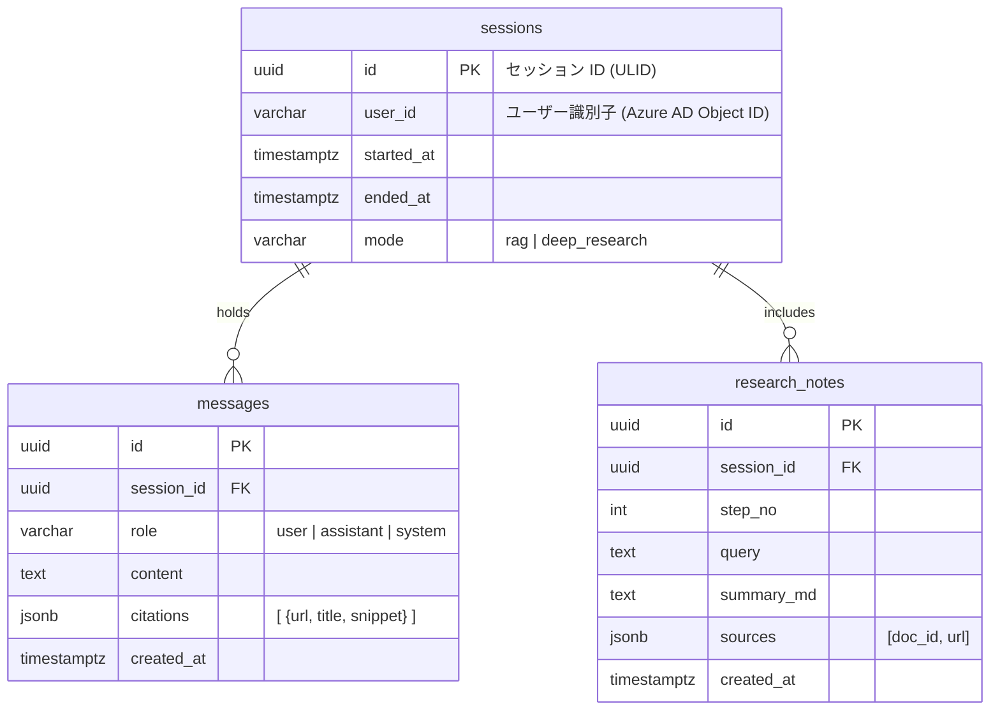

# データモデル設計 – Cosmos DB for PostgreSQL

> **目的** — QRAI が永続化するデータ構造（チャットセッション・メッセージ・リサーチノート）を定義し、Cosmos DB for PostgreSQL の **分散テーブル** 概念に沿ったシャーディング／インデックス戦略を示す。

---

## 1. ER 図



---

## 2. 分散テーブル設計

| テーブル             | 分散キー         | ハッシュ関数 | 理由                                 |
| ---------------- | ------------ | ------ | ---------------------------------- |
| `sessions`       | `id`         | *hash* | セッション単位で完結、JOIN が少なく局所性高い          |
| `messages`       | `session_id` | *hash* | 99% クエリが特定セッションメッセージ取得             |
| `research_notes` | `session_id` | *hash* | Deep Research 中間ノートはセッション JOIN が多い |

> Cosmos DB for PostgreSQL は **ハッシュ分散** が最汎用。`session_id` を同じノードに集めることでローカル JOIN が高速化。

---

## 3. CREATE TABLE スケッチ

```sql
-- sessions (distributed)
CREATE TABLE sessions (
  id uuid PRIMARY KEY,
  user_id varchar(64) NOT NULL,
  started_at timestamptz DEFAULT now(),
  ended_at timestamptz,
  mode varchar(16) NOT NULL
);
SELECT create_distributed_table('sessions', 'id');

-- messages (distributed & partitioned)
CREATE TABLE messages (
  id uuid PRIMARY KEY,
  session_id uuid NOT NULL REFERENCES sessions(id),
  role varchar(16) NOT NULL,
  content text NOT NULL,
  citations jsonb,
  created_at timestamptz DEFAULT now()
);
SELECT create_distributed_table('messages', 'session_id');
CREATE INDEX ON messages (created_at);

-- research_notes
CREATE TABLE research_notes (
  id uuid PRIMARY KEY,
  session_id uuid NOT NULL REFERENCES sessions(id),
  step_no int NOT NULL,
  query text,
  summary_md text,
  sources jsonb,
  created_at timestamptz DEFAULT now()
);
SELECT create_distributed_table('research_notes', 'session_id');
```

> **注意** — Single‑node Basic プランでは `create_distributed_table` は実質ローカルだが、HA クラスタ移行時に無停止でスケールアウト可能。

---

## 4. インデックス & クエリパターン

| クエリ                 | 推奨インデックス                                | 期待 p95           |
| ------------------- | --------------------------------------- | ---------------- |
| 最新 50 メッセージ取得       | `messages(session_id, created_at DESC)` | < 20 ms          |
| Deep Research ノート一覧 | `research_notes(session_id, step_no)`   | < 30 ms          |
| ユーザー月間セッション数        | `sessions(user_id, started_at)`         | < 50 ms (分散部分集計) |

> JSONB フィールド `citations.sources @> '{"url": "..."}'` アドホック検索は bitmap GIN インデックスを将来検討。

---

## 5. データ保持ポリシー

* **セッション & メッセージ** — 180 日で自動 `DROP PARTITION` (PG cron) または TTL ルール。
* **リサーチノート** — 90 日保持。監査要件によってはログアーカイブにエクスポート。

---

## 6. マイグレーション & バックアップ

* **Schema 変更** — `gh-ost` などオンライン DDL は非対応。開発環境はダウンタイム許容、prod は「新テーブル → デュアルライト → 切替」。
* **バックアップ** — Cosmos PG 自動バックアップ (7 日保持) + `pg_dump` 週次オフサイト。

---

*Last updated: 2025‑06‑03*
