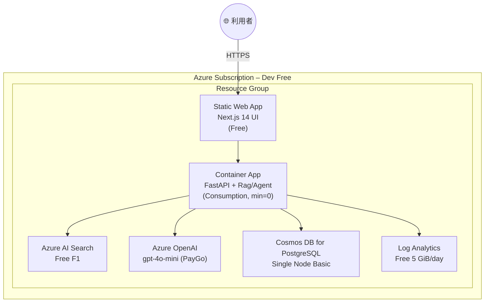

# Deployment 図 & IaC 構成 – QRAI **Dev / Free Tier**

> **目的** — 個人開発・PoC 用の **無料枠 (Free Tier) 前提** で QRAI をデプロイする際の物理ビューと IaC（Terraform × Bicep 併用）方針を示す。コストゼロを維持しつつ、コード化・CI/CD が回る最小構成にする。

---

## 1. 物理 Deployment 図



---

## 2. IaC 併用戦略 (Terraform + Bicep)

| レイヤ / リソース                     | 変更頻度          | **ツール**       | 理由                                     |
| ------------------------------ | ------------- | ------------- | -------------------------------------- |
| VNet (optional), Log Analytics | 低             | **Terraform** | tfstate で環境一元管理、他クラウドでも再利用可            |
| Static Web Apps (Free)         | 中             | **Bicep**     | 発行が高速・ARM 対応が即日。State 不要でクリーン削除可       |
| Container Apps                 | 中             | **Terraform** | Module で HPA/ingress など記述、Provider が安定 |
| AI Search F1                   | 高 (schema 追加) | **Bicep**     | `az deployment what-if` で差分確認しやすい      |
| OpenAI (mini)                  | 中             | **Bicep**     | 新モデル追加時に Bicep が最速対応                   |
| Cosmos PG Single Node          | 低             | **Terraform** | DB パラメータ管理を tfvars で厳格に                |

> **ポイント**
>
> * 基盤少なめだが **"Terraform = 状態を持って長生きするリソース"**、**"Bicep = 試して壊す PaaS"** の役割分担は変わらない。
> * `terraform destroy` でネットワークや DB を一括削除、Bicep でサンドボックス RG を高速に再構築。

---

## 3. ディレクトリ例

```
infra/
 ├─ terraform/
 │   ├─ main.tf            # Blob backend, basic LA Workspace
 │   ├─ container_app.tf   # CA env + app (minReplicas = 0)
 │   └─ cosmos_pg.tf       # Single-node PG (free)
 └─ bicep/
     ├─ swa.bicep          # Static Web App Free
     ├─ ai_search.bicep    # Search F1 + index schema
     └─ openai.bicep       # gpt-4o-mini deployment
```

CI 例:

```yaml
name: terraform
on: [push]
jobs:
  tf-plan:
    steps:
      - uses: hashicorp/setup-terraform@v2
      - run: terraform init && terraform plan
```

```yaml
name: bicep
on: [pull_request]
jobs:
  what-if:
    steps:
      - run: az deployment group what-if -f bicep/ai_search.bicep -g qrai-dev-rg
```

---

## 4. 無料枠ガードレール (IaC Variable)

詳細なコスト制御・IaC設定・予算管理については **[cost_management.md](cost_management.md)** を参照してください。

基本的な無料枠制限変数：

| Variable            | Value         | 説明                                     |
| ------------------- | ------------- | -------------------------------------- |
| `is_free`           | `true`        | Bicep 条件で SKU を `free` または `basic` に固定 |
| `openai_model`      | `gpt-4o-mini` | 料金を意図せず変更しないよう PR で gated              |
| `ai_search_replica` | `1`           | 無料枠は rep=1 par=1 以外不可                  |

> **Validation**: CI/CD で Terraform plan に有料 SKU が含まれる場合は fail。

## 5. コスト上限イメージ

詳細なコスト見積もりと最適化戦略については **[cost_management.md](cost_management.md)** を参照してください。

| リソース            | 月額推定            | 備考                       |
| --------------- | --------------- | ------------------------ |
| **AI Search**   | **\$0**         | F1 無料                    |
| **OpenAI**      | **\$1–3**       | gpt‑4o‑mini token 従量      |
| **Container**   | **\$0**         | 無料枠内                     |
| **Database**    | **\$0**         | 単一ノード無料                  |
| **監視・ログ**       | **\$0**         | 5GB 以内                   |
| **合計**          | **\$5 以下**       | プライベート開発想定                 |

---

## 6. 一括削除 / クリーンアップ

```