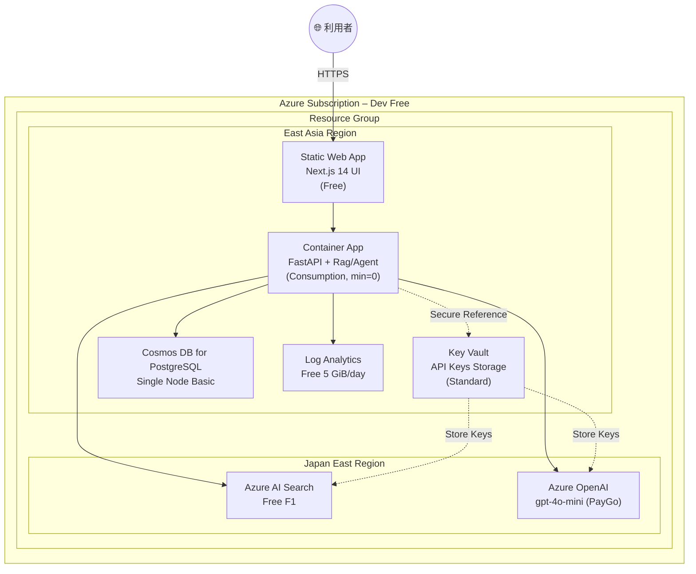
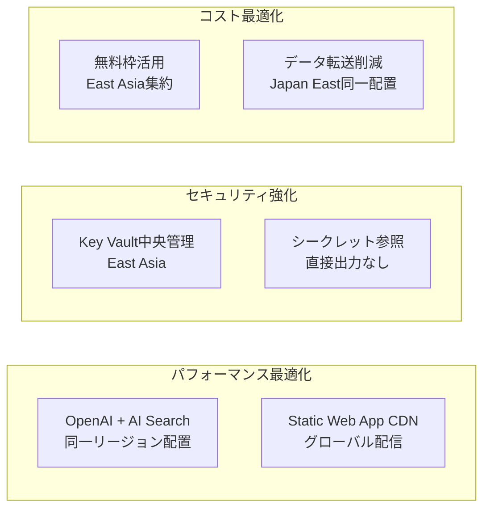

# Deployment 図 & IaC 構成 – QRAI **Dev / Free Tier**

> **目的** — 個人開発・PoC 用の **無料枠 (Free Tier) 前提** で QRAI をデプロイする際の物理ビューと IaC（Terraform × Bicep 併用）方針を示す。コストゼロを維持しつつ、コード化・CI/CD が回る最小構成にする。

---

## 1. 物理 Deployment 図



---

## 2. IaC 併用戦略 (Terraform + Bicep)

| レイヤ / リソース                     | 変更頻度          | **ツール**       | 理由                                     |
| ------------------------------ | ------------- | ------------- | -------------------------------------- |
| VNet (optional), Log Analytics | 低             | **Terraform** | tfstate で環境一元管理、他クラウドでも再利用可            |
| Key Vault, Container Apps     | 中             | **Terraform** | シークレット管理の一元化、Module でセキュリティ強化       |
| Static Web Apps (Free)         | 中             | **Bicep**     | 発行が高速・ARM 対応が即日。State 不要でクリーン削除可       |
| AI Search F1                   | 高 (schema 追加) | **Bicep**     | `az deployment what-if` で差分確認しやすい      |
| OpenAI (mini)                  | 中             | **Bicep**     | 新モデル追加時に Bicep が最速対応                   |
| Cosmos PG Single Node          | 低             | **Terraform** | DB パラメータ管理を tfvars で厳格に                |

> **セキュリティ強化ポイント**
>
> * **Key Vault経由**: OpenAI・AI Search のAPIキーは直接出力せず、すべてKey Vaultに保存
> * **リージョン戦略**: コストとパフォーマンスを最適化する多地域分散配置
> * **最小権限**: TerraformはKey Vault参照のみ、実際のキーは暗号化ストレージ内

---

## 3. リージョン戦略

### 3.1 地域別配置方針

| リソース | リージョン | 理由 |
|---------|-----------|------|
| **OpenAI** | Japan East | GPT-4o対応、低レイテンシ |
| **AI Search** | Japan East | OpenAIと同一、データ転送コスト削減 |
| **Container Apps** | East Asia | 無料枠活用、運用コスト最適化 |
| **Key Vault** | East Asia | 中央管理、セキュリティ統制 |
| **Static Web App** | East Asia | グローバル CDN、アクセス最適化 |
| **Cosmos DB** | East Asia | データ常駐、コンプライアンス |

### 3.2 セキュリティ・パフォーマンス最適化



---

## 4. ディレクトリ例

```
infra/
 ├─ terraform/
 │   ├─ main.tf            # Blob backend, basic LA Workspace, Key Vault連携
 │   ├─ container_app.tf   # CA env + app (minReplicas = 0)
 │   ├─ cosmos_pg.tf       # Single-node PG (free)
 │   └─ variables.tf       # Bicep連携変数、Key Vault参照
 └─ bicep/
     ├─ main.bicep         # OpenAI + AI Search + SWA + Key Vault
     ├─ main.bicepparam    # リージョン戦略パラメータ
     └─ modules/           # 再利用可能コンポーネント
```

CI 例:

```yaml
name: terraform
on: [push]
jobs:
  tf-plan:
    steps:
      - uses: hashicorp/setup-terraform@v2
      - run: terraform init && terraform plan
      env:
        TF_VAR_bicep_key_vault_name: ${{ secrets.KEY_VAULT_NAME }}
```

```yaml
name: bicep
on: [pull_request]
jobs:
  what-if:
    steps:
      - run: az deployment group what-if --template-file bicep/main.bicep --parameters bicep/main.bicepparam
```

---

## 5. セキュリティ管理 (Key Vault)

### 5.1 シークレット管理戦略

| シークレット | 保存先 | アクセス方法 | Terraform連携 |
|-------------|--------|-------------|---------------|
| OpenAI API Key | Key Vault | `data.azurerm_key_vault_secret` | 参照のみ |
| AI Search Admin Key | Key Vault | `data.azurerm_key_vault_secret` | 参照のみ |
| DB接続文字列 | Key Vault | `data.azurerm_key_vault_secret` | 参照のみ |

### 5.2 アクセス制御

```hcl
# Key Vault参照例（terraform/main.tf）
data "azurerm_key_vault_secret" "openai_key" {
  count        = var.bicep_key_vault_name != "" ? 1 : 0
  name         = var.bicep_openai_key_secret_name
  key_vault_id = data.azurerm_key_vault.bicep_kv[0].id
}
```

### 5.3 デプロイメント連携

```bash
# 1. Bicep でKey Vault + OpenAI/AI Search作成
az deployment group create \
  --resource-group qrai-dev-rg \
  --template-file infra/bicep/main.bicep \
  --parameters infra/bicep/main.bicepparam

# 2. TerraformでKey Vault参照情報を取得
export TF_VAR_bicep_key_vault_name=$(az deployment group show \
  --resource-group qrai-dev-rg \
  --name main \
  --query properties.outputs.keyVaultName.value -o tsv)

# 3. Terraform実行（セキュアな参照）
terraform plan -var="bicep_key_vault_name=${TF_VAR_bicep_key_vault_name}"
```

---

## 6. 無料枠ガードレール (IaC Variable)

詳細なコスト制御・IaC設定・予算管理については **[cost_management.md](cost_management.md)** を参照してください。

基本的な無料枠制限変数：

| Variable            | Value         | 説明                                     |
| ------------------- | ------------- | -------------------------------------- |
| `is_free_tier`      | `true`        | Bicep 条件で SKU を `free` または `basic` に固定 |
| `openai_model`      | `gpt-4o-mini` | 料金を意図せず変更しないよう PR で gated              |
| `ai_search_replica` | `1`           | 無料枠は rep=1 par=1 以外不可                  |
| `openai_location`   | `japaneast`   | GPT-4o対応リージョンに固定                       |
| `search_location`   | `japaneast`   | OpenAIと同一リージョンでレイテンシ最適化                |

> **Validation**: CI/CD で Terraform plan に有料 SKU が含まれる場合は fail。

## 7. コスト上限イメージ

詳細なコスト見積もりと最適化戦略については **[cost_management.md](cost_management.md)** を参照してください。

| リソース            | 月額推定            | 備考                       |
| --------------- | --------------- | ------------------------ |
| **AI Search**   | **\$0**         | F1 無料                    |
| **OpenAI**      | **\$1–3**       | gpt‑4o‑mini token 従量      |
| **Container**   | **\$0**         | 無料枠内                     |
| **Key Vault**   | **\$0**         | 10,000 操作/月まで無料         |
| **Database**    | **\$0**         | 単一ノード無料                  |
| **監視・ログ**       | **\$0**         | 5GB 以内                   |
| **合計**          | **\$5 以下**       | プライベート開発想定                 |

---

## 8. 一括削除 / クリーンアップ

```bash
# Key Vaultの論理削除対応
az keyvault purge --name qrai-dev-kv-xxxxx --location eastasia

# リソースグループ削除
az group delete --name qrai-dev-rg --yes --no-wait
```
