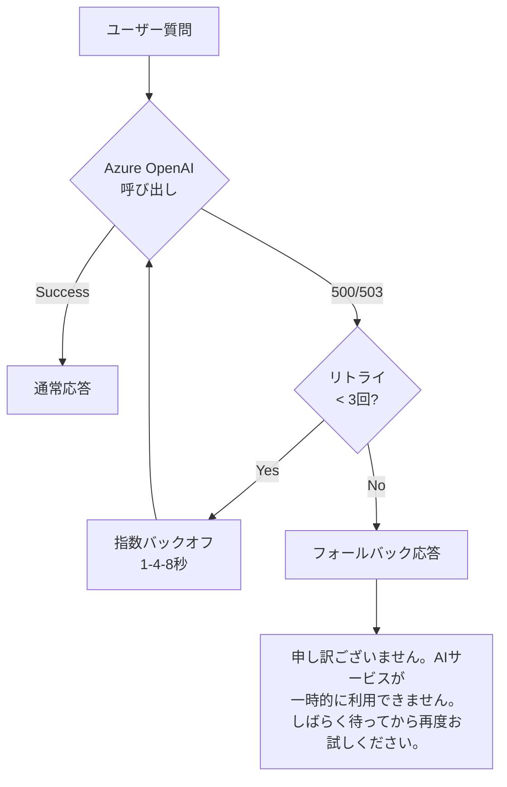
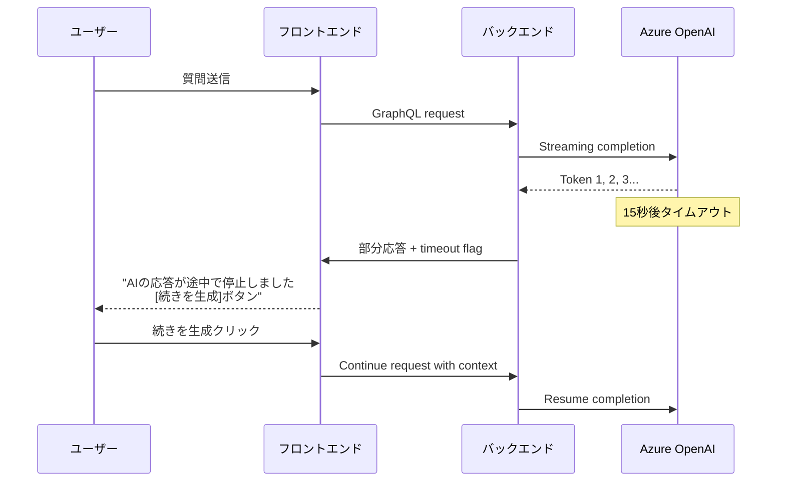

# エラーハンドリング戦略 – QRAI

> **目的** — QRAI の MVP で発生しうるエラーシナリオを網羅的に整理し、各レイヤでの対応策・フォールバック・ユーザー体験を統一的に定義する。分散システムの信頼性を高めながら、無料枠制約下での適切な挙動を実現する。

---

## 1. エラー分類と優先度

| カテゴリ             | 優先度 | 影響範囲               | 対応方針                      |
| ---------------- | --- | ------------------ | ------------------------- |
| **Azure サービス障害** | 🔴高  | 全ユーザー、機能停止         | フォールバック + 明確な告知            |
| **Rate Limit 超過** | 🟡中  | 個別ユーザー、一時的制限       | リトライ + 待機時間の明示             |
| **LLM タイムアウト**   | 🟡中  | 個別リクエスト、UX 劣化      | 部分応答 + 再試行オプション            |
| **バリデーションエラー** | 🟢低  | 個別リクエスト、入力ミス       | 即時フィードバック + 修正ガイド          |
| **ネットワーク切断**     | 🟡中  | 個別ユーザー、ストリーミング中断   | 自動再接続 + 進行状況復旧             |
| **データベース障害**     | 🔴高  | セッション履歴、データ整合性の問題 | 読み取り専用モード + 手動復旧           |

---

## 2. Azure サービス障害時のフォールバック

### 2-1 Azure OpenAI 障害



**実装**:
- `openai.APIError` を捕捉し、HTTPステータスコードで分岐
- 429 (Rate Limit): `Retry-After` ヘッダーを尊重
- 500/502/503: 指数バックオフで最大3回リトライ
- 全リトライ失敗時: 502 Bad Gateway + フォールバックメッセージ

### 2-2 Azure AI Search 障害

| 障害パターン        | HTTPコード | 対応策                                    | ユーザーへの表示                  |
| ------------- | ------- | -------------------------------------- | ------------------------- |
| Rate Limit   | 429     | Retry-After 尊重 + 最大2回リトライ             | "検索が集中しています。少々お待ちください"     |
| サービス無応答     | 503     | 5秒タイムアウト + エラー応答                      | "検索サービスが一時的に利用できません"       |
| インデックス破損    | 404/400 | 管理者アラート + 検索なしモード                     | "資料検索を一時停止中です。直接回答いたします" |
| 無料枠容量超過     | 507     | インデックス再構築必要 + 読み取り専用モード              | "容量上限のため、新しい資料の追加は停止中です"  |

---

## 3. Rate Limit 制御とユーザー体験

### 3-1 トークンバケット方式

```python
# 疑似コード
class RateLimiter:
    def __init__(self, rate: int = 20, burst: int = 5):
        self.rate = rate      # 1分あたり20リクエスト
        self.burst = burst    # バースト許容5リクエスト
        
    async def acquire(self, user_id: str) -> bool:
        if tokens_available(user_id) > 0:
            consume_token(user_id)
            return True
        else:
            return False  # 429 Too Many Requests
```

### 3-2 Rate Limit 到達時のUX

| UI状態           | 表示内容                                       | 行動オプション               |
| -------------- | ------------------------------------------ | ---------------------- |
| 送信ボタン無効化     | "しばらく待ってから再度お試しください（残り: 42秒）"             | カウントダウン表示 + 待機          |
| Deep Research中 | "AIの利用量上限に達しました。リサーチを一時停止します"            | 部分結果保存 + 後で再開オプション     |
| SSEストリーミング中  | "回答生成を一時停止しました。続きは X秒後に表示されます"           | 既存応答は保持 + 自動再開        |

---

## 4. LLM応答タイムアウト処理

### 4-1 タイムアウト設定

| 操作               | タイムアウト | 対応策                    |
| ---------------- | ------ | ---------------------- |
| RAG応答 (通常)      | 15秒    | 部分応答表示 + "続きを生成"ボタン   |
| Deep Research Step | 30秒    | 当該ステップスキップ + 次ステップ実行 |
| ストリーミング無応答      | 5秒     | 接続リセット + 自動再試行        |

### 4-2 部分応答とリカバリ



---

## 5. ネットワーク切断・再接続戦略

### 5-1 SSE接続の復旧

```javascript
// フロントエンド疑似コード
class RobustEventSource {
  constructor(url) {
    this.url = url;
    this.reconnectInterval = 1000; // 1秒から開始
    this.maxReconnectInterval = 30000; // 最大30秒
    this.reconnectMultiplier = 1.5;
  }
  
  connect() {
    this.eventSource = new EventSource(this.url);
    
    this.eventSource.onerror = () => {
      console.log(`接続エラー。${this.reconnectInterval}ms後に再試行`);
      setTimeout(() => this.connect(), this.reconnectInterval);
      this.reconnectInterval = Math.min(
        this.reconnectInterval * this.reconnectMultiplier,
        this.maxReconnectInterval
      );
    };
  }
}
```

### 5-2 進行状況の復旧

| シナリオ               | 復旧方法                                      |
| ------------------ | ----------------------------------------- |
| Deep Research 途中で切断 | `research_notes` テーブルから最新ステップを取得し、続行または再開 |
| RAG応答途中で切断        | 部分応答をローカルストレージに保存し、再接続時に継続表示            |
| セッション途中で切断        | セッションIDで最新状態を復旧し、チャット履歴を再表示             |

---

## 6. データベース障害対応

### 6-1 Cosmos DB for PostgreSQL 障害

| 障害レベル     | 検出方法               | 対応策                           | 影響                  |
| --------- | ------------------ | ----------------------------- | ------------------- |
| 接続タイムアウト  | Health check 失敗   | 読み取り専用モード                     | 新規セッション作成不可、既存は継続 |
| クエリ失敗     | SQLAlchemy例外      | インメモリ一時保存 + 復旧後同期             | 履歴消失リスク             |
| 容量上限      | 容量監視アラート         | 古いセッション自動削除 + 管理者通知           | 古い履歴の自動削除           |

### 6-2 読み取り専用モードの実装

```python
class DatabaseService:
    def __init__(self):
        self.read_only_mode = False
        self.temp_storage = {}  # インメモリ一時保存
    
    async def save_message(self, session_id: str, message: dict):
        if self.read_only_mode:
            # 一時保存
            self.temp_storage[session_id] = message
            return {"status": "temp_saved", "will_sync": True}
        else:
            # 通常のDB保存
            return await self.db.save(message)
```

---

## 7. エラーメッセージの統一

### 7-1 GraphQLエラーレスポンス標準

```json
{
  "data": null,
  "errors": [
    {
      "message": "検索サービスが一時的に利用できません",
      "extensions": {
        "code": "SEARCH_SERVICE_UNAVAILABLE",
        "retryAfter": 30,
        "userAction": "しばらく待ってから再試行してください"
      }
    }
  ]
}
```

### 7-2 エラーコード体系

| エラーコード                  | HTTPコード | 意味                | 推奨アクション        |
| ----------------------- | ------- | ----------------- | -------------- |
| `VALIDATION_ERROR`      | 400     | 入力値検証失敗           | 入力内容を確認して再送信   |
| `RATE_LIMIT_EXCEEDED`   | 429     | API呼び出し上限超過      | 時間を置いて再試行      |
| `LLM_TIMEOUT`           | 408     | LLM応答タイムアウト      | 続きを生成 or 再質問   |
| `SEARCH_UNAVAILABLE`    | 502     | 検索サービス障害         | サポートに連絡        |
| `DATABASE_READONLY`     | 503     | データベース読み取り専用モード | 機能制限モードで継続利用   |

---

## 8. 監視・アラート設定

### 8-1 Azure Monitor クエリ

```kusto
// エラー率監視 (過去5分間)
requests
| where timestamp > ago(5m)
| summarize 
    total = count(),
    errors = countif(resultCode >= 400)
| extend error_rate = (errors * 100.0) / total
| where error_rate > 5  // 5%超過でアラート
```

### 8-2 アラート条件

| メトリクス             | しきい値     | アクション                                 |
| ----------------- | -------- | ------------------------------------- |
| エラー率              | > 5%     | Teams通知 + 管理者メール                     |
| 平均応答時間            | > 15秒    | パフォーマンス調査トリガー                       |
| Azure OpenAI エラー率 | > 10%    | フォールバックモード自動有効化                     |
| Database接続失敗      | > 3回/5分  | 読み取り専用モード + 緊急メンテナンス                |

---

## 9. 運用プレイブック

### 9-1 障害対応手順

1. **検知**: Azure Monitor アラート受信
2. **トリアージ**: エラーコードと影響範囲の特定
3. **緊急対応**: フォールバックモード有効化
4. **根本原因調査**: ログ分析とトレース確認
5. **復旧**: サービス正常化とユーザー通知
6. **事後**: ポストモーテムとプロセス改善

### 9-2 フォールバック判断基準

| 状況                    | フォールバック実行条件           | 実行内容                |
| --------------------- | --------------------- | ------------------- |
| Azure OpenAI 高エラー率  | 連続5分間エラー率 > 20%      | キャッシュ応答 + 静的FAQ   |
| AI Search 完全停止      | 連続3回接続失敗             | LLMのみモード + 引用なし回答 |
| Database 完全停止       | ヘルスチェック連続失敗 > 3回     | 読み取り専用 + 一時保存モード |

---

*Last updated: 2025-06-03* 