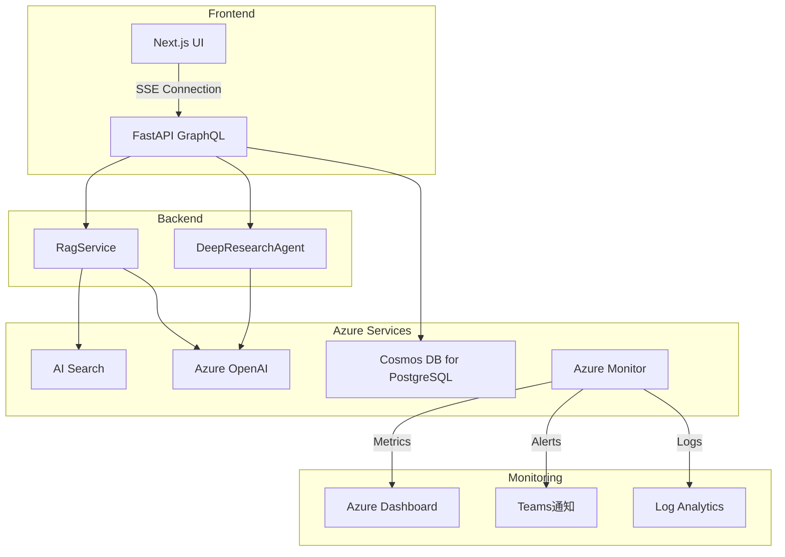

# パフォーマンス監視・可観測性 – QRAI

> **目的** — RAG + Deep Research アプリケーションの性能監視、ログ収集、分散トレース、アラート設定を体系化し、障害検知・パフォーマンス改善・SLA管理を実現する。MVP環境（無料枠）から本番環境への拡張性も考慮。

---

## 1. 監視戦略概要

### 1-1 Three Pillars of Observability

| 柱             | ツール・手法                                    | MVP 目標                     | 本番目標                        |
| ------------- | ----------------------------------------- | -------------------------- | --------------------------- |
| **Metrics**   | Azure Monitor Container Insights           | 基本メトリクス（CPU, Memory, 応答時間） | カスタムメトリクス（トークン使用量、検索ヒット率） |
| **Logs**      | Structured logging (structlog) → Log Analytics | 構造化ログ + セッション・トレースID       | ログ分析・検索・アラート            |
| **Traces**    | OpenTelemetry → Azure Monitor           | HTTP リクエスト全体のトレース         | LLM呼び出し・DB クエリ個別トレース     |

### 1-2 監視対象コンポーネント



---

## 2. パフォーマンスメトリクス

### 2-1 アプリケーション KPI

| メトリクス           | 目標値            | 測定方法                                       | アラートしきい値      |
| --------------- | -------------- | ------------------------------------------ | ------------- |
| **RAG応答時間**     | p95 < 10秒      | Locust負荷テスト                               | p95 > 15秒 5分間 |
| **Deep Research** | 完了 < 120秒     | E2Eテスト（pytest）                            | > 180秒      |
| **スループット**      | 20 RPS (無料枠制限) | Container Insights requests/sec           | > 25 RPS     |
| **可用性**         | 99.5%          | Azure Monitor availability                | < 99%        |
| **エラー率**        | < 2%           | HTTP 4xx/5xx 率                           | > 5% 5分間    |

### 2-2 Azure リソースメトリクス

| リソース            | メトリクス                    | しきい値        | 影響                     |
| --------------- | ------------------------ | ----------- | ---------------------- |
| **Container App** | CPU使用率                   | > 70% 5分    | HPA トリガー（スケールアウト）     |
|                 | Memory使用率                | > 80%       | OOM Kill リスク           |
|                 | レプリカ数                    | 0 or > 3    | スケール異常                 |
| **Azure OpenAI** | Requests/min               | > 900       | Rate Limit 接近          |
|                 | Token使用量/day             | > 50,000    | 無料枠上限接近               |
|                 | エラー率                     | > 10%       | フォールバック検討            |
| **AI Search**   | QPS                      | > 3 (F1制限) | Free tier 上限           |
|                 | ストレージ使用量                 | > 45MB      | 容量不足                   |
| **Cosmos DB**   | DTU使用率                   | > 80%       | パフォーマンス劣化            |
|                 | ストレージ使用量                 | > 900MB     | 無料枠上限接近               |

---

## 3. ログ戦略

### 3-1 構造化ログフォーマット

```python
# 推奨ログ設定（structlog）
import structlog
from uuid import uuid4

# 各リクエストでユニークなトレースIDを生成
def setup_logging():
    structlog.configure(
        processors=[
            structlog.stdlib.filter_by_level,
            structlog.stdlib.add_logger_name,
            structlog.stdlib.add_log_level,
            structlog.stdlib.PositionalArgumentsFormatter(),
            structlog.processors.TimeStamper(fmt="iso"),
            structlog.processors.StackInfoRenderer(),
            structlog.processors.format_exc_info,
            structlog.processors.UnicodeDecoder(),
            structlog.processors.JSONRenderer()  # JSON形式で出力
        ],
        wrapper_class=structlog.stdlib.BoundLogger,
        logger_factory=structlog.stdlib.LoggerFactory(),
        context_class=dict,
        cache_logger_on_first_use=True,
    )

# 使用例
logger = structlog.get_logger()
logger.info(
    "rag_search_completed",
    session_id="sess_123",
    trace_id="trace_456", 
    question="社内研修制度について",
    search_results_count=3,
    search_duration_ms=250,
    total_tokens=1250
)
```

### 3-2 ログレベル運用

| レベル    | 用途                           | 例                                     | 環境              |
| ------ | ---------------------------- | ------------------------------------- | --------------- |
| DEBUG  | 開発用詳細情報                      | HTTP リクエスト・レスポンス詳細、変数値              | development     |
| INFO   | 正常業務フロー                      | ユーザー質問受信、RAG検索完了、応答生成開始             | 全環境             |
| WARN   | 要注意だが継続可能                    | Rate Limit 接近、検索結果0件、タイムアウト自動復旧      | 全環境             |
| ERROR  | 業務エラー（復旧可能）                  | LLM API エラー、DB接続失敗、フォールバック実行        | 全環境             |
| CRITICAL | システム障害（運用者対応必要）              | 全サービス停止、セキュリティ侵害、データ消失             | 全環境（即座にアラート）    |

### 3-3 重要なログエントリ

| 業務フロー        | ログキー                   | 必須フィールド                                              |
| ------------ | ---------------------- | ---------------------------------------------------- |
| ユーザー質問受信     | `user_question_received` | `session_id`, `user_id`, `question_length`           |
| RAG検索実行      | `rag_search_started`     | `session_id`, `trace_id`, `search_query`             |
| RAG検索完了      | `rag_search_completed`   | `session_id`, `results_count`, `search_duration_ms`  |
| LLM呼び出し開始   | `llm_call_started`       | `session_id`, `model_name`, `prompt_tokens`          |
| LLM応答受信     | `llm_response_received`  | `session_id`, `completion_tokens`, `response_time_ms` |
| Deep Research | `deep_research_step`     | `session_id`, `step_number`, `step_type`, `duration`  |
| エラー発生        | `error_occurred`         | `session_id`, `error_code`, `error_message`, `stack_trace` |

---

## 4. 分散トレース

### 4-1 OpenTelemetry 設定

```python
# OpenTelemetry SDK 設定
from opentelemetry import trace
from opentelemetry.exporter.otlp.proto.grpc.trace_exporter import OTLPSpanExporter
from opentelemetry.sdk.trace import TracerProvider
from opentelemetry.sdk.trace.export import BatchSpanProcessor

# Azure Monitor エクスポート設定
def setup_tracing():
    trace.set_tracer_provider(TracerProvider())
    tracer = trace.get_tracer(__name__)
    
    # Azure Monitor へのエクスポート
    otlp_exporter = OTLPSpanExporter(
        endpoint="https://ingest-qrai-dev.monitor.azure.com/otlp/traces",
        headers={"Authorization": f"Bearer {AZURE_MONITOR_TOKEN}"}
    )
    
    span_processor = BatchSpanProcessor(otlp_exporter)
    trace.get_tracer_provider().add_span_processor(span_processor)

# トレース実装例
@tracer.start_as_current_span("rag.search")
async def search_documents(query: str) -> List[Document]:
    span = trace.get_current_span()
    span.set_attribute("search.query", query)
    span.set_attribute("search.top_k", 3)
    
    try:
        results = await azure_search_client.search(query, top=3)
        span.set_attribute("search.results_count", len(results))
        span.set_status(trace.Status(trace.StatusCode.OK))
        return results
    except Exception as e:
        span.set_status(trace.Status(trace.StatusCode.ERROR, str(e)))
        raise
```

### 4-2 重要なスパン

| スパン名                     | 親スパン              | 期待時間      | 測定内容                           |
| ------------------------ | ----------------- | --------- | ------------------------------ |
| `http.request`           | root              | < 10s     | GraphQL リクエスト全体               |
| `rag.search`             | `http.request`    | < 500ms   | Azure AI Search 検索             |
| `rag.prompt_build`       | `http.request`    | < 50ms    | プロンプト組み立て                      |
| `openai.completion`      | `http.request`    | < 8s      | Azure OpenAI 生成               |
| `rag.citation_format`    | `http.request`    | < 100ms   | 引用文整形                          |
| `deep_research.step`     | `http.request`    | < 30s     | Deep Research 個別ステップ          |
| `db.session_save`        | `http.request`    | < 200ms   | セッション・メッセージ保存                  |

---

## 5. Azure Monitor 設定

### 5-1 Log Analytics クエリ

```kusto
// パフォーマンス分析：RAG応答時間の分布
requests
| where timestamp > ago(1h)
| where name contains "rag"
| summarize 
    count(),
    avg(duration), 
    percentile(duration, 50),
    percentile(duration, 95),
    percentile(duration, 99)
by bin(timestamp, 5m)
| render timechart

// エラー率監視
requests
| where timestamp > ago(30m)
| summarize 
    total = count(),
    errors = countif(resultCode >= 400),
    error_rate = (errors * 100.0) / count()
by bin(timestamp, 5m)
| where error_rate > 5
| project timestamp, error_rate, total, errors

// 最も遅いリクエスト Top 10
requests
| where timestamp > ago(1h)
| top 10 by duration desc
| project timestamp, name, duration, resultCode, operation_Id

// Azure OpenAI トークン使用量
customMetrics
| where name == "openai_tokens_consumed"
| summarize sum(value) by bin(timestamp, 1h)
| render columnchart 
```

### 5-2 カスタムメトリクス

```python
# カスタムメトリクス送信
from azure.monitor.opentelemetry import AzureMonitorMetricExporter
from opentelemetry.metrics import get_meter_provider, set_meter_provider
from opentelemetry.sdk.metrics import MeterProvider
from opentelemetry.sdk.metrics.export import PeriodicExportingMetricReader

def setup_custom_metrics():
    metric_reader = PeriodicExportingMetricReader(
        AzureMonitorMetricExporter(), export_interval_millis=30000
    )
    provider = MeterProvider(metric_readers=[metric_reader])
    set_meter_provider(provider)
    
    meter = get_meter_provider().get_meter("qrai")
    
    # メトリクス定義
    response_time_histogram = meter.create_histogram(
        "rag_response_time", 
        description="RAG response time in milliseconds",
        unit="ms"
    )
    
    token_counter = meter.create_counter(
        "openai_tokens_consumed",
        description="Azure OpenAI tokens consumed"
    )
    
    search_results_gauge = meter.create_up_down_counter(
        "search_results_count",
        description="Number of search results returned"
    )

# 使用例
def record_rag_metrics(response_time: float, token_count: int, results_count: int):
    response_time_histogram.record(response_time, {"operation": "rag_search"})
    token_counter.add(token_count, {"model": "gpt-4o-mini"})
    search_results_gauge.add(results_count, {"index": "qrai-documents"})
```

---

## 6. アラート設定

### 6-1 Azure Monitor アラートルール

```json
{
  "name": "QRAI-HighLatency",
  "description": "RAG応答時間が15秒を超過",
  "severity": 2,
  "condition": {
    "query": "requests | where name contains 'rag' | summarize avg(duration) by bin(timestamp, 5m) | where avg_duration > 15000",
    "timeAggregation": "Average",
    "operator": "GreaterThan",
    "threshold": 15000,
    "evaluationFrequency": "PT5M",
    "windowSize": "PT5M"
  },
  "actions": [
    {
      "actionGroupId": "/subscriptions/.../actionGroups/qrai-alerts",
      "webhookProperties": {
        "severity": "P2",
        "component": "RAG Service"
      }
    }
  ]
}
```

### 6-2 アラート階層

| 重要度 | 例                           | 通知先                    | 対応SLA    |
| --- | --------------------------- | ---------------------- | -------- |
| P0  | 全サービス停止、セキュリティ侵害           | 電話 + SMS + Teams     | 15分以内   |
| P1  | API エラー率 > 20%、DB接続失敗      | Teams + メール           | 1時間以内   |
| P2  | 応答時間SLA違反、Rate Limit接近     | Teams通知              | 4時間以内   |
| P3  | 容量警告、パフォーマンス劣化             | メール                    | 24時間以内  |

### 6-3 Action Group 設定

```bash
# Teams通知用 Action Group
az monitor action-group create \
  --name "qrai-alerts" \
  --resource-group "rg-qrai-dev-eastus-01" \
  --action office365-connector \
    office365-connector-name "Teams-QRAI-Alerts" \
    webhook-url "https://outlook.office.com/webhook/..."

# メール通知
az monitor action-group create \
  --name "qrai-email-alerts" \
  --resource-group "rg-qrai-dev-eastus-01" \
  --action email \
    email-name "Admin" \
    email-address "admin@company.com"
```

---

## 7. ダッシュボード設計

### 7-1 Azure Dashboard レイアウト

```json
{
  "title": "QRAI MVP パフォーマンス ダッシュボード",
  "sections": [
    {
      "title": "Application Health",
      "widgets": [
        {
          "type": "metric",
          "query": "requests | summarize count() by resultCode",
          "visualization": "piechart",
          "timeRange": "PT1H"
        },
        {
          "type": "metric", 
          "query": "requests | summarize avg(duration), percentile(duration, 95)",
          "visualization": "timechart",
          "timeRange": "PT4H"
        }
      ]
    },
    {
      "title": "Azure Resources",
      "widgets": [
        {
          "type": "metric",
          "resource": "/subscriptions/.../containerApps/ca-qrai-dev",
          "metricName": "CpuPercentage",
          "aggregation": "Average"
        },
        {
          "type": "metric",
          "resource": "/subscriptions/.../cognitiveServices/oai-qrai-dev", 
          "metricName": "TotalTokenCalls",
          "aggregation": "Total"
        }
      ]
    }
  ]
}
```

### 7-2 ダッシュボード項目

| セクション          | ウィジェット                                | 目的                     |
| -------------- | ------------------------------------- | ---------------------- |
| **Application** | エラー率（円グラフ）、応答時間（時系列）、スループット（時系列） | アプリケーション健全性の概要       |
| **User Experience** | セッション数、アクティブユーザー、Deep Research完了率 | ユーザー体験の定量化           |
| **Azure Resources** | Container App CPU/Memory、OpenAI Token消費 | インフラリソース使用量監視        |
| **Business KPI** | 質問回数/日、検索ヒット率、平均セッション時間          | ビジネス価値測定             |

---

## 8. パフォーマンス最適化指針

### 8-1 レイテンシ改善

| 対象コンポーネント   | 最適化手法                                  | 期待効果          |
| ----------- | -------------------------------------- | ------------- |
| **AI Search** | インデックス圧縮、クエリ最適化                        | 検索時間 50% 短縮   |
| **OpenAI**   | プロンプト長最適化、ストリーミング有効化               | 初回応答 2秒短縮     |
| **Database** | 接続プール設定、インデックス追加、クエリ最適化              | DB応答 30% 改善   |
| **Network**  | CDN使用、gzip圧縮、HTTP/2有効化              | 転送時間 40% 短縮   |

### 8-2 スケーラビリティ対策

```python
# 接続プール最適化
DATABASE_CONFIG = {
    "pool_size": 5,          # 基本プールサイズ
    "max_overflow": 10,      # 追加接続数
    "pool_timeout": 30,      # 接続取得タイムアウト
    "pool_recycle": 3600,    # 接続リサイクル間隔
}

# Redis キャッシュ（将来実装）
CACHE_CONFIG = {
    "ttl": 3600,            # 1時間キャッシュ
    "max_entries": 1000,    # 最大エントリ数
    "eviction": "lru",      # LRU削除ポリシー
}
```

---

## 9. コスト監視

詳細なコスト管理・予算設定・最適化戦略については **[cost_management.md](cost_management.md)** を参照してください。

基本的なコスト監視項目：

### 9-1 基本アラート

| メトリクス           | 閾値        | アクション     |
| --------------- | --------- | --------- |
| 月次予算進捗          | > 80%     | Email通知   |
| OpenAI Token使用量 | > 50K/日   | Rate制限強化 |
| AI Search容量     | > 45MB    | 古い文書削除   |

### 9-2 監視クエリ例

```kusto
// 基本的な月次コスト監視
AzureCosts
| where TimeGenerated >= startofmonth(now())
| summarize MonthlyCost = sum(CostInBillingCurrency)
| extend BudgetProgress = (MonthlyCost / 5.0) * 100
| project MonthlyCost, BudgetProgress
```

---

## 10. 運用プロセス

### 10-1 定期レビュー

| 頻度    | レビュー内容                                 | 参加者         | 成果物          |
| ----- | -------------------------------------- | ----------- | ------------ |
| 毎日    | SLA違反、エラー傾向、異常検知                      | SRE         | 日次レポート       |
| 毎週    | パフォーマンス傾向、コスト分析、容量計画                 | Dev + SRE   | 週次改善アクション    |
| 毎月    | SLI/SLO見直し、ダッシュボード改善、アラート調整         | Full Team   | 月次振り返り       |
| 四半期   | インフラスケール計画、監視ツール更新、ベンチマーク実施        | Management  | 四半期計画更新      |

### 10-2 インシデント対応

詳細なインシデント対応手順については **[error_handling.md](error_handling.md)** を参照してください。

監視システムによる早期検知からエスカレーション、復旧、事後分析までの流れを体系化しています。

---

*Last updated: 2025-06-03* 