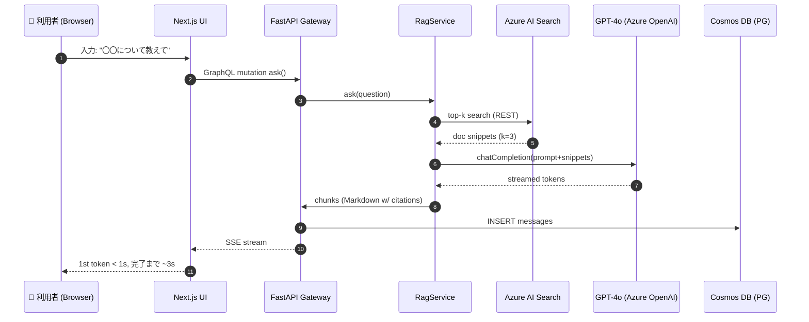
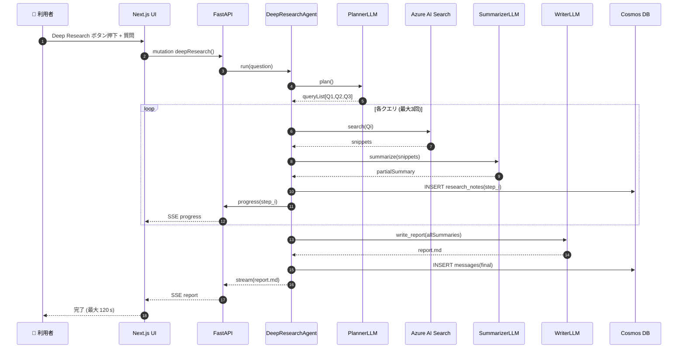

# ランタイムビュー – QRAI

> **目的** — 実行時のデータフローとコンポーネント相互作用を時系列で示し、パフォーマンス最適化やデバッグ時にどこでレイテンシが発生するかを可視化する。RAG（通常質問）と Deep Research の 2 つの主要ワークフローをそれぞれシーケンス図で定義。

---

## 1. RAG ワークフロー（通常質問）

### レイテンシ目安 (p95 開発環境)

| 区間           | 目標         | 備考                               |
| ------------ | ---------- | -------------------------------- |
| UI→API       | ≤ 100 ms   | LAN + GraphQL                    |
| AI Search    | ≤ 300 ms   | Free SKU, キャッシュ未使用時              |
| GPT-4o       | ≤ 1,500 ms | `gpt-4o-mini`, `max_tokens=1024` |
| 最初の SSE トークン | ≤ 1 s      | UX 要件 (NFR-01)                   |
| 全文ストリーム完了    | ≤ 10 s     | NFR-01 p95                       |

---

## 2. Deep Research ワークフロー

### ランタイム特性

* **並列処理** — `summarize` は `asyncio.gather` で並列化し、ステップ当たり 300–700 ms を目標。
* **ステータス更新** — UI へは `progress` イベントを 1 ステップ完了ごとに送信し "Step 1/3 完了" を表示。
* **キャンセル** — ユーザーが Esc／Cancel を押下すると SSE で `STOP` を送信し、Agent の `asyncio.CancelledError` をトリガして全 LLM 呼び出しをキャンセル。

---

## 3. 例外フロー・障害対応

詳細なエラーハンドリング戦略については **[error_handling.md](error_handling.md)** を参照してください。

ランタイム特有の重要ポイント:
- **並列処理でのエラー**: `asyncio.gather` の例外は個別に捕捉し、部分的な結果を返却
- **キャンセル処理**: ユーザーが Esc/Cancel を押下すると SSE で `STOP` を送信し、Agent の `asyncio.CancelledError` をトリガして全 LLM 呼び出しをキャンセル

---

## 4. ランタイム計測・可視化

* **OpenTelemetry** を FastAPI / RagService / DeepResearchAgent に組み込み、Span 名は `rag.search`, `rag.gpt`, `agent.plan`, `agent.summarize` など。
* 開発環境では `OTEL_EXPORTER_OTLP_ENDPOINT=http://jaeger:4318` で Jaeger UI にタイムライン表示。
* NFR-01/02 に準拠しているか CI の E2E テスト (`pytest + locust`) で計測。

---

## 5. 将来拡張ポイント

1. **Chunk 並列要約のワーカー化** — Celery / RQ でタスクキューを分離し GPT 呼び出しを後段にオフロード。
2. **Retry Budget** — GPT / Search のリトライ上限を 1 分間窓で 5 回に制限し、無料枠爆発を防ぐ。
3. **Web 検索ツール** — `SearchTool` をインターフェイス化済みのため plug‑in で追加可能。

---

*Last updated: 2025-06-03*
