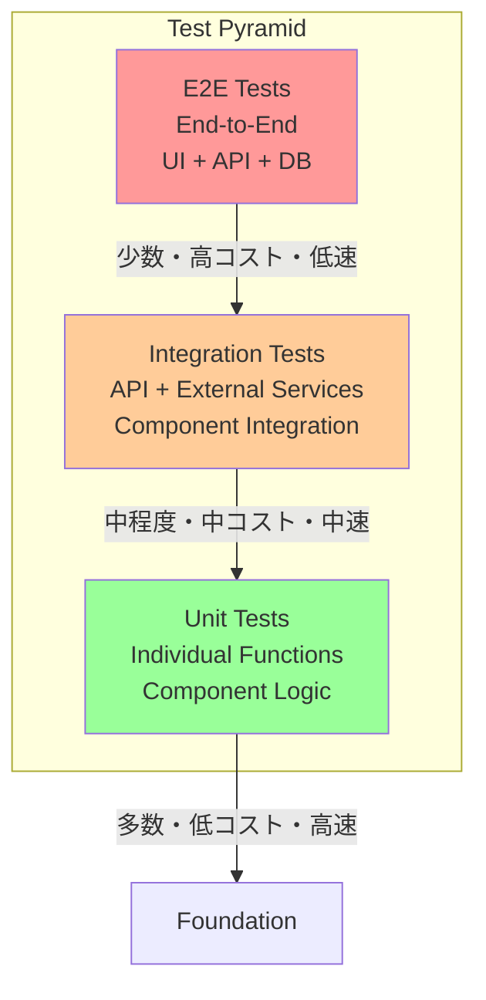

# テスト戦略 – QRAI

> **目的** — RAG + Deep Research アプリケーションの包括的テスト戦略を定義し、品質保証・回帰防止・パフォーマンス検証を体系化する。ユニット・統合・E2E・負荷テストまでのテストピラミッドを MVP から本番まで段階的に構築。

---

## 1. テスト戦略概要

### 1-1 テストピラミッド



### 1-2 カバレッジ目標

| テストレベル        | カバレッジ目標 | 実行頻度      | 目標実行時間    | 責任者        |
| ------------- | ------- | --------- | --------- | ---------- |
| **Unit**      | 80%     | PR毎・コミット毎 | < 30秒     | 開発者        |
| **Integration** | 60%     | PR毎      | < 2分      | 開発者        |
| **E2E**       | 主要パス100% | PR毎・デプロイ前 | < 5分      | QA + 開発者   |
| **Load**      | P95性能目標 | 週次・リリース前  | < 10分     | SRE + 開発者  |

### 1-3 テストディレクトリ構造

QRAIプロジェクトでは、フロントエンドとバックエンドで異なるテスト配置戦略を採用しています。

```
llm-app-trial-with-ai-driven/
├── frontend/                    # Next.js フロントエンド
│   ├── src/                     # アプリケーションソース
│   │   ├── components/          # UIコンポーネント
│   │   ├── hooks/               # カスタムフック
│   │   ├── app/                 # Next.js App Router
│   │   └── lib/                 # ユーティリティ
│   ├── tests/                   # 🔧 フロントエンドテスト
│   │   ├── components/          # コンポーネントテスト
│   │   │   ├── MessageBubble.test.tsx
│   │   │   ├── InputForm.test.tsx
│   │   │   └── LoadingSpinner.test.tsx
│   │   ├── hooks/               # フックテスト
│   │   │   └── useChatStream.test.ts
│   │   ├── setup.ts             # テスト設定
│   │   └── basic.test.ts        # 基本テスト
│   ├── vitest.config.ts         # Vitest設定
│   └── package.json
├── backend/                     # FastAPI バックエンド
│   ├── api/                     # GraphQL API
│   ├── services/                # ビジネスロジック
│   ├── providers/               # LLMプロバイダー
│   ├── infra/                   # インフラストラクチャー
│   ├── models/                  # データモデル
│   ├── tests/                   # 🔧 バックエンドテスト
│   │   ├── unit/                # ユニットテスト
│   │   ├── integration/         # 統合テスト
│   │   ├── mocks/               # モックデータ・ヘルパー
│   │   ├── test_api.py          # APIテスト
│   │   ├── test_providers.py    # プロバイダーテスト
│   │   ├── conftest.py          # pytest設定・フィクスチャ
│   │   └── __init__.py
│   ├── alembic.ini              # DB マイグレーション設定
│   └── Dockerfile               # テスト環境用
├── tests/                       # 🔧 プロジェクト全体のテスト
│   └── e2e/                     # E2Eテスト（Playwright）
│       ├── basic-chat.spec.ts   # （予定）基本チャット機能
│       ├── streaming.spec.ts    # （予定）ストリーミング機能
│       └── error-scenarios.spec.ts # （予定）エラーケース
├── playwright.config.ts         # （予定）Playwright設定（E2E）
└── docker-compose.yml           # 開発・テスト環境設定
```

#### テスト配置戦略の理由

| 配置場所                    | 対象テスト             | 理由                                    |
| ----------------------- | ------------------ | ------------------------------------- |
| `frontend/tests/`       | フロントエンドユニット・統合テスト | Next.jsのモジュール解決とVitestの統合を最適化         |
| `backend/tests/`        | バックエンドユニット・統合テスト | Pythonのモジュールパス解決とpytestの設定を簡素化       |
| `tests/e2e/`            | E2Eテスト            | フロントエンド・バックエンド・DBの全体連携テストのため独立配置 |
| `tests/load/`           | 負荷テスト              | システム全体のパフォーマンステストのため独立配置           |

---

## 2. ユニットテスト戦略

### 2-1 Backend (Python) テスト

#### テストツール構成
```python
# テスト依存関係
pytest==7.4.0
pytest-asyncio==0.21.0  # async/await テスト
pytest-mock==3.11.0     # モック機能
pytest-cov==4.1.0       # カバレッジ計測
httpx==0.24.0           # HTTP クライアント（テスト用）
```

#### RagService ユニットテスト例
```python
import pytest
from unittest.mock import AsyncMock, Mock
from services.rag import RagService
from infra.search_client import AzureSearchClient
from infra.openai_client import OpenAIClient

@pytest.fixture
async def rag_service():
    search_client = Mock(spec=AzureSearchClient)
    openai_client = Mock(spec=OpenAIClient)
    return RagService(search_client, openai_client)

@pytest.mark.asyncio
async def test_rag_answer_with_citations(rag_service):
    # Arrange
    question = "社内研修制度について教えて"
    mock_search_results = [
        {"content": "研修制度の概要", "url": "https://intranet.com/training", "title": "研修制度ガイド"}
    ]
    rag_service.search_client.search.return_value = mock_search_results
    rag_service.openai_client.complete.return_value = "研修制度は年2回実施されます。"

    # Act
    result = await rag_service.answer(question)

    # Assert
    assert "研修制度は年2回実施されます" in result
    assert "[1]" in result  # 引用番号確認
    rag_service.search_client.search.assert_called_once_with(question, top_k=3)
```

#### FastAPI API テスト例
```python
from fastapi.testclient import TestClient
from main import create_app

@pytest.fixture
def client():
    app = create_app(testing=True)
    return TestClient(app)

def test_graphql_ask_mutation(client):
    query = """
    mutation {
        ask(question: "テスト質問", deepResearch: false) {
            answer
            citations {
                url
                title
            }
        }
    }
    """

    response = client.post("/graphql", json={"query": query})
    assert response.status_code == 200
    data = response.json()
    assert "answer" in data["data"]["ask"]
    assert len(data["data"]["ask"]["citations"]) > 0
```

### 2-2 Frontend (TypeScript) テスト

#### テストツール構成
```json
{
  "devDependencies": {
    "vitest": "^1.0.0",
    "@testing-library/react": "^13.4.0",
    "@testing-library/jest-dom": "^6.0.0",
    "@testing-library/user-event": "^14.4.0",
    "jsdom": "^22.0.0"
  }
}
```

#### React コンポーネント テスト例
```typescript
import { render, screen, fireEvent } from '@testing-library/react'
import { MessageBubble } from '@/components/MessageBubble'

describe('MessageBubble', () => {
  it('ユーザーメッセージを正しく表示する', () => {
    const props = {
      message: {
        id: '1',
        content: 'テストメッセージ',
        role: 'user',
        timestamp: new Date()
      }
    }

    render(<MessageBubble {...props} />)

    expect(screen.getByText('テストメッセージ')).toBeInTheDocument()
    expect(screen.getByTestId('user-message')).toHaveClass('bg-blue-500')
  })

  it('AI回答に引用リンクが含まれる', () => {
    const props = {
      message: {
        id: '2',
        content: '回答内容 [1]',
        role: 'assistant',
        citations: [
          { url: 'https://example.com', title: 'テスト文書' }
        ]
      }
    }

    render(<MessageBubble {...props} />)

    expect(screen.getByText('[1]')).toHaveAttribute('href', 'https://example.com')
  })
})
```

#### カスタムフック テスト例
```typescript
import { renderHook, act } from '@testing-library/react'
import { useChatStream } from '@/hooks/useChatStream'

describe('useChatStream', () => {
  it('ストリーミング開始・停止が正常動作する', async () => {
    const { result } = renderHook(() => useChatStream())

    expect(result.current.isStreaming).toBe(false)

    act(() => {
      result.current.startStream('session123', 'テスト質問')
    })

    expect(result.current.isStreaming).toBe(true)

    act(() => {
      result.current.stopStream()
    })

    expect(result.current.isStreaming).toBe(false)
  })
})
```

---

## 3. 統合テスト戦略

### 3-1 API 統合テスト

```python
@pytest.mark.integration
@pytest.mark.asyncio
async def test_rag_with_real_azure_search():
    """実際のAzure Search APIを使用した統合テスト"""
    search_client = AzureSearchClient(
        endpoint=os.getenv("AZURE_SEARCH_ENDPOINT"),
        key=os.getenv("AZURE_SEARCH_KEY")
    )

    # テスト用インデックスにテストデータを投入
    await search_client.upload_documents([
        {"id": "test1", "content": "テスト文書内容", "title": "テスト文書"}
    ])

    # 検索テスト実行
    results = await search_client.search("テスト", top_k=1)

    assert len(results) == 1
    assert "テスト文書内容" in results[0]["content"]
```

### 3-2 Database 統合テスト

```python
@pytest.mark.integration
@pytest.mark.asyncio
async def test_session_crud_operations():
    """Cosmos DB for PostgreSQL との統合テスト"""
    async with AsyncTestingSessionLocal() as db:
        # セッション作成
        session = Session(user_id="test_user", title="テストセッション")
        db.add(session)
        await db.commit()

        # メッセージ追加
        message = Message(
            session_id=session.id,
            content="テストメッセージ",
            role="user"
        )
        db.add(message)
        await db.commit()

        # データ取得検証
        retrieved = await db.get(Session, session.id)
        assert retrieved.title == "テストセッション"
        assert len(retrieved.messages) == 1
```

---

## 4. E2E テスト戦略

### 4-1 Playwright E2E テスト

#### 設定ファイル
```typescript
// playwright.config.ts
import { defineConfig } from '@playwright/test'

export default defineConfig({
  testDir: './e2e',
  timeout: 30000,
  use: {
    baseURL: 'http://localhost:3000',
    headless: process.env.CI === 'true',
  },
  projects: [
    { name: 'chromium', use: { ...devices['Desktop Chrome'] } },
    { name: 'webkit', use: { ...devices['Desktop Safari'] } },
  ],
})
```

#### チャット機能 E2E テスト
```typescript
import { test, expect } from '@playwright/test'

test.describe('チャット機能', () => {
  test('質問送信からAI応答まで', async ({ page }) => {
    await page.goto('/chat/new')

    // 質問入力
    await page.fill('[data-testid="message-input"]', '社内研修制度について')
    await page.click('[data-testid="send-button"]')

    // 送信確認
    await expect(page.locator('[data-testid="user-message"]')).toContainText('社内研修制度について')

    // AI応答待機（最大10秒）
    await expect(page.locator('[data-testid="ai-message"]')).toBeVisible({ timeout: 10000 })

    // 引用リンク確認
    await expect(page.locator('[data-testid="citation-link"]')).toBeVisible()
  })

  test('Deep Research機能', async ({ page }) => {
    await page.goto('/chat/new')

    // Deep Research モード有効化
    await page.check('[data-testid="deep-research-toggle"]')
    await page.fill('[data-testid="message-input"]', '競合他社の動向を調査して')
    await page.click('[data-testid="send-button"]')

    // プログレスバー表示確認
    await expect(page.locator('[data-testid="progress-bar"]')).toBeVisible()

    // リサーチ完了確認（最大120秒）
    await expect(page.locator('[data-testid="research-report"]')).toBeVisible({ timeout: 120000 })

    // レポート構造確認
    await expect(page.locator('h2')).toHaveCount({ min: 2 }) // セクション見出し
  })
})
```

### 4-2 API E2E テスト

```python
@pytest.mark.e2e
@pytest.mark.asyncio
async def test_full_rag_workflow():
    """GraphQL API経由でのRAG全体フロー"""
    async with httpx.AsyncClient() as client:
        # セッション作成
        create_session_query = """
        mutation { createSession(title: "E2Eテスト") { id } }
        """
        response = await client.post("/graphql", json={"query": create_session_query})
        session_id = response.json()["data"]["createSession"]["id"]

        # 質問送信
        ask_query = """
        mutation($sessionId: ID!, $question: String!) {
            ask(sessionId: $sessionId, question: $question) {
                answer
                citations { url title }
            }
        }
        """
        response = await client.post("/graphql", json={
            "query": ask_query,
            "variables": {"sessionId": session_id, "question": "テスト質問"}
        })

        assert response.status_code == 200
        data = response.json()["data"]["ask"]
        assert len(data["answer"]) > 0
        assert len(data["citations"]) > 0
```

---

## 5. 負荷テスト戦略

### 5-1 Locust 負荷テスト

```python
from locust import HttpUser, task, between

class QRAIUser(HttpUser):
    wait_time = between(1, 3)  # 1-3秒間隔

    def on_start(self):
        """テスト開始時の初期化"""
        self.session_id = self.create_session()

    def create_session(self):
        query = """mutation { createSession(title: "Load Test") { id } }"""
        response = self.client.post("/graphql", json={"query": query})
        return response.json()["data"]["createSession"]["id"]

    @task(3)
    def ask_rag_question(self):
        """RAG質問（重み3：頻度高）"""
        query = """
        mutation($sessionId: ID!, $question: String!) {
            ask(sessionId: $sessionId, question: $question) {
                answer
            }
        }
        """
        questions = [
            "社内研修制度について",
            "有給休暇の取得方法",
            "人事評価制度はどのようになっていますか"
        ]

        self.client.post("/graphql", json={
            "query": query,
            "variables": {
                "sessionId": self.session_id,
                "question": self.random_choice(questions)
            }
        }, name="RAG質問")

    @task(1)
    def ask_deep_research(self):
        """Deep Research（重み1：頻度低）"""
        query = """
        mutation($sessionId: ID!, $question: String!) {
            ask(sessionId: $sessionId, question: $question, deepResearch: true) {
                answer
            }
        }
        """

        self.client.post("/graphql", json={
            "query": query,
            "variables": {
                "sessionId": self.session_id,
                "question": "競合分析レポートを作成してください"
            }
        }, name="Deep Research", timeout=180)  # 3分タイムアウト
```

### 5-2 負荷テストシナリオ

| シナリオ名          | 仮想ユーザー数 | 実行時間 | 目標値                    | 検証項目                  |
| -------------- | ------- | ---- | ---------------------- | --------------------- |
| **軽負荷テスト**     | 5       | 5分   | p95 < 10秒, エラー率 < 2%   | 基本機能動作確認            |
| **通常負荷テスト**    | 20      | 10分  | p95 < 15秒, エラー率 < 5%   | 無料枠上限での安定動作         |
| **ピーク負荷テスト**   | 50      | 5分   | サーバー無停止, Rate Limit適切 | 過負荷時の適切な制限動作        |
| **持続負荷テスト**    | 10      | 30分  | メモリリーク無し, p95安定     | 長時間運用での安定性          |

---

## 6. テストデータ管理

### 6-1 テストデータ戦略

```python
# テストデータファクトリー
import factory
from models import Session, Message

class SessionFactory(factory.Factory):
    class Meta:
        model = Session

    user_id = factory.Sequence(lambda n: f"test_user_{n}")
    title = factory.Faker('sentence', nb_words=3)
    created_at = factory.Faker('date_time_this_year')

class MessageFactory(factory.Factory):
    class Meta:
        model = Message

    session = factory.SubFactory(SessionFactory)
    content = factory.Faker('text', max_nb_chars=500)
    role = factory.Iterator(['user', 'assistant'])

# 使用例
def test_with_sample_data():
    session = SessionFactory()
    messages = MessageFactory.create_batch(5, session=session)
    assert len(messages) == 5
```

### 6-2 Mock 戦略

```python
# Azure サービス Mock
class MockAzureSearchClient:
    def __init__(self):
        self.mock_results = [
            {
                "content": "モック検索結果",
                "url": "https://example.com/doc1",
                "title": "テスト文書1"
            }
        ]

    async def search(self, query: str, top_k: int = 3):
        return self.mock_results[:top_k]

class MockOpenAIClient:
    async def complete(self, prompt: str):
        return f"モック回答: {prompt[:50]}..."

# テストでの使用
@pytest.fixture
def mock_services():
    return {
        'search': MockAzureSearchClient(),
        'openai': MockOpenAIClient()
    }
```

---

## 7. テスト自動化・CI/CD

### 7-1 GitHub Actions ワークフロー

```yaml
name: Test Suite

on: [push, pull_request]

jobs:
  unit-tests:
    runs-on: ubuntu-latest
    steps:
      - uses: actions/checkout@v4
      - name: Setup Python
        uses: actions/setup-python@v4
        with:
          python-version: '3.12'

      - name: Install dependencies
        run: |
          pip install -r backend/requirements-dev.txt

      - name: Run Python unit tests
        run: |
          cd backend
          pytest tests/unit/ --cov=. --cov-report=xml

      - name: Setup Node.js
        uses: actions/setup-node@v4
        with:
          node-version: '20'

      - name: Install frontend dependencies
        run: |
          cd frontend
          pnpm install

      - name: Run frontend unit tests
        run: |
          cd frontend
          pnpm test:unit

  integration-tests:
    runs-on: ubuntu-latest
    needs: unit-tests
    services:
      postgres:
        image: postgres:16
        env:
          POSTGRES_PASSWORD: postgres
        options: >-
          --health-cmd pg_isready
          --health-interval 10s
          --health-timeout 5s
          --health-retries 5

    steps:
      - uses: actions/checkout@v4
      - name: Run integration tests
        run: |
          cd backend
          pytest tests/integration/ --tb=short

  e2e-tests:
    runs-on: ubuntu-latest
    needs: integration-tests
    steps:
      - uses: actions/checkout@v4
      - name: Start services
        run: docker compose up -d

      - name: Run E2E tests
        run: |
          cd frontend
          pnpm playwright test

      - name: Upload test results
        uses: actions/upload-artifact@v3
        if: always()
        with:
          name: playwright-report
          path: frontend/playwright-report/
```

### 7-2 Pre-commit フック

```yaml
# .pre-commit-config.yaml
repos:
  - repo: local
    hooks:
      - id: pytest-unit
        name: Unit tests
        entry: bash -c 'cd backend && pytest tests/unit/ --tb=short'
        language: system
        pass_filenames: false

      - id: frontend-test
        name: Run frontend tests
        entry: bash -c 'cd frontend && pnpm test:unit --run'
        language: system
        pass_filenames: false
```

---

## 8. テスト品質指標

### 8-1 継続的監視指標

| 指標                | 目標値      | 測定方法                    | アラート条件        |
| ----------------- | -------- | ----------------------- | ------------- |
| **ユニットテストカバレッジ** | > 80%    | pytest-cov, istanbul   | < 75%         |
| **テスト実行時間**       | < 5分     | GitHub Actions ログ     | > 10分         |
| **テスト成功率**        | > 98%    | CI 成功/失敗率              | < 95% (3日間平均) |
| **E2Eテスト安定性**     | > 95%    | Playwright 成功率        | < 90%         |

### 8-2 品質ゲート

```python
# pytest.ini
[tool:pytest]
addopts =
    --cov=backend
    --cov-report=term-missing
    --cov-fail-under=80
    --maxfail=5
    --tb=short

testpaths = tests
python_files = test_*.py
python_classes = Test*
python_functions = test_*
```

---

## 9. 運用・メンテナンス

### 9-1 テストデータ整備

| 作業内容           | 頻度    | 責任者     | 自動化状況 |
| -------------- | ----- | ------- | ----- |
| テストDB初期化      | PR毎   | CI/CD   | 済     |
| Mock データ更新    | 月次    | 開発者     | 一部    |
| 負荷テストシナリオ見直し | 四半期   | SRE     | 手動    |
| E2Eテスト安定化     | 週次    | QA      | 一部    |

### 9-2 トラブルシューティング

詳細なテスト障害対応については **[../operational_runbook.md](../operational_runbook.md)** と **[error_handling.md](error_handling.md)** を参照してください。

---

*Last updated: 2024-12-28*
