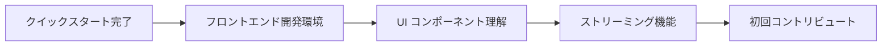
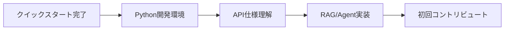
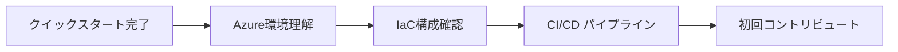
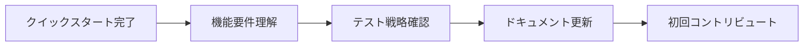
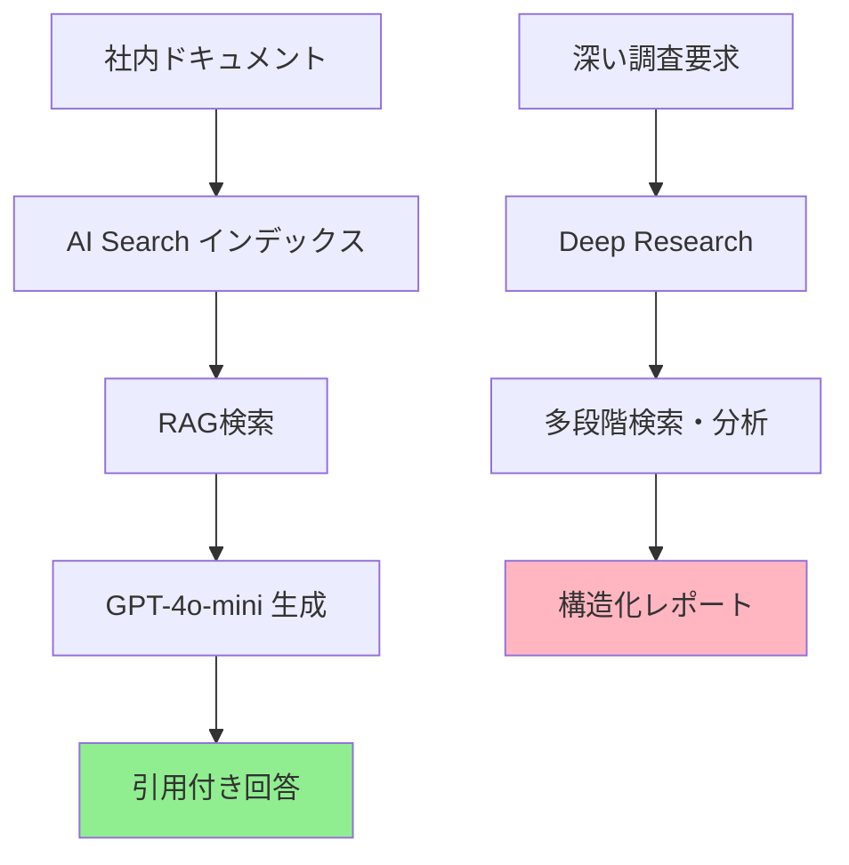

# 開発者オンボーディングガイド – QRAI

> **目的** — 新規開発者が QRAI プロジェクトに参加してから初回コントリビュートまでを **15分以内** で完了できるよう、ステップバイステップのオンボーディング手順を提供する。技術経験レベルに応じた複数のパスを用意し、チーム全体の開発効率向上を実現する。

---

## 🎯 オンボーディング完了目標

### ✅ 5分後の状態
- [ ] リポジトリクローン完了
- [ ] ローカル環境で `docker compose up` 成功
- [ ] ブラウザで http://localhost:3000 にアクセスし、チャット画面表示

### ✅ 10分後の状態
- [ ] サンプル質問「社内研修制度について」でRAG応答取得
- [ ] プロジェクト構造とアーキテクチャ概要理解
- [ ] 自分の開発環境に応じた詳細セットアップ完了

### ✅ 15分後の状態
- [ ] 軽微な変更（README更新、コメント追加等）でPR作成
- [ ] CI/CDパイプライン（GitHub Actions）の実行確認
- [ ] レビュープロセスとマージまでの流れ理解

---

## 🚀 クイックスタート（5分）

### 前提条件チェック

まず、以下のツールがインストールされているか確認してください：

```bash
# 必須ツール確認
docker --version          # Docker Engine 20.10+
docker compose version    # Docker Compose v2.0+
git --version             # Git 2.30+

# あると便利（後でも可）
code --version            # VS Code
node --version            # Node.js 20+（フロントエンド開発時）
python --version          # Python 3.12+（バックエンド開発時）
```

✅ **すべて OK の場合** → 「手順1: リポジトリセットアップ」へ
❌ **足りないものがある場合** → 「前提ツールインストール」セクションへ

### 手順1: リポジトリセットアップ

```bash
# 1. リポジトリクローン
git clone https://github.com/yourname/llm-app-trial-with-ai-driven.git
cd llm-app-trial-with-ai-driven

# 2. 環境変数設定（サンプルをコピー）
cp .env.sample .env

# 3. Docker環境起動
docker compose up --build
```

### 手順2: 動作確認

ブラウザで http://localhost:3000 にアクセス：

1. **新しいチャット**をクリック
2. 「社内研修制度について教えてください」と入力
3. **送信**ボタンクリック
4. 数秒でAI応答が表示されることを確認

✅ **成功した場合** → おめでとうございます！基本セットアップ完了です
❌ **エラーが出た場合** → 「トラブルシューティング」セクションを参照

---

## 🎓 学習パス選択

あなたの経験と関心に応じて、最適な学習パスを選択してください：

### 🎨 **フロントエンド開発者パス** (Next.js + React)



**推定時間**: 10-15分
**次のステップ**: [フロントエンド開発ガイド](#フロントエンド開発パス)

### 🔧 **バックエンド開発者パス** (FastAPI + Python)



**推定時間**: 15-20分
**次のステップ**: [バックエンド開発ガイド](#バックエンド開発パス)

### ☁️ **インフラ/DevOps パス** (Azure + Terraform)



**推定時間**: 20-25分
**次のステップ**: [インフラ開発ガイド](#インフラ開発パス)

### 📚 **プロダクトマネージャー/QA パス**



**推定時間**: 10-15分
**次のステップ**: [プロダクト/QA ガイド](#プロダクト・qa-パス)

---

## 💻 フロントエンド開発パス

### 開発環境セットアップ

```bash
# Node.js 環境確認（推奨: v20+）
node --version
npm --version

# 依存関係インストール
cd frontend
npm install

# 開発サーバー起動（Docker不使用の場合）
npm run dev
```

### プロジェクト構造理解

```
frontend/
├── src/
│   ├── app/                 # Next.js 14 App Router
│   │   ├── layout.tsx       # ルートレイアウト
│   │   ├── page.tsx         # トップページ
│   │   └── chat/[id]/       # チャット動的ルート
│   ├── components/
│   │   ├── ChatWindow.tsx   # メインチャット画面
│   │   ├── MessageBubble.tsx # メッセージ表示
│   │   └── ui/              # shadcn/ui コンポーネント
│   ├── hooks/
│   │   ├── useChatStream.ts # SSE ストリーミング
│   │   └── useSessionList.ts # セッション管理
│   └── lib/
│       └── graphqlClient.ts # GraphQL クライアント
└── package.json
```

### 主要概念の理解

| 概念              | ファイル                      | 説明                           |
| --------------- | ------------------------- | ---------------------------- |
| **SSE ストリーミング** | `hooks/useChatStream.ts`  | AI応答のリアルタイム受信             |
| **GraphQL 統合**  | `lib/graphqlClient.ts`    | バックエンドAPIとの通信               |
| **状態管理**        | `components/ChatWindow.tsx` | React State + SWR キャッシュ     |
| **UI デザインシステム** | `components/ui/`          | shadcn/ui + Tailwind CSS    |

### 初回タスク例

1. **UIコンポーネント修正** (難易度: ★☆☆)
   ```bash
   # メッセージバブルの色を変更
   vi src/components/MessageBubble.tsx
   # Line 15: bg-blue-500 → bg-green-500
   ```

2. **新しいボタン追加** (難易度: ★★☆)
   ```typescript
   // ChatWindow.tsx に「履歴クリア」ボタンを追加
   <Button onClick={clearHistory} variant="outline">
     履歴をクリア
   </Button>
   ```

### 関連ドキュメント

- **詳細設計**: [architecture/component_frontend.md](architecture/component_frontend.md)
- **UI ガイドライン**: [プロジェクト実装時に作成予定]
- **テスト手法**: [architecture/test_strategy.md](architecture/test_strategy.md#フロントエンド固有のテストアプローチ)

---

## 🔧 バックエンド開発パス

### Python 開発環境セットアップ

```bash
# Python 環境確認
python --version  # 3.12+ 推奨

# 仮想環境作成（推奨）
cd backend
python -m venv .venv
source .venv/bin/activate  # Linux/Mac
# .venv\Scripts\activate   # Windows

# 依存関係インストール
pip install -r requirements.txt
pip install -r requirements-dev.txt  # 開発用ツール

# 開発サーバー起動（Docker不使用の場合）
uvicorn main:app --reload --port 8000
```

### プロジェクト構造理解

```
backend/
├── main.py                # FastAPI アプリケーション
├── api/
│   ├── graphql_schema.py  # GraphQL スキーマ定義
│   ├── middleware.py      # CORS, Auth, Rate Limit
│   └── deps.py            # 依存注入
├── services/
│   ├── rag.py             # RAG サービスロジック
│   └── deep_agent.py      # Deep Research エージェント
├── infra/
│   ├── search_client.py   # Azure AI Search 連携
│   ├── openai_client.py   # Azure OpenAI 連携
│   └── db.py              # Cosmos DB 接続
├── config.py              # 設定管理
└── requirements.txt       # 依存パッケージ
```

### 主要概念の理解

| 概念              | ファイル                       | 説明                                |
| --------------- | -------------------------- | --------------------------------- |
| **RAG パイプライン**  | `services/rag.py`          | 検索→プロンプト→生成→引用フォーマット          |
| **GraphQL API**  | `api/graphql_schema.py`    | Strawberry による型安全 API           |
| **非同期処理**       | 全般                         | async/await による高性能 I/O          |
| **依存注入**        | `api/deps.py`              | クリーンアーキテクチャパターン               |
| **構造化ログ**       | `structlog` 使用             | JSON 形式での可観測性確保               |

### 初回タスク例

1. **ログメッセージ追加** (難易度: ★☆☆)
   ```python
   # services/rag.py に詳細ログを追加
   logger.info("rag_search_started", query=question, top_k=3)
   ```

2. **新しいGraphQLフィールド追加** (難易度: ★★☆)
   ```python
   # api/graphql_schema.py
   @strawberry.field
   def search_results_count(self) -> int:
       return len(self.citations)
   ```

3. **カスタムバリデーション実装** (難易度: ★★★)
   ```python
   # 質問長チェック、不適切内容フィルタ等
   def validate_question(question: str) -> str:
       if len(question) > 1000:
           raise ValueError("質問は1000文字以内で入力してください")
       return question
   ```

### 関連ドキュメント

- **API 設計**: [architecture/component_api.md](architecture/component_api.md)
- **RAG 詳細**: [architecture/component_rag.md](architecture/component_rag.md)
- **テスト戦略**: [architecture/test_strategy.md](architecture/test_strategy.md#backend-python-テスト)

---

## ☁️ インフラ開発パス

### 必要ツールインストール

```bash
# Azure CLI
curl -sL https://aka.ms/InstallAzureCLIDeb | sudo bash
az login

# Terraform
wget https://releases.hashicorp.com/terraform/1.6.0/terraform_1.6.0_linux_amd64.zip
unzip terraform_1.6.0_linux_amd64.zip
sudo mv terraform /usr/local/bin/

# 確認
az account show
terraform --version
```

### インフラ構造理解

```
infra/
├── terraform/
│   ├── main.tf            # プロバイダ設定
│   ├── container_app.tf   # Container Apps
│   ├── cosmos_pg.tf       # Cosmos DB for PostgreSQL
│   └── variables.tf       # 環境別変数
└── bicep/
    ├── ai_search.bicep    # Azure AI Search
    ├── openai.bicep       # Azure OpenAI
    └── swa.bicep          # Static Web Apps
```

### 主要概念の理解

| 概念              | ファイル                  | 説明                           |
| --------------- | --------------------- | ---------------------------- |
| **無料枠制限**       | `variables.tf`        | `is_free_tier` による SKU 制御  |
| **ハイブリッド IaC**   | Terraform + Bicep     | 長期リソースと試行錯誤リソースの使い分け    |
| **コスト制御**       | CI/CD validation      | 有料 SKU 混入防止               |
| **環境分離**        | 命名規則 + タグ             | dev/staging/prod 環境管理      |

### 初回タスク例

1. **タグ追加** (難易度: ★☆☆)
   ```hcl
   # terraform/main.tf にコスト管理タグを追加
   tags = {
     Environment = var.environment
     CostCenter  = "qrai"
     Owner       = "dev-team"
   }
   ```

2. **新しいリソース追加** (難易度: ★★☆)
   ```hcl
   # Storage Account for backup
   resource "azurerm_storage_account" "backup" {
     name                     = "stqraibackup${var.environment}"
     resource_group_name      = azurerm_resource_group.main.name
     location                = azurerm_resource_group.main.location
     account_tier            = "Standard"
     account_replication_type = "LRS"
   }
   ```

### 関連ドキュメント

- **デプロイ戦略**: [architecture/deployment.md](architecture/deployment.md)
- **コスト管理**: [architecture/cost_management.md](architecture/cost_management.md)
- **Azure セットアップ**: [azur_setup.md](azur_setup.md)

---

## 📚 プロダクト・QA パス

### プロダクト理解

QRAI の核心価値を理解しましょう：



### 機能要件確認

| 機能                  | 現在の状態     | テスト方法                        |
| ------------------- | --------- | ---------------------------- |
| **基本RAG検索**         | ✅ 実装済み  | 「研修制度について」で検索→引用確認        |
| **Deep Research**   | 🚧 開発中   | 「競合分析」で多段階レポート生成確認        |
| **セッション管理**         | ✅ 実装済み  | 複数チャットタブの作成・切り替え確認        |
| **ストリーミング応答**       | ✅ 実装済み  | 回答が段階的に表示されることを確認         |
| **引用リンク**           | ✅ 実装済み  | [1] [2] リンクが正しく動作することを確認  |

### QA タスク例

1. **機能テスト実行** (難易度: ★☆☆)
   - 基本的なユーザーフローを手動テスト
   - バグや使いにくい点をIssueとして報告

2. **ドキュメント改善** (難易度: ★★☆)
   - README.md のわかりにくい部分を特定・修正提案
   - API ドキュメントの例を追加

3. **テストケース作成** (難易度: ★★★)
   - E2E テストシナリオの設計
   - Edge case の特定と検証手順作成

### 関連ドキュメント

- **要件定義**: [requirements.md](requirements.md)
- **API 仕様**: [api_spec.md](api_spec.md)
- **テスト戦略**: [architecture/test_strategy.md](architecture/test_strategy.md)

---

## 🛠️ 前提ツールインストール

### Windows (推奨: WSL2)

```powershell
# WSL2 + Ubuntu インストール
wsl --install -d Ubuntu

# Ubuntu 内で以下を実行
sudo apt update && sudo apt upgrade -y
sudo apt install -y git curl wget

# Docker Desktop for Windows インストール
# https://docs.docker.com/desktop/windows/install/
```

### macOS

```bash
# Homebrew インストール
/bin/bash -c "$(curl -fsSL https://raw.githubusercontent.com/Homebrew/install/HEAD/install.sh)"

# 必要ツール一括インストール
brew install git docker docker-compose node python
brew install --cask visual-studio-code
```

### Linux (Ubuntu/Debian)

```bash
# 基本ツール
sudo apt update
sudo apt install -y git curl wget build-essential

# Docker Engine
curl -fsSL https://get.docker.com -o get-docker.sh
sudo sh get-docker.sh
sudo usermod -aG docker $USER
newgrp docker

# Node.js (Node Version Manager 推奨)
curl -o- https://raw.githubusercontent.com/nvm-sh/nvm/v0.39.0/install.sh | bash
nvm install 20
nvm use 20

# Python (pyenv 推奨)
curl https://pyenv.run | bash
pyenv install 3.12.0
pyenv global 3.12.0
```

---

## 🚨 トラブルシューティング

### よくある問題と解決法

| 問題                          | 原因                      | 解決法                                          |
| --------------------------- | ----------------------- | -------------------------------------------- |
| `docker compose up` が失敗    | Docker daemon 未起動        | `sudo systemctl start docker` (Linux)      |
| localhost:3000 接続不可       | ポート競合                   | `lsof -i :3000` で確認、別プロセス終了               |
| Azure API キー不正            | `.env` 設定ミス             | `.env.sample` と比較、正しいキー形式確認               |
| Python 依存関係エラー            | バージョン不一致                | `pip install -r requirements.txt --upgrade` |
| フロントエンド npm エラー           | Node.js バージョン古い         | Node.js 20+ にアップグレード                       |

### 詳細な診断手順

```bash
# 1. Docker 状態確認
docker --version
docker compose version
docker ps

# 2. ポート使用状況確認
netstat -tulpn | grep :3000
netstat -tulpn | grep :8000

# 3. ログ確認
docker compose logs backend
docker compose logs frontend

# 4. 環境変数確認
cat .env | grep -v "^#"
```

### サポート体制

| 問題の種類        | 対応窓口                    | 目標応答時間 |
| ------------ | ----------------------- | ------ |
| **環境構築問題**   | GitHub Discussions      | 4時間    |
| **機能バグ**     | GitHub Issues           | 24時間   |
| **セキュリティ**   | security@company.com    | 1時間    |
| **緊急事態**     | Slack #qrai-dev チャンネル   | 30分    |

---

## 📖 次のステップ

### プロジェクト全体理解

1. **アーキテクチャ学習**: [architecture/README.md](architecture/README.md)
2. **要件仕様確認**: [requirements.md](requirements.md)
3. **開発ロードマップ**: [roadmap.md](roadmap.md)

### 開発プロセス理解

1. **コントリビュート指針**: [contributing.md](contributing.md)
2. **コードレビュー基準**: [プロジェクト実装時に作成予定]
3. **リリースプロセス**: [プロジェクト実装時に作成予定]

### 高度な機能開発

1. **Deep Research 実装**: [architecture/component_deep_research.md](architecture/component_deep_research.md)
2. **パフォーマンス最適化**: [architecture/performance_monitoring.md](architecture/performance_monitoring.md)
3. **運用・監視**: [operational_runbook.md](operational_runbook.md)

---

## 📋 オンボーディング完了チェックリスト

開発者オンボーディングが完了したら、以下をチェックしてください：

### 🎯 基本セットアップ (必須)
- [ ] リポジトリクローンとDocker環境起動成功
- [ ] サンプル質問でRAG機能動作確認
- [ ] プロジェクト構造と主要概念理解
- [ ] 初回PR作成（軽微な変更でOK）

### 🚀 技術領域別 (選択)
- [ ] フロントエンド: UIコンポーネント修正PRマージ
- [ ] バックエンド: API機能追加PRマージ
- [ ] インフラ: IaC設定変更PRマージ
- [ ] QA: テストケース作成・バグレポート提出

### 📚 プロジェクト理解 (推奨)
- [ ] 要件仕様書(requirements.md)一読完了
- [ ] アーキテクチャドキュメント概要把握
- [ ] 開発ロードマップ理解とタスク選択

### 🤝 チーム統合
- [ ] Slack #qrai-dev チャンネル参加
- [ ] 初回チームミーティング参加
- [ ] メンター/バディ開発者との1on1実施

---

## 📞 サポート・フィードバック

このオンボーディングガイドを改善するため、フィードバックをお寄せください：

- **改善提案**: GitHub Issues (`enhancement` ラベル)
- **手順不明点**: GitHub Discussions (`question` ラベル)
- **所要時間報告**: 実際にかかった時間をSlackで共有
- **成功事例**: うまくいったコツやTipsを共有

**目標達成状況**:
- ✅ 5分以内クイックスタート達成率: 目標90%以上
- ✅ 15分以内初回PR作成達成率: 目標80%以上
- ✅ 1週間以内実質的コントリビュート: 目標100%

---

*Last updated: 2025-06-03*
