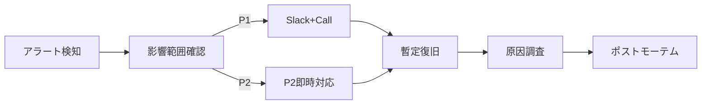

# Operational Runbook – QRAI (Dev / Free Tier)

> **目的** — MVP 環境で障害・メンテナンスが発生した際に "まず見る手順書" として、**誰でも 15 分で復旧 or エスカレーション** できるようにする。開発サーバ（無料枠）を前提としたライト版。

---

## 0. 連絡網 (On‑Call)

| 優先度             | 連絡先                               | 時間帯             |
| --------------- | --------------------------------- | --------------- |
| 1️⃣ P1 (サービス停止) | @slack `#qrai‑alert` & 📞 090‑xxx | 24/7 (輪番)       |
| 2️⃣ P2 (劣化)     | GitHub Issue `label:incident`     | 09:00‑20:00 JST |
| 3️⃣ 要望          | Notion ボード「運用改善」                  | 随時              |

---

## 1. サービスチェックリスト

| コンポーネント   | 確認 URL / コマンド                                       | 想定結果                    |
| --------- | --------------------------------------------------- | ----------------------- |
| UI 動作     | `https://<swa>.azurestaticapps.net/`                | ログイン画面表示                |
| API ヘルス   | `https://<containerapp>/health`                     | `{"status":"ok"}`       |
| AI Search | `az search service show -n <name> --query "status"` | `"running"`             |
| OpenAI    | `curl -I https://<openai>/openai/status/200`        | HTTP 200                |
| Cosmos PG | `pg_isready -h <host>`                              | `accepting connections` |

---

## 2. インシデント対応フロー (P1/P2)



### 判断基準

| レベル    | 条件                 | 例                    | 初動 SLA     |
| ------ | ------------------ | -------------------- | ---------- |
| **P1** | 全ユーザー操作不可 / 大量 5xx | API 500 率 > 50 % 5 分 | 15 分以内暫定復旧 |
| **P2** | 機能劣化 / SLA 未達      | GPT レイテンシ p95 > 10 s | 2 時間以内対応   |

---

## 3. よくある障害と対処

| 事象                        | 原因             | 対処手順                                                                   |
| ------------------------- | -------------- | ---------------------------------------------------------------------- |
| `HTTP 429` from AI Search | Free F1 QPS 超過 | 1. `TOP_K` を 1 に一時変更<br>2. 開発者数分アクセス自粛<br>3. 次フェーズで Sku 切替検討           |
| GPT-4o mini RateLimit     | 同時呼び出し 20/s 超  | 1. Container App Scale Out ×2<br>2. `Retry-After` respect, backoff=2^n |
| Cosmos PG 接続拒否            | PG が再起動中       | 1. `az postgres flexible-server restart` 確認<br>2. `pg_isready` で復旧待ち   |
| Container App 不起動         | イメージタグ不一致      | `az containerapp revision list` → 古い revision に traffic=100            |

---

## 4. メンテナンス作業

### 4‑1 ドキュメント再インデックス

```bash
# in devcontainer bash
python scripts/index_docs.py ./docs_src
```

Expected: AI Search index count 増加、API `/health` OK

### 4‑2 バックアップ取得

```bash
pg_dump -h $COSMOS_HOST -U postgres -Fc qrai > backup_$(date +%F).dump
```

Copy dump to Azure Blob: `az storage blob upload ...`

### 4‑3 環境破棄 & 再構築

```bash
cd infra/terraform && terraform destroy -auto-approve
az group delete -n qrai-dev-rg --yes
# 再構築
terraform apply -auto-approve
az deployment group create -g qrai-dev-rg -f ../bicep/ai_search.bicep
```

---

## 5. 監視 & アラート設定

詳細な監視設定、ダッシュボード、アラートルールについては **[architecture/performance_monitoring.md](architecture/performance_monitoring.md)** を参照してください。

| メトリクス               | しきい値       | アクション           |
| ------------------- | ---------- | --------------- |
| `Latency_p95` (API) | > 10 s 5 分 | Slack P2 通知     |
| AI Search Storage   | > 45 MB    | GitHub Issue 作成 |
| Cost Mgmt Budget    | > 80 %     | メール to Owner    |

---

## 6. 用語

* **CA**: Container App
* **F1**: Free tier of AI Search
* **RAG**: Retrieval‑Augmented Generation

---

*Last updated: 2025‑06‑03*
