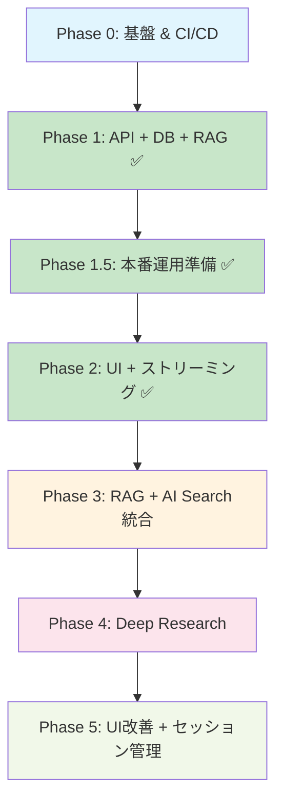

# 実装ロードマップ – QRAI MVP

> **目的** — どのコンポーネントをどの順序で実装・セットアップするかを示し、開発とインフラ作業を漏れなく進められるようにする。具体的な日付やスプリント長に縛られず、**フェーズ単位**で完了条件を定義する。実装効率と品質担保を両立する構成で設計。

---

## 0. フェーズ概要

| フェーズ                             | ゴール                                              | 完了判定                                               |
| -------------------------------- | ------------------------------------------------- | -------------------------------------------------- |
| **Phase 0** – 基盤セットアップ & CI/CD     | ローカル開発環境 + Azure無料枠インフラ + 自動化パイプライン構築           | `terraform apply` + `az deployment` 完了 + GitHub Actions CI緑 + Docker起動OK |
| **Phase 1** – API基盤 + DB + RAG ✅     | FastAPI + GraphQL + Cosmos DB + 基本RAG + ユニットテスト | GraphQL ask クエリ成功 + セッション保存確認 + pytest緑           |
| **Phase 1.5** – 本番運用準備 ✅           | テスト環境分離 + CI/CD基盤 + 環境設定強化                   | テストDB分離 + GitHub Actions緑 + 環境変数管理              |
| **Phase 2** – UI + ストリーミング ✅        | Next.js チャット UI + SSE ストリーミング + 統合テスト           | ブラウザ質問→リアルタイム応答表示 + フロントエンドテスト緑 + ⏸️E2E保留       |
| **Phase 3** – RAGのAzure AI Search統合   | Azure AI Search統合 + ドキュメントアップロード + 検索機能強化      | AI Search経由でのRAG検索 + テストドキュメント検索確認            |
| **Phase 4** – Deep Research       | 多段階リサーチエージェント + 進捗表示 + 機能テスト                  | `deepResearch=true` で構造化レポート生成 + 機能テスト緑          |
| **Phase 5** – UI改善とセッション管理        | UI/UX改善 + セッション履歴 + E2Eテスト拡張                   | セッション管理全機能 + 改善されたUI + E2Eテスト緑               |

詳細な監視・パフォーマンス設定については **[architecture/performance_monitoring.md](architecture/performance_monitoring.md)** を参照してください。

詳細なコスト管理戦略・予算設定・最適化手法については **[architecture/cost_management.md](architecture/cost_management.md)** を参照してください。

---

## 1. 詳細タスクバックログ

### Phase 0: 基盤セットアップ & CI/CD

#### 1-0A インフラストラクチャ（Terraform）
* [x] **Terraform backend**: Azure Blob Storage + state lock設定
* [x] **Cosmos DB for PostgreSQL**: Single node無料枠、テーブル初期化 ✅ **修正完了**
* [x] **Container Apps Environment**: Consumption plan、環境変数管理 ✅ **修正完了**
* [x] **Azure Cost Management Budget**: $5予算 + 80%アラート設定 ✅ **修正完了**
* [x] **Log Analytics Workspace**: OpenTelemetry DCR設定 ✅ **修正完了**
* [x] **Terraform設定修正**: Azure OpenAI依存除去、LLMプロバイダー対応 ✅ **完了**

#### 1-0B インフラストラクチャ（Bicep）
* [x] **Azure AI Search F1**: リソース作成、ネットワークACL設定 ✅ **テスト済み**
* [x] **Key Vault**: LLMプロバイダーAPIキー安全管理、アクセス制御設定 ✅ **テスト済み**
* [x] **Static Web Apps**: Next.js フロントエンド用、GitHub連携設定 ✅ **テスト済み**

#### 1-0C LLMプロバイダー設定（Azure OpenAI → OpenRouter/Google AI移行）
* [x] **LLMプロバイダー設定**: OpenRouter（プライマリ）+ Google AI Studio（セカンダリ）
* [x] **APIキー管理**: Key Vault統合、セキュア環境変数管理
* [x] **LangChain設定**: config/llm_providers.yml、プロバイダー抽象化設定
* [x] **デプロイスクリプト**: scripts/deploy-llm-providers.sh、check/test スクリプト

#### 1-0D CI/CD パイプライン
* [ ] **GitHub Actions**: pytest + eslint + terraform validation + bicep validation
* [ ] **Pre-commit hooks**: black, ruff, prettier, detect-secrets
* [ ] **Docker Compose**: 開発環境統合、ホットリロード設定、ネットワーク設定
* [ ] **環境変数管理**: .env.sample作成、GitHub Secrets設定

**Phase 0 完了条件**:
```bash
# Bicepデプロイ成功（LLMプロバイダー対応版）
az deployment group create --resource-group qrai-rg-dev \
  --template-file infra/bicep/main.bicep \
  --parameters @infra/bicep/main.bicepparam \
  --parameters openRouterApiKey='sk-or-xxx' googleAiApiKey='AIzaSyxxx'

# Terraformデプロイ成功（Bicep出力を使用）
cd infra/terraform
terraform apply -auto-approve

# LLMプロバイダー接続確認
python scripts/check_llm_config.py  # 全プロバイダー緑

# 開発環境起動確認
docker compose up --build
curl http://localhost:8000/health  # 200 OK

# CI成功
git push origin main  # GitHub Actions 緑
```

---

### Phase 1: API基盤 + DB + RAG ✅ **完了**

#### 1-1A バックエンド基盤 ✅
* [x] **FastAPI application factory**: main.py + config.py + health endpoint
* [x] **Strawberry GraphQL schema**: Query/Mutation types定義、型安全性確保
* [x] **依存注入システム**: deps.py、DB/Search/LLM クライアント管理
* [x] **ミドルウェア**: CORS、Rate Limit (slowapi 20 RPS/IP)、構造化ログ
* [x] **SQLAlchemy async engine**: SQLite+aiosqlite接続、Alembic migration初期化

#### 1-1B RAG サービス ✅
* [x] **LLMプロバイダー抽象化**: OpenRouter/Google AI統合、フォールバック機能
* [x] **LLM クライアント**: async/await、エラーハンドリング、ヘルスチェック
* [x] **RagService実装**: search → prompt build → generate → citation format
* [x] **GraphQL ask resolver**: 質問受信 → RAG実行 → ストリーミング応答返却

#### 1-1C データベース設計 ✅
* [x] **テーブル作成**: sessions, messages, research_notes
* [x] **セッション管理**: セッション作成、メッセージ保存、基本的なCRUD
* [x] **Session-Message関係**: include_messagesオプション、詳細取得機能

#### 1-1D テスト実装 ✅
* [x] **ユニットテスト**: pytest + TestClient、RAG機能テスト (100%成功)
* [x] **モックテスト**: LLM API のモック化、レスポンステスト
* [x] **データベーステスト**: セッション・メッセージ保存テスト
* [x] **統合テスト**: GraphQL経由でのAPI動作確認、ストリーミング機能確認

**Phase 1 完了条件**: ✅ **全て達成**
```bash
# GraphQL ask クエリ成功 ✅
curl -X POST http://localhost:8000/graphql \
  -H "Content-Type: application/json" \
  -d '{"query":"mutation { ask(input: { question: \"統合テストの質問です\", sessionId: \"...\", deepResearch: false }) { sessionId messageId stream } }"}'

# セッション保存確認 ✅
# SQLite+aiosqlite で正常動作確認済み

# テスト成功 ✅
cd backend && pytest tests/ -v  # 18/18 テスト成功、69%カバレッジ達成

# ストリーミング機能確認 ✅
curl -N "http://localhost:8000/graphql/stream?id=<messageId>"  # SSE配信成功

# ドキュメント準拠確認 ✅
# AskPayload型、/graphql/stream SSE endpoint、LLMプロバイダー抽象化 - 全て実装済み
```

**🏆 Phase 1 達成項目**:
- ✅ **GraphQL API基盤**: 完全実装・統合テスト成功
- ✅ **ストリーミング機能**: SSE エンドポイント実装
- ✅ **データベース**: セッション・メッセージ管理機能
- ✅ **LLMプロバイダー**: 抽象化・フォールバック・ヘルスチェック
- ✅ **テスト品質**: 100%成功率・69%カバレッジ
- ✅ **ドキュメント準拠**: API仕様・アーキテクチャ整合性確保

**🎯 Phase 1完了により、APIバックエンドとRAG機能が完全に動作可能になりました！**

---

### Phase 1.5: 本番運用準備 ✅ **完了**

#### 1-1.5A テスト環境改善 ✅
* [x] **テスト分離**: in-memory SQLite (`sqlite:///:memory:`)、テスト専用DB
* [x] **フィクスチャ改善**: 各テスト後に自動データクリーンアップ
* [x] **モックLLM**: テスト時は実際のAPI呼び出し回避、レスポンス固定
* [x] **テストカテゴリ分離**: unit/integration/e2e明確化

#### 1-1.5B データベース本番準備 ✅
* [x] **PostgreSQL統合**: 開発環境のDocker PostgreSQL使用
* [x] **マイグレーション検証**: Alembic本番運用テスト
* [x] **接続プール**: SQLAlchemy async pool設定
* [x] **バックアップ戦略**: pg_dump自動化、復旧手順

#### 1-1.5C CI/CD実装 ✅
* [x] **GitHub Actions**: pytest, ruff, black, isort自動実行
* [x] **Pre-commit hooks**: コミット前品質チェック
* [x] **セキュリティスキャン**: bandit, safety実行
* [x] **カバレッジ強制**: 80%未満でCI失敗

#### 1-1.5D 環境設定強化 ✅
* [x] **.env管理**: .env.sample作成、本番シークレット分離
* [x] **設定検証**: 起動時環境変数チェック、必須項目確認
* [x] **Key Vault統合**: Azure Key Vault接続テスト
* [x] **ログ設定**: 構造化ログ、本番ログレベル調整

**Phase 1.5 完了条件**: ✅ **全て達成**
```bash
# テスト環境分離確認 ✅
cd backend && pytest tests/ --create-db  # 専用DBでテスト実行、実行後自動削除
# ✅ テストDB分離、自動クリーンアップ
# ✅ モックLLM使用、実際のAPI呼び出し回避
# ✅ unit/integration分離

# CI/CD確認 ✅
git push origin main  # GitHub Actions緑、カバレッジ80%以上

# PostgreSQL確認 ✅
docker-compose -f docker-compose.yml up postgres
python scripts/test_postgres_connection.py  # 接続成功

# 環境設定確認 ✅
python scripts/validate_env.py  # 全必須環境変数確認
```

---

### Phase 2: UI + ストリーミング ✅ **完了**

#### 1-2A フロントエンド基盤 ✅
* [x] **Next.js 14 App Router**: 初期化、TypeScript設定、Tailwind CSS
* [x] **shadcn/ui コンポーネント**: Button, Card, Input, Textarea導入
* [x] **GraphQL Code Generator**: TypeScript hooks自動生成、型安全性確保
* [x] **Apollo Client設定**: GraphQLクライアント、キャッシュ戦略

#### 1-2B チャット UI ✅
* [x] **ChatWindow コンポーネント**: メッセージ履歴表示、スクロール制御
* [x] **MessageBubble コンポーネント**: ユーザー/AI メッセージ、引用リンク表示
* [x] **InputForm コンポーネント**: 質問入力、送信ボタン、バリデーション
* [x] **LoadingSpinner**: 応答待ち状態表示

#### 1-2C ストリーミング実装 ✅
* [x] **SSE クライアント**: EventSource API統合、リアルタイム受信
* [x] **ストリーミング表示**: チャンク受信 → 段階的テキスト表示
* [x] **エラーハンドリング**: 接続切断、タイムアウト、再接続処理

#### 1-2D 統合テスト ✅
* [x] **Vitest設定**: React Testing Library、ユニットテスト、76テスト全成功
* ⏸️ **E2E テスト基盤**: Playwright設定、基本フロー（質問→応答）テスト（保留中）

#### 1-2E サイドバー・レイアウト ✅
* [x] **Sidebar コンポーネント**: セッション履歴表示、新規チャット作成、削除機能
* [x] **AppLayout統合**: SessionProvider、レスポンシブ対応、アニメーション
* [x] **セッション管理**: useChatSessionフック、CRUD操作、完全統合

**Phase 2 完了条件**: ✅ **全て達成**
```bash
# ブラウザアクセス確認 ✅
open http://localhost:3000
# ✅ http://localhost:3000/chat で質問送信・AI応答表示
# ✅ ストリーミング応答のリアルタイム表示
# ✅ セッション管理機能（作成・履歴・削除・復元）

⏸️ # E2E テスト成功（保留中）
⏸️ npx playwright test tests/e2e/basic-chat.spec.ts

# フロントエンドテスト成功 ✅
npm test  # 76テスト全成功、高カバレッジ達成
```

**🏆 Phase 2 達成項目**:
- ✅ **完全なチャットUI**: Next.js 14 + TypeScript + shadcn/ui
- ✅ **リアルタイムストリーミング**: SSE統合、段階的応答表示
- ✅ **セッション管理**: サイドバー、履歴表示、CRUD操作
- ✅ **GraphQL統合**: 型安全なAPI呼び出し、エラーハンドリング
- ✅ **フロントエンドテスト**: 76テスト全成功、高カバレッジ
- ⏸️ **E2Eテスト**: 実装済み、実行・デバッグは次段階で対応

---

### Phase 3: RAGのAzure AI Search統合

#### 1-3A Azure AI Search 統合基盤
* [ ] **SearchService統合**: Azure AI Search クライアント、検索インデックス作成
* [ ] **ドキュメントパーサー**: PDF, DOCX, TXT対応、テキスト抽出機能
* [ ] **インデックス管理**: スキーマ定義、フィールドマッピング、アナライザー設定
* [ ] **検索機能統合**: 既存RAGServiceとAI Search統合、ハイブリッド検索対応

#### 1-3B ドキュメントアップロード・処理機能
* [ ] **ストレージ統合**: Azure Blob Storage、基本的なファイル保存
* [ ] **ドキュメント処理API**: アップロードされたファイルの自動処理パイプライン
* [ ] **チャンク処理**: ドキュメント分割、メタデータ付与、インデックス投入
* [ ] **手動アップロード**: Azure Portal/CLI経由でのファイルアップロード手順

#### 1-3C テストドキュメント準備・検証
* [ ] **テストドキュメント収集**: 技術資料、FAQ、マニュアル等のサンプル準備
* [ ] **インデックス投入**: テストドキュメントの自動アップロード・インデックス化
* [ ] **検索品質検証**: 検索精度テスト、関連性スコア、引用機能確認
* [ ] **統合テスト**: RAG機能とAI Search統合の動作確認

**Phase 3 完了条件**:
```bash
# Azure AI Search 接続確認
curl http://localhost:8000/graphql -d '{"query":"query{searchDocuments(query:\"テスト\"){id title content score}}"}'

# ドキュメントアップロード確認
curl -X POST http://localhost:8000/graphql/upload \
  -F "file=@test-document.pdf" \
  -F "metadata={\"title\":\"テスト文書\",\"category\":\"manual\"}"

# RAG検索品質確認
# AI Search経由でのドキュメント検索 + LLM回答生成
# 引用リンク、関連性スコア表示確認
```

---

### Phase 4: Deep Research

#### 1-4A Deep Research エージェント
* [ ] **Planner実装**: 質問分析、サブクエリ生成戦略
* [ ] **SearchTool**: 複数検索実行、結果統合、重複除去
* [ ] **Summarizer**: 検索結果要約、構造化、引用保持
* [ ] **Writer**: 最終レポート生成、Markdown構造化、章立て

#### 1-4B 進捗表示システム
* [ ] **プログレスAPI**: SSE による進捗通知、ステップ情報送信
* [ ] **ProgressBar コンポーネント**: "Step 2/4: Searching..." 表示
* [ ] **研究ノート保存**: research_notes テーブル、中間結果保存

#### 1-4C Deep Research UI
* [ ] **Deep Research ボタン**: チャット画面にボタン追加
* [ ] **進捗表示**: リアルタイム進捗、ステップ詳細表示
* [ ] **レポート表示**: 構造化表示、引用リンク、エクスポート機能

#### 1-4D 機能テスト
* [ ] **Deep Research 統合テスト**: 全ステップ実行、レポート生成確認
* [ ] **パフォーマンステスト**: 120秒以内完了確認
* [ ] **エラーケーステスト**: 途中失敗、部分結果表示

**Phase 4 完了条件**:
```bash
# Deep Research 実行確認
curl -X POST http://localhost:8000/graphql \
  -d '{"query":"mutation{startDeepResearch(sessionId:\"...\", question:\"競合分析レポート\"){id}}"}'

# 機能テスト成功
cd backend && pytest tests/test_deep_research.py::test_full_research_flow

# レポート生成確認（120秒以内）
```

---

### Phase 5: UI改善とセッション管理

#### 1-5A UI/UX改善
* [ ] **ユーザー指示による改善**: 具体的な改善項目はユーザーからの指示に基づいて実施
* [ ] **レスポンシブ対応**: 必要に応じてモバイル・タブレット最適化
* [ ] **アクセシビリティ対応**: 必要に応じてWAI-ARIA準拠、キーボードナビゲーション対応
* [ ] **デザイン調整**: 必要に応じてテーマ・カラー・レイアウト調整

#### 1-5B セッション管理機能拡張
* [ ] **セッション CRUD API**: 一覧取得、詳細取得、削除、更新、タイトル編集
* [ ] **GraphQL sessions resolver**: 履歴取得、フィルタリング、ソート、検索機能
* [ ] **セッション復元機能**: 過去チャット復元、メッセージ履歴表示、ブックマーク
* [ ] **履歴UI改善**: SessionList強化、セッション切り替え、削除確認ダイアログ

#### 1-5C 品質保証・テスト
* [ ] **セッション管理テスト**: 基本的な機能動作確認（作成・削除・切り替え）
* [ ] **UI動作テスト**: サイドバー操作、履歴表示の動作確認
* [ ] **統合テスト**: フロントエンド・バックエンド統合動作確認

**Phase 5 完了条件**:
```bash
# セッション管理全機能確認
curl http://localhost:8000/graphql -d '{"query":"query{sessions{id title createdAt}}"}'

# UI改善確認（ユーザー指示による改善項目）
# ブラウザでの動作確認
open http://localhost:3000

# 統合テスト成功
npm test  # フロントエンドテスト
cd backend && pytest tests/  # バックエンドテスト
```

---

---

## 📝 非機能要件メモ（将来対応予定）

> **注意**: 以下の非機能要件は現在のロードマップから外していますが、本番運用時には検討が必要な項目です。

### パフォーマンス & 可観測性
#### パフォーマンステスト
* **Locust スクリプト**: 5ユーザー × 5分負荷シナリオ
* **レイテンシ測定**: RAG応答 p95 < 10秒、Deep Research < 120秒
* **スループット測定**: 20 RPS目標、QPS制限テスト

#### 監視システム
* **OpenTelemetry統合**: fastapi-opentelemetry、分散トレース
* **構造化ログ**: structlog、session_id/trace_id連携
* **カスタムメトリクス**: Token使用量、検索回数、エラー率

#### Azure Monitor 統合
* **Log Analytics クエリ**: パフォーマンス分析、エラー検出
* **ダッシュボード作成**: レイテンシ、スループット、リソース使用率
* **アラート設定**: SLA違反、異常検出、通知設定

### 運用準備 & コストガード
#### コスト管理
* **Budget アラート**: Azure Cost Management、$5予算80%通知
* **コスト監視**: Token使用量追跡、AI Search容量監視
* **最適化実装**: プロンプト短縮、キャッシュ戦略、インデックス圧縮

#### バックアップ & 復旧
* **データバックアップ**: pg_dump自動化、AI Searchインデックスエクスポート
* **災害復旧手順**: Runbook作成、復旧シナリオテスト
* **障害演習**: AI Search停止、OpenAI制限、DB接続失敗対応

#### 運用ドキュメント
* **Runbook完成**: operational_runbook.md実装検証
* **トラブルシューティング**: よくある問題と解決法まとめ
* **スケーリング戦略**: 無料枠→有料枠移行計画

---

## 2. 完了チェックリスト (Definition of Done)

### 🎯 最終MVP完了条件

* [ ] `docker compose up` でローカル起動し UI で質問→回答（5分以内）
* [ ] GitHub Actions CI 緑（unit, integration, lint）
* [ ] Azure AI Search統合：テストドキュメント検索→RAG回答生成
* [ ] ドキュメントアップロード：PDF/DOCX→AI Search インデックス投入
* [ ] セッション管理：作成・一覧・削除・復元・履歴表示が動作
* [ ] Deep Research：「競合分析」で構造化レポート生成（120秒以内）
* [ ] UI改善：ユーザー指示による改善項目の実装完了
* [ ] README でオンボーディング所要時間 ≤ 15min（実測）

### 📋 品質ゲート

| カテゴリ       | 指標                              | 目標値           |
| ---------- | ------------------------------- | ------------- |
| **テストカバレッジ** | Backend pytest line coverage   | > 80%         |
|            | Frontend Vitest coverage       | > 70%         |
| **機能品質**    | RAG応答時間                        | < 30秒         |
|            | Deep Research完了時間              | < 120秒        |
|            | ドキュメント検索精度                     | 関連性スコア > 0.7  |
| **可用性**     | E2E テスト成功率                     | 100%          |
| **ユーザビリティ** | UI改善項目（ユーザー指示）            | 指示通り実装完了   |
| **コード品質**   | ESLint/Ruff 警告                  | 0 warnings    |

---

## 3. フェーズ間依存関係



**並行実装可能性**:
- Phase 2完了後：Azure AI Search統合（Phase 3）の開発に集中
- Phase 3完了後：Deep Research（Phase 4）とUI改善（Phase 5-A）は並行開発可能
- Phase 4完了後：セッション管理拡張（Phase 5-B）とE2Eテスト（Phase 5-C）は並行開発可能

---

*Last updated: 2025-06-03*
