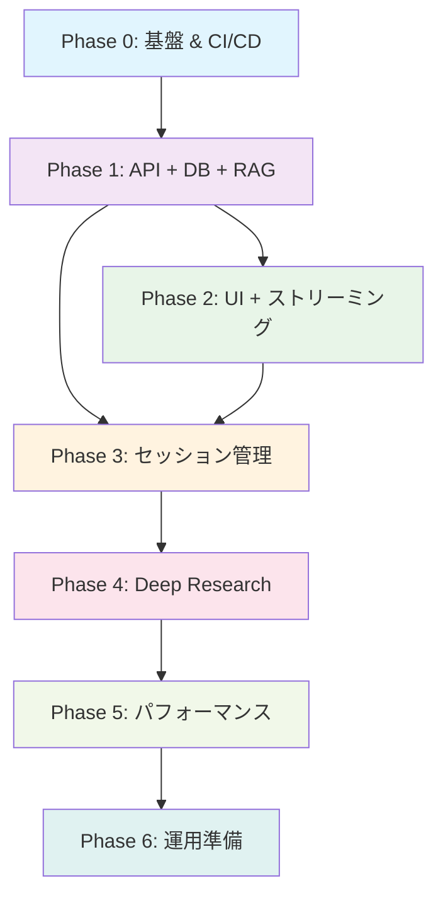

# 実装ロードマップ – QRAI MVP

> **目的** — どのコンポーネントをどの順序で実装・セットアップするかを示し、開発とインフラ作業を漏れなく進められるようにする。具体的な日付やスプリント長に縛られず、**フェーズ単位**で完了条件を定義する。実装効率と品質担保を両立する構成で設計。

---

## 0. フェーズ概要

| フェーズ                             | ゴール                                              | 完了判定                                               |
| -------------------------------- | ------------------------------------------------- | -------------------------------------------------- |
| **Phase 0** – 基盤セットアップ & CI/CD     | ローカル開発環境 + Azure無料枠インフラ + 自動化パイプライン構築           | `terraform apply` + `az deployment` 完了 + GitHub Actions CI緑 + Docker起動OK |
| **Phase 1** – API基盤 + DB + RAG      | FastAPI + GraphQL + Cosmos DB + 基本RAG + ユニットテスト | GraphQL ask クエリ成功 + セッション保存確認 + pytest緑           |
| **Phase 2** – UI + ストリーミング         | Next.js チャット UI + SSE ストリーミング + 統合テスト           | ブラウザ質問→リアルタイム応答表示 + E2E基本テスト緑                    |
| **Phase 3** – セッション管理 & 履歴        | セッション一覧・復元・削除 + 履歴UI + E2Eテスト拡張              | セッション管理全機能 + 履歴画面 + E2Eテスト緑                     |
| **Phase 4** – Deep Research       | 多段階リサーチエージェント + 進捗表示 + 機能テスト                  | `deepResearch=true` で構造化レポート生成 + 機能テスト緑          |
| **Phase 5** – パフォーマンス & 可観測性      | 負荷テスト + 監視ダッシュボード + メトリクス可視化                   | Locust p95<10s + Azure Monitor ダッシュボード稼働           |
| **Phase 6** – 運用準備 & コストガード       | Budget アラート + バックアップ + 障害演習 + 最適化              | 月額<$5確認 + Runbook検証 + 障害演習完了                    |

詳細な監視・パフォーマンス設定については **[architecture/performance_monitoring.md](architecture/performance_monitoring.md)** を参照してください。

詳細なコスト管理戦略・予算設定・最適化手法については **[architecture/cost_management.md](architecture/cost_management.md)** を参照してください。

---

## 1. 詳細タスクバックログ

### Phase 0: 基盤セットアップ & CI/CD

#### 1-0A インフラストラクチャ（Terraform）
* [x] **Terraform backend**: Azure Blob Storage + state lock設定
* [x] **Cosmos DB for PostgreSQL**: Single node無料枠、テーブル初期化 ✅ **修正完了**
* [x] **Container Apps Environment**: Consumption plan、環境変数管理 ✅ **修正完了**
* [x] **Azure Cost Management Budget**: $5予算 + 80%アラート設定 ✅ **修正完了**
* [x] **Log Analytics Workspace**: OpenTelemetry DCR設定 ✅ **修正完了**
* [x] **Terraform設定修正**: Azure OpenAI依存除去、LLMプロバイダー対応 ✅ **完了**

#### 1-0B インフラストラクチャ（Bicep）
* [x] **Azure AI Search F1**: リソース作成、ネットワークACL設定 ✅ **テスト済み**
* [x] **Key Vault**: LLMプロバイダーAPIキー安全管理、アクセス制御設定 ✅ **テスト済み**
* [x] **Static Web Apps**: Next.js フロントエンド用、GitHub連携設定 ✅ **テスト済み**

#### 1-0C LLMプロバイダー設定（Azure OpenAI → OpenRouter/Google AI移行）
* [x] **LLMプロバイダー設定**: OpenRouter（プライマリ）+ Google AI Studio（セカンダリ）
* [x] **APIキー管理**: Key Vault統合、セキュア環境変数管理
* [x] **LangChain設定**: config/llm_providers.yml、プロバイダー抽象化設定
* [x] **デプロイスクリプト**: scripts/deploy-llm-providers.sh、check/test スクリプト

#### 1-0D CI/CD パイプライン
* [ ] **GitHub Actions**: pytest + eslint + terraform validation + bicep validation
* [ ] **Pre-commit hooks**: black, ruff, prettier, detect-secrets
* [ ] **Docker Compose**: 開発環境統合、ホットリロード設定、ネットワーク設定
* [ ] **環境変数管理**: .env.sample作成、GitHub Secrets設定

**Phase 0 完了条件**:
```bash
# Bicepデプロイ成功（LLMプロバイダー対応版）
az deployment group create --resource-group qrai-rg-dev \
  --template-file infra/bicep/main.bicep \
  --parameters @infra/bicep/main.bicepparam \
  --parameters openRouterApiKey='sk-or-xxx' googleAiApiKey='AIzaSyxxx'

# Terraformデプロイ成功（Bicep出力を使用）
cd infra/terraform
terraform apply -auto-approve

# LLMプロバイダー接続確認
python scripts/check_llm_config.py  # 全プロバイダー緑

# 開発環境起動確認
docker compose up --build
curl http://localhost:8000/health  # 200 OK

# CI成功
git push origin main  # GitHub Actions 緑
```

---

### Phase 1: API基盤 + DB + RAG

#### 1-1A バックエンド基盤
* [ ] **FastAPI application factory**: main.py + config.py + health endpoint
* [ ] **Strawberry GraphQL schema**: Query/Mutation types定義、型安全性確保
* [ ] **依存注入システム**: deps.py、DB/Search/OpenAI クライアント管理
* [ ] **ミドルウェア**: CORS、Rate Limit (slowapi 20 RPS/IP)、構造化ログ
* [ ] **SQLAlchemy async engine**: Cosmos PG接続、Alembic migration初期化

#### 1-1B RAG サービス
* [ ] **Azure AI Search クライアント**: ベクトル検索、フルテキスト検索統合
* [ ] **Azure OpenAI クライアント**: gpt-4o-mini、async/await、エラーハンドリング
* [ ] **RagService実装**: search → prompt build → generate → citation format
* [ ] **GraphQL ask resolver**: 質問受信 → RAG実行 → 引用付き応答返却

#### 1-1C データベース設計
* [ ] **テーブル作成**: sessions, messages, research_notes
* [ ] **セッション管理**: セッション作成、メッセージ保存、基本的なCRUD
* [ ] **インデックス設計**: 検索最適化、パーティション考慮

#### 1-1D テスト実装
* [ ] **ユニットテスト**: pytest + TestClient、RAG機能テスト
* [ ] **モックテスト**: Azure API のモック化、レスポンステスト
* [ ] **データベーステスト**: セッション・メッセージ保存テスト

**Phase 1 完了条件**:
```bash
# GraphQL ask クエリ成功
curl -X POST http://localhost:8000/graphql \
  -H "Content-Type: application/json" \
  -d '{"query":"query{ask(question:\"社内研修制度について教えてください\"){response citations{title url}}}"}'

# セッション保存確認
psql $COSMOS_POSTGRES_URL -c "SELECT * FROM sessions;"

# テスト成功
pytest tests/ -v
```

---

### Phase 2: UI + ストリーミング

#### 1-2A フロントエンド基盤
* [ ] **Next.js 14 App Router**: 初期化、TypeScript設定、Tailwind CSS
* [ ] **shadcn/ui コンポーネント**: Button, Card, Input, Textarea導入
* [ ] **GraphQL Code Generator**: TypeScript hooks自動生成、型安全性確保
* [ ] **SWR設定**: GraphQLクライアント、キャッシュ戦略

#### 1-2B チャット UI
* [ ] **ChatWindow コンポーネント**: メッセージ履歴表示、スクロール制御
* [ ] **MessageBubble コンポーネント**: ユーザー/AI メッセージ、引用リンク表示
* [ ] **InputForm コンポーネント**: 質問入力、送信ボタン、バリデーション
* [ ] **LoadingSpinner**: 応答待ち状態表示

#### 1-2C ストリーミング実装
* [ ] **SSE クライアント**: `graphql-sse` 統合、リアルタイム受信
* [ ] **ストリーミング表示**: チャンク受信 → 段階的テキスト表示
* [ ] **エラーハンドリング**: 接続切断、タイムアウト、再接続処理

#### 1-2D 統合テスト
* [ ] **Vitest設定**: React Testing Library、ユニットテスト
* [ ] **E2E テスト基盤**: Playwright設定、基本フロー（質問→応答）テスト

**Phase 2 完了条件**:
```bash
# ブラウザアクセス確認
open http://localhost:3000

# E2E テスト成功
npx playwright test tests/e2e/basic-chat.spec.ts

# フロントエンドテスト成功
npm test
```

---

### Phase 3: セッション管理 & 履歴

#### 1-3A セッション機能拡張
* [ ] **セッション CRUD API**: 一覧取得、詳細取得、削除、更新
* [ ] **GraphQL sessions resolver**: 履歴取得、フィルタリング、ソート
* [ ] **セッション復元機能**: 過去チャット復元、メッセージ履歴表示

#### 1-3B 履歴 UI
* [ ] **SessionList コンポーネント**: サイドバー、セッション一覧表示
* [ ] **セッション切り替え**: クリック選択、アクティブ状態表示
* [ ] **セッション削除**: 削除確認ダイアログ、楽観的UI更新

#### 1-3C E2E テスト拡張
* [ ] **セッション管理テスト**: 作成→メッセージ→切り替え→削除フロー
* [ ] **UI操作テスト**: サイドバー操作、履歴表示確認
* [ ] **データ整合性テスト**: DB保存内容とUI表示の一致確認

**Phase 3 完了条件**:
```bash
# セッション管理全機能確認
curl http://localhost:8000/graphql -d '{"query":"query{sessions{id title createdAt}}"}'

# E2E テスト拡張成功
npx playwright test tests/e2e/session-management.spec.ts

# セッション履歴表示確認
```

---

### Phase 4: Deep Research

#### 1-4A Deep Research エージェント
* [ ] **Planner実装**: 質問分析、サブクエリ生成戦略
* [ ] **SearchTool**: 複数検索実行、結果統合、重複除去
* [ ] **Summarizer**: 検索結果要約、構造化、引用保持
* [ ] **Writer**: 最終レポート生成、Markdown構造化、章立て

#### 1-4B 進捗表示システム
* [ ] **プログレスAPI**: SSE による進捗通知、ステップ情報送信
* [ ] **ProgressBar コンポーネント**: "Step 2/4: Searching..." 表示
* [ ] **研究ノート保存**: research_notes テーブル、中間結果保存

#### 1-4C Deep Research UI
* [ ] **Deep Research ボタン**: チャット画面にボタン追加
* [ ] **進捗表示**: リアルタイム進捗、ステップ詳細表示
* [ ] **レポート表示**: 構造化表示、引用リンク、エクスポート機能

#### 1-4D 機能テスト
* [ ] **Deep Research 統合テスト**: 全ステップ実行、レポート生成確認
* [ ] **パフォーマンステスト**: 120秒以内完了確認
* [ ] **エラーケーステスト**: 途中失敗、部分結果表示

**Phase 4 完了条件**:
```bash
# Deep Research 実行確認
curl -X POST http://localhost:8000/graphql \
  -d '{"query":"mutation{startDeepResearch(sessionId:\"...\", question:\"競合分析レポート\"){id}}"}'

# 機能テスト成功
pytest tests/test_deep_research.py::test_full_research_flow

# レポート生成確認（120秒以内）
```

---

### Phase 5: パフォーマンス & 可観測性

#### 1-5A パフォーマンステスト
* [ ] **Locust スクリプト**: 5ユーザー × 5分負荷シナリオ
* [ ] **レイテンシ測定**: RAG応答 p95 < 10秒、Deep Research < 120秒
* [ ] **スループット測定**: 20 RPS目標、QPS制限テスト

#### 1-5B 監視システム
* [ ] **OpenTelemetry統合**: fastapi-opentelemetry、分散トレース
* [ ] **構造化ログ**: structlog、session_id/trace_id連携
* [ ] **カスタムメトリクス**: Token使用量、検索回数、エラー率

#### 1-5C Azure Monitor 統合
* [ ] **Log Analytics クエリ**: パフォーマンス分析、エラー検出
* [ ] **ダッシュボード作成**: レイテンシ、スループット、リソース使用率
* [ ] **アラート設定**: SLA違反、異常検出、通知設定

**Phase 5 完了条件**:
```bash
# 負荷テスト実行
locust -f tests/load/chat_scenario.py --host=http://localhost:8000

# p95レイテンシ確認
curl "https://api.loganalytics.io/v1/workspaces/.../query" \
  -d "query=requests | summarize percentile(duration, 95)"

# ダッシュボード表示確認
```

---

### Phase 6: 運用準備 & コストガード

#### 1-6A コスト管理
* [ ] **Budget アラート**: Azure Cost Management、$5予算80%通知
* [ ] **コスト監視**: Token使用量追跡、AI Search容量監視
* [ ] **最適化実装**: プロンプト短縮、キャッシュ戦略、インデックス圧縮

#### 1-6B バックアップ & 復旧
* [ ] **データバックアップ**: pg_dump自動化、AI Searchインデックスエクスポート
* [ ] **災害復旧手順**: Runbook作成、復旧シナリオテスト
* [ ] **障害演習**: AI Search停止、OpenAI制限、DB接続失敗対応

#### 1-6C 運用ドキュメント
* [ ] **Runbook完成**: operational_runbook.md実装検証
* [ ] **トラブルシューティング**: よくある問題と解決法まとめ
* [ ] **スケーリング戦略**: 無料枠→有料枠移行計画

**Phase 6 完了条件**:
```bash
# コスト確認（月額$5以内）
az consumption budget show --budget-name "qrai-dev-budget"

# 障害演習成功
python scripts/disaster_drill.py --scenario ai_search_down

# Runbook検証完了
python scripts/verify_runbook.py --all-scenarios
```

---

## 2. 完了チェックリスト (Definition of Done)

### 🎯 最終MVP完了条件

* [ ] `docker compose up` でローカル起動し UI で質問→回答（5分以内）
* [ ] GitHub Actions CI 緑（unit, integration, e2e, lint, plan, what-if）
* [ ] Azure Portal でリソース状態**Running** & コスト < $5/月
* [ ] Runbook 手順で AI Search 容量 45MB を検知し対処実演済み
* [ ] README でオンボーディング所要時間 ≤ 15min（実測）
* [ ] セッション管理：作成・一覧・削除・復元が動作
* [ ] Deep Research：「競合分析」で構造化レポート生成（120秒以内）
* [ ] パフォーマンス：Locust負荷テスト p95レイテンシ < 10秒
* [ ] 可観測性：Azure Monitor ダッシュボードでメトリクス確認

### 📋 品質ゲート

| カテゴリ       | 指標                              | 目標値           |
| ---------- | ------------------------------- | ------------- |
| **テストカバレッジ** | Backend pytest line coverage   | > 80%         |
|            | Frontend Vitest coverage       | > 70%         |
| **パフォーマンス** | RAG応答時間 p95                    | < 10秒         |
|            | Deep Research完了時間 p95         | < 120秒        |
| **可用性**     | E2E テスト成功率                     | 100%          |
| **コスト**     | 月間Azure利用料金                    | < $5          |
| **コード品質**   | ESLint/Ruff 警告                  | 0 warnings    |

---

## 3. フェーズ間依存関係



**並行実装可能性**:
- Phase 1完了後：フロントエンド（Phase 2）とセッション管理API（Phase 3）は並行開発可能
- Phase 2-3完了後：Deep Research（Phase 4）と監視設定（Phase 5前半）は並行開発可能

---

*Last updated: 2025-06-03*
